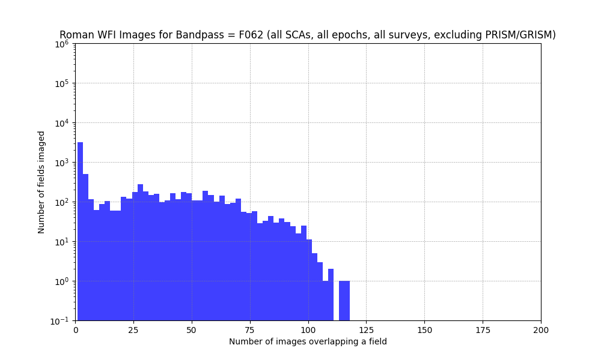
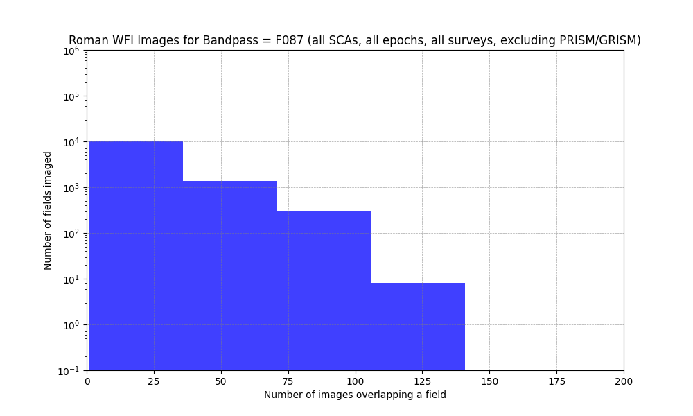
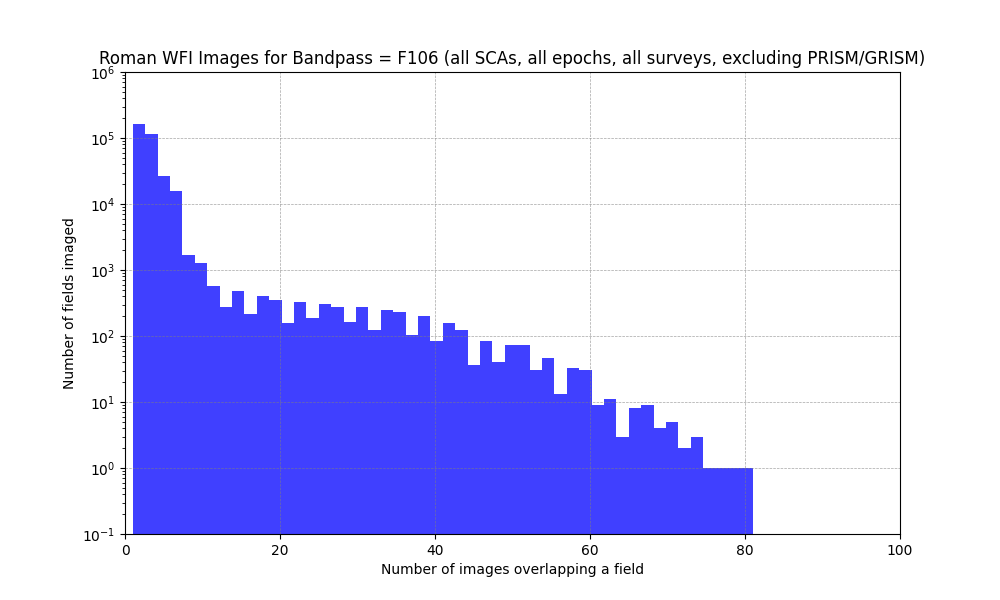
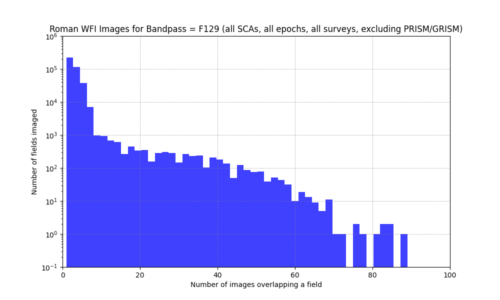
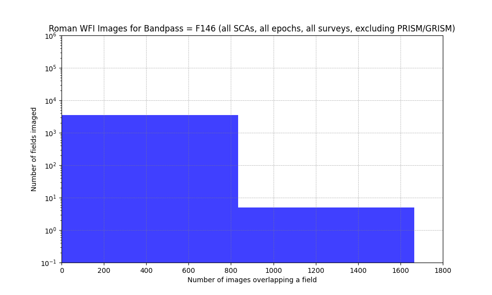
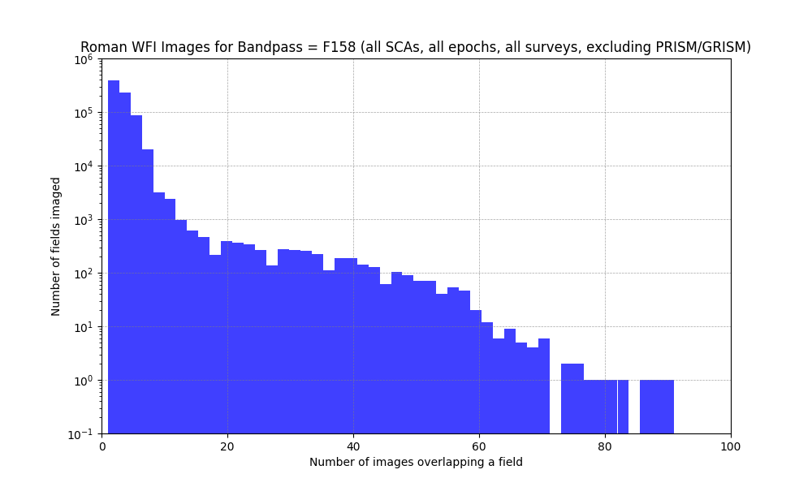
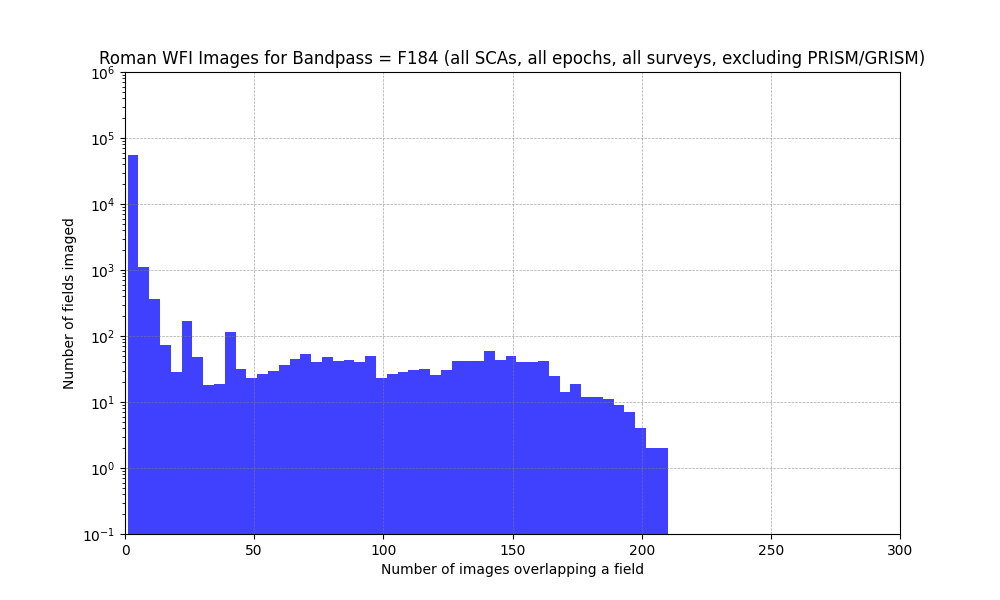
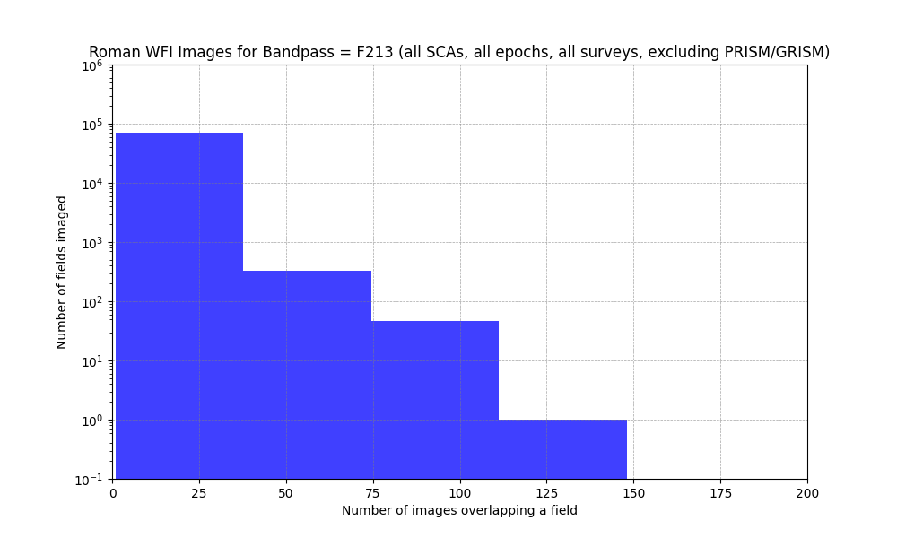

Projections of RAPID Reference-Image Numbers
####################################################

Overview
************************************

For the RAPID project, the Roman sky-tessellation parameter NSIDE=512 is used,
and this gives tile sizes somewhat smaller than that of a Roman SCA image
(4K x 4K pixels, 0.11 arcsecond per pixel), which
results in 6,291,458 tiles covering the entire sky.
Each sky tile is assigned a field number.  A "field" is just another name for a sky tile.

A RAPID reference image for a given field and bandpass filter is a coaddition of some
number of SCA images in the vicinity of the field.
Images from different SCAs can be coadded.
Reference images are 7K x 7K pixels, a tangent projection (no distortion),
centered on a field, with no rotation (CROTA2 = 0 degrees).
Reference-image pixels are the same size as SCA images.

To get a handle on the number of reference images and their coverage depths possible
for the planned observations, statistics are computed covering all Roman WFI-camera surveys,
all epochs, and all SCAs, but excluding PRISM/GRISM observations.
The output from python code count_fields_imaged.py is given in a separate section below.

Reference-Image Numbers
************************************

===============      =====================================================================
Bandpass             Number of reference images possible (assuming ``num_coad >= 2``)
===============      =====================================================================
F062                 6488
F087                 10431
F106                 255035
F129                 270997
F146                 3522
F158                 532517
F184                 22945
F213                 25099
===============      =====================================================================

Below are histograms of numbers of fields imaged as a function of number of images overlapping a field.
The histograms are given separately for the different WFI-camera bandpass filters.

Code Output
************************************

.. code-block::

    % export PYTHONPATH=/Users/laher/git/rapid
    % export ROMANTESSELLATIONDBNAME=/Users/laher/Folks/rapid/roman_tessellation_nside512.db
    % python -u /Users/laher/git/rapid/soc/apt/count_fields_imaged.py
    swname = count_fields_imaged.py
    swvers = 1.0
    proc_utc_datetime = 2026-04-10T18:12:59Z
    proc_pt_datetime_started = 2026-04-10T11:12:59 PT
    dbname = /Users/laher/Folks/rapid/roman_tessellation_nside512.db
    q1 = select count(*) from decbins;
    Number of records in decbins table = (2049,)

    Projected reference-image statistics for bandpass = F062 (all SCAs, excluding PRISM/GRISM):
    Number of reference images possible (assuming num_coadd >= 2) = 6488
    Number of fields imaged (samples) = 7741
    Number of fields imaged only once = 1253
    Below are statistics for number of images overlapping fields...
    mean_n = 24.22710244154502
    std_n = 26.335916793581543
    median_n = 10.0
    min_n = 1
    max_n = 118
    pct5 = 1.0
    pct10 = 1.0
    pct20 = 2.0
    pct40 = 3.0
    pct60 = 27.0
    pct80 = 51.0
    pct90 = 64.0
    pct95 = 74.0
    pct99 = 94.0
    pct99_9 = 103.26000000000113
    pct99_99 = 114.90399999999863

    Projected reference-image statistics for bandpass = F087 (all SCAs, excluding PRISM/GRISM):
    Number of reference images possible (assuming num_coadd >= 2) = 10431
    Number of fields imaged (samples) = 12034
    Number of fields imaged only once = 1603
    Below are statistics for number of images overlapping fields...
    mean_n = 29.882333388731926
    std_n = 114.91758266134248
    median_n = 6.0
    min_n = 1
    max_n = 1750
    pct5 = 1.0
    pct10 = 1.0
    pct20 = 2.0
    pct40 = 4.0
    pct60 = 11.0
    pct80 = 30.0
    pct90 = 47.0
    pct95 = 67.0
    pct99 = 790.6700000000001
    pct99_9 = 908.9670000000006
    pct99_99 = 1666.390099999997

    Projected reference-image statistics for bandpass = F106 (all SCAs, excluding PRISM/GRISM):
    Number of reference images possible (assuming num_coadd >= 2) = 255035
    Number of fields imaged (samples) = 332491
    Number of fields imaged only once = 77456
    Below are statistics for number of images overlapping fields...
    mean_n = 3.1776679669524888
    std_n = 3.8230355063725416
    median_n = 3.0
    min_n = 1
    max_n = 81
    pct5 = 1.0
    pct10 = 1.0
    pct20 = 1.0
    pct40 = 2.0
    pct60 = 3.0
    pct80 = 4.0
    pct90 = 5.0
    pct95 = 6.0
    pct99 = 22.0
    pct99_9 = 49.0
    pct99_99 = 65.0

    Projected reference-image statistics for bandpass = F129 (all SCAs, excluding PRISM/GRISM):
    Number of reference images possible (assuming num_coadd >= 2) = 270997
    Number of fields imaged (samples) = 394426
    Number of fields imaged only once = 123429
    Below are statistics for number of images overlapping fields...
    mean_n = 2.920289230425986
    std_n = 3.684581145747998
    median_n = 2.0
    min_n = 1
    max_n = 89
    pct5 = 1.0
    pct10 = 1.0
    pct20 = 1.0
    pct40 = 2.0
    pct60 = 3.0
    pct80 = 4.0
    pct90 = 5.0
    pct95 = 6.0
    pct99 = 18.0
    pct99_9 = 49.0
    pct99_99 = 64.0

    Projected reference-image statistics for bandpass = F146 (all SCAs, excluding PRISM/GRISM):
    Number of reference images possible (assuming num_coadd >= 2) = 3522
    Number of fields imaged (samples) = 3733
    Number of fields imaged only once = 211
    Below are statistics for number of images overlapping fields...
    mean_n = 1145.9871417090812
    std_n = 4776.462735928726
    median_n = 6.0
    min_n = 1
    max_n = 41619
    pct5 = 1.0
    pct10 = 2.0
    pct20 = 2.0
    pct40 = 4.0
    pct60 = 7.0
    pct80 = 11.0
    pct90 = 17.0
    pct95 = 18128.0
    pct99 = 20892.44
    pct99_9 = 38948.96800000013
    pct99_99 = 40801.31879999901

    Projected reference-image statistics for bandpass = F158 (all SCAs, excluding PRISM/GRISM):
    Number of reference images possible (assuming num_coadd >= 2) = 532517
    Number of fields imaged (samples) = 733363
    Number of fields imaged only once = 200846
    Below are statistics for number of images overlapping fields...
    mean_n = 2.9687753540879482
    std_n = 2.9617787377180242
    median_n = 2.0
    min_n = 1
    max_n = 91
    pct5 = 1.0
    pct10 = 1.0
    pct20 = 1.0
    pct40 = 2.0
    pct60 = 3.0
    pct80 = 4.0
    pct90 = 5.0
    pct95 = 6.0
    pct99 = 10.0
    pct99_9 = 43.0
    pct99_99 = 58.0

    Projected reference-image statistics for bandpass = F184 (all SCAs, excluding PRISM/GRISM):
    Number of reference images possible (assuming num_coadd >= 2) = 22945
    Number of fields imaged (samples) = 58117
    Number of fields imaged only once = 35172
    Below are statistics for number of images overlapping fields...
    mean_n = 4.183388681452931
    std_n = 17.187707926712964
    median_n = 1.0
    min_n = 1
    max_n = 210
    pct5 = 1.0
    pct10 = 1.0
    pct20 = 1.0
    pct40 = 1.0
    pct60 = 1.0
    pct80 = 2.0
    pct90 = 3.0
    pct95 = 6.0
    pct99 = 118.0
    pct99_9 = 176.88400000000547
    pct99_99 = 199.37679999998363

    Projected reference-image statistics for bandpass = F213 (all SCAs, excluding PRISM/GRISM):
    Number of reference images possible (assuming num_coadd >= 2) = 25099
    Number of fields imaged (samples) = 69992
    Number of fields imaged only once = 44893
    Below are statistics for number of images overlapping fields...
    mean_n = 4.656875071436736
    std_n = 49.49886241272287
    median_n = 1.0
    min_n = 1
    max_n = 1840
    pct5 = 1.0
    pct10 = 1.0
    pct20 = 1.0
    pct40 = 1.0
    pct60 = 1.0
    pct80 = 2.0
    pct90 = 3.0
    pct95 = 5.0
    pct99 = 18.0
    pct99_9 = 895.0
    pct99_99 = 1663.000899999999
    Total elapsed time in seconds = 184.9293577671051
    terminating_exitcode = 0
