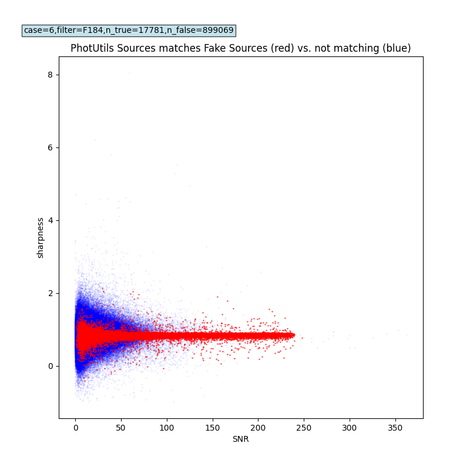
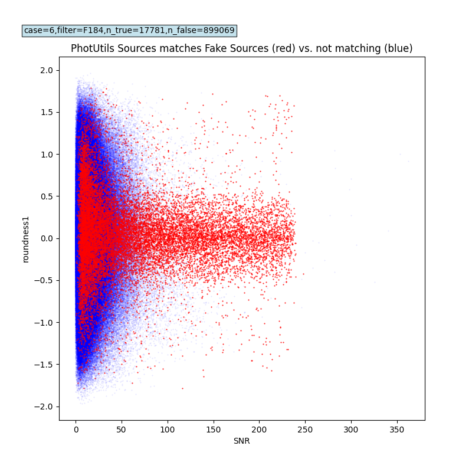
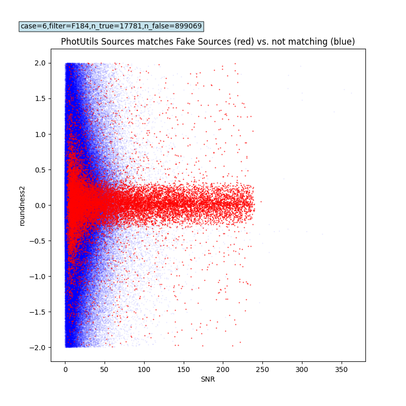
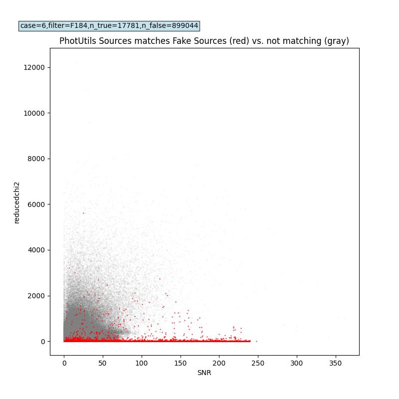
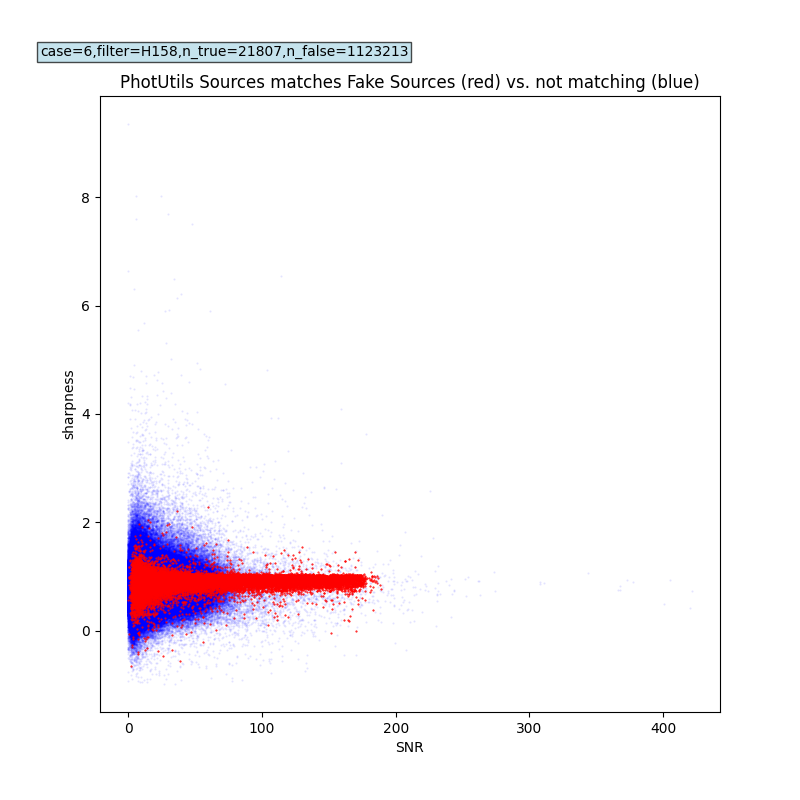
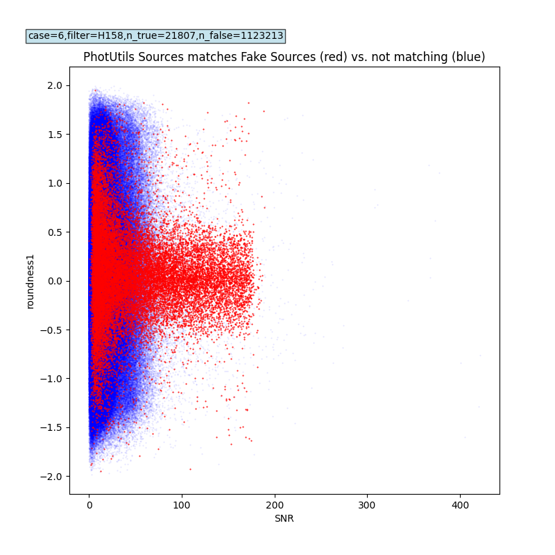
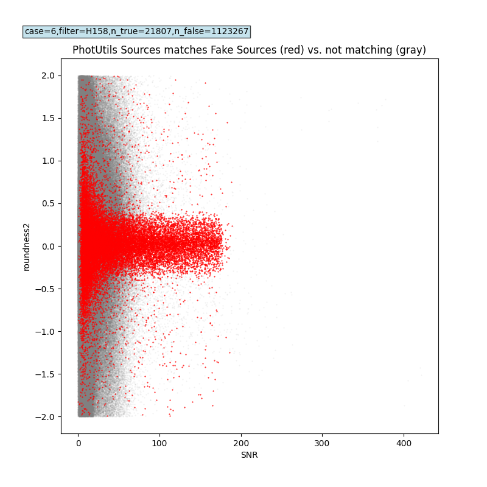
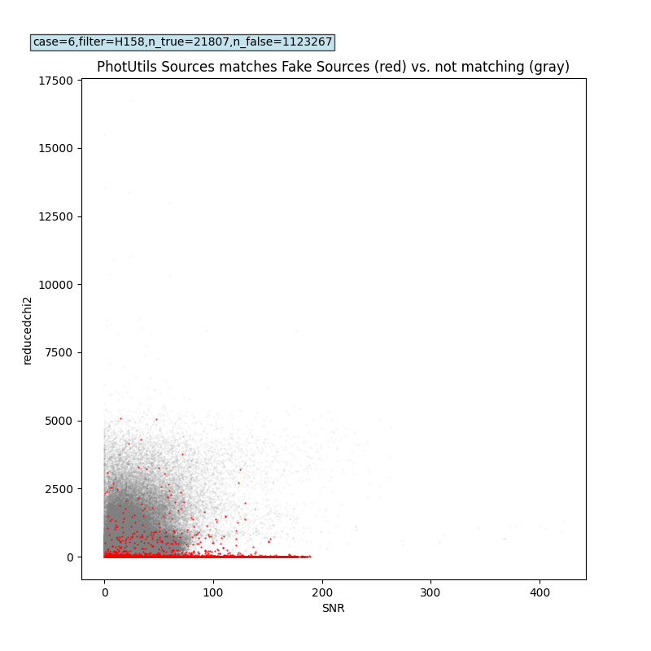

PhotUtils DAOStarFinder Parameter Study
####################################################

Overview
************************************

The analysis described below is for the purpose of understanding
the effects of varying PhotUtils DAOStarFinder input parameters.
This is a systematic study with 1000 independent samples as input.
These results can be compared with the three SExtractor input configurations that are documented below.

Input Difference Images
************************************

One thousand sets of ZOGY difference-image products are used.
Here is an example of how to download the input files needed for a single sample:

.. code-block::

    aws s3 cp s3://rapid-product-files/20250927/jid79170/bkg_subbed_science_image.fits .
    aws s3 cp s3://rapid-product-files/20250927/jid79170/diffimage_masked.fits .
    aws s3 cp s3://rapid-product-files/20250927/jid79170/scorrimage_masked.fits .
    aws s3 cp s3://rapid-product-files/20250927/jid79170/diffimage_uncert_masked.fits .
    aws s3 cp s3://rapid-product-files/20250927/jid79170/diffpsf.fits .
    aws s3 cp s3://rapid-product-files/20250927/jid79170/Roman_TDS_simple_model_Y106_124_5_lite_inject.txt .

The Python script ``scripts/download_files.py`` was used to do the bulk downloading (see next section).

Analysis Software
************************************

The following Python scripts are used to download the input data,
regenerate the catalogs for the various input configurations,
and make plots (offline, on a laptop):

.. code-block::

    scripts/download_files.py
    scripts/generate_sexcat.py
    scripts/generate_psfcat.py
    scripts/plot_detections.py
    scripts/generate_sexcats_with_custom_config.py
    scripts/generate_psfcats_for_many_cases.py
    scripts/breakdown_by_filter_cats_for_many_cases.py
    scripts/scatter_plot_by_filter_psfcats_for_many_cases.py

SExtractor Baseline for Comparison
************************************

Three SExtractor configurations were tested.

The first SExtractor configuration below is similar to ZTF.  The others were determined by Alice Ciobanu and Lynn Yan in experiments with OpenUniverse simulated images.

===============      ===================      ===================      ======================      =======================================================================
Configuraton              ZTF                      AL1                      A2                     Description
===============      ===================      ===================      ======================      =======================================================================
DEBLEND_NTHRESH           4                        4                        4                      Number of deblending sub-thresholds
DEBLEND_MINCONT           0.005                    0.005                    0.005                  Minimum contrast parameter for deblending
DETECT_MINAREA            1                        4                        5                      Minimum number of pixels above threshold
DETECT_THRESH             5.0                      2.5                      2.5                    Detection threshold in **absolute DN/s** if weight image not used
ANALYSIS_THRESH           5.0                      2.5                      2.5                    Analysis threshold in number of sigmas
WEIGHT_TYPE            "NONE,MAP_RMS"           "NONE,MAP_RMS"          "BACKGROUND,MAP_RMS"       Do not use weight image for detection
FILTER                 "N"                      "N"                     "N"                        Do not apply filter for detection
===============      ===================      ===================      ======================      =======================================================================

The ZOGY scorr image is used for detection, and the difference image for analysis.

Fake sources were injected into the input image before ZOGY.  100 fake sources were injected.
In matching within 1.0 pixels for the SExtractor ZTF baseline,
there were on average 64.83 matches between extracted source positions and fake source positions.

Statistical results over all filters or WFI bands:

================================= ======================== ======================== ======================== ===============================================================================
Statistic                         ZTF                      AL1                      A2                       Description
================================= ======================== ======================== ======================== ===============================================================================
sample_size                       1000                     1000                     1000                     Number of ZOGY difference-image cases studied
avg_numpy_nsources_sexcat         1590.26                  2799.98                  1835.53                  Average number of SExtractor sources analyzed
std_numpy_nsources_sexcat         584.70                   1531.22                  942.60                   Standard deviation of corresponding average
margin_of_error_nsources_sexcat   36.24                    94.91                    58.42                    Uncertainty of corresponding average (95% confidence level)
avg_numpy_ns_true                 64.83                    61.36                    60.34                    Average number of catalog matches with fake-source positions (1.0-pixel radius)
std_numpy_ns_true=                8.10                     8.45                     8.62                     Standard deviation of corresponding average
margin_of_error_ns_true           0.5020                   0.5235                   0.5342                   Uncertainty of corresponding average (95% confidence level)
================================= ======================== ======================== ======================== ===============================================================================

.. note::
    The ``XWIN_IMAGE, YWIN_IMAGE`` pixel coordinates are one-based indices, while the pixel coordinates
    of the fake-source truth list and PhotUtils PSF-fit catalog are zero-based indices.

PhotUtils DAOStarFinder Input-Parameter Variation
************************************

In all ten cases below, the input threshold is 5 times the clipped standard deviation
of the ZOGY difference image (multiplied by a Gaussian correction factor to account for the data clipping)::

    threshold = 0.2488752235542349 DN/s for the aforementioned single sample

This is the same threshold sigma that was used in the 9/27/2025 test.

Case #1 defines the parameters that were used in the 9/27/2025 test.

Statistical results covering all filters or WFI bands, for sample size = 1000.  The same inputs were used as for the above SExtractor ZTF baseline.

===== ==== ======= ======= ======= ======= ======= =============================== ==========================================================
Cases fwhm sharplo sharphi roundlo roundhi min_sep num_sources (std,unc)           num_matches_with_fake_sources (std,unc)
===== ==== ======= ======= ======= ======= ======= =============================== ==========================================================
1     2.0  0.2     1.0     -1.0    1.0     0.0     1715.98 (821.23,50.90)          48.92 (14.94,0.926)
2     2.0  -1.0    10.0    -1.0    1.0     0.0     2307.33 (1030.44,63.87)         64.02 (8.01,0.4966)
3     2.0  -1.0    10.0    -1.0    1.0     1.0     2567.87 (1153.88,71.52)         64.67 (8.02,0.4971)
4     2.0  -1.0    10.0    -1.0    1.0     2.0     2307.33 (1030.48,63.87)         64.02 (8.01,0.4967)
5     2.0  -1.0    1.0     -1.0    1.0     1.0     1924.32 (909.99,56.40)          49.56 (14.92,0.9246)
6     2.0  -1.0    10.0    -2.0    2.0     1.0     3874.28 (1469.20,91.06)         68.13 (7.77,0.4814)
7     1.4  0.2     1.0     -1.0    1.0     0.0     2178.58 (998.78,61.91)          62.45 (8.56,0.5304)
8     1.4  -1.0    10.0    -1.0    1.0     0.0     2510.98 (1123.97,69.66)         64.12 (8.01,0.4963)
9     1.0  0.2     1.0     -1.0    1.0     0.0     2357.50 (1066.53,66.10)         62.18 (8.12,0.5030)
10    1.0  -1.0    10.0    -1.0    1.0     0.0     2516.48 (1131.74,70.15)         62.42 (8.11,0.5029)
===== ==== ======= ======= ======= ======= ======= =============================== ==========================================================

The average results are each given with corresponding standard deviation and uncertainty (95% confidence level) in parentheses.

Case #6 gave the largest number of PhotoUtils PSF-fit catalog sources and also
the largest number of fake-source matches (68.13) within 1.0 pixels.

Results Broken Down By Filter
************************************

.. code-block::

    Statistical results for filter = F184:
    case_list = ['ZTF', 'AL1', 'A2', 'PU1', 'PU2', 'PU3', 'PU4', 'PU5', 'PU6', 'PU7', 'PU8', 'PU9', 'PU10']
    sample_size_list = [220, 220, 220, 220, 220, 220, 220, 220, 220, 220, 220, 220, 220]
    avg_numpy_nsources_cat=[2172.35909091 4527.5        2982.64090909 2715.89090909 3404.25909091
     3783.74090909 3404.2        3013.14090909 5073.45909091 3288.19090909
     3647.29090909 3438.59545455 3609.10909091]
    std_numpy_nsources_cat=[260.25220837 363.85890747 262.60487629 327.49009271 393.60512187
     452.68622603 393.445579   365.86723021 671.45297213 395.07161596
     436.17822349 423.83808548 440.46165545]
    margin_of_error_nsources_cat=[34.39055261 48.08147057 34.70144161 43.27557999 52.01222973 59.8193943
     51.99114723 48.34685671 88.72792629 52.20601691 57.63797446 56.00730947
     58.20400075]
    avg_numpy_nmatches_cat=[69.35909091 66.5        66.07272727 67.76818182 69.80454545 70.45
     69.80454545 68.33181818 73.04545455 69.70454545 70.03636364 68.29545455
     68.43636364]
    std_numpy_nmatches_cat=[6.19113436 6.19493928 6.15365241 5.5682449  5.76060108 5.75264761
     5.76060108 5.60956054 5.82141246 5.67762573 5.70394962 5.58479895
     5.60199197]
    margin_of_error_nmatches_cat=[0.81811614 0.81861893 0.81316316 0.73580555 0.76122411 0.76017311
     0.76122411 0.74126513 0.76925991 0.75025948 0.753738   0.73799305
     0.74026499]

    Statistical results for filter = H158:
    case_list = ['ZTF', 'AL1', 'A2', 'PU1', 'PU2', 'PU3', 'PU4', 'PU5', 'PU6', 'PU7', 'PU8', 'PU9', 'PU10']
    sample_size_list = [285, 285, 285, 285, 285, 285, 285, 285, 285, 285, 285, 285, 285]
    avg_numpy_nsources_cat=[1884.65964912 2848.89473684 1878.39649123 2113.52280702 2925.27719298
     3274.44912281 2925.43157895 2381.24561404 4839.01403509 2750.74385965
     3220.4877193  3033.68421053 3259.84561404]
    std_numpy_nsources_cat=[266.13916677 319.22262397 274.52421487 332.20325158 423.47062742
     489.44168877 423.64494367 375.5226384  850.92492906 416.37773127
     479.84106728 468.82938796 505.91983696]
    margin_of_error_nsources_cat=[30.89885841 37.06186796 31.87236568 38.56892376 49.16510078 56.82436607
     49.18533896 43.59832103 98.79270765 48.34161284 55.70973027 54.43127012
     58.73748534]
    avg_numpy_nmatches_cat=[67.41052632 64.63157895 63.68070175 54.86666667 66.64210526 67.2877193
     66.64561404 55.43508772 70.61754386 65.70877193 66.66315789 65.12982456
     65.32982456]
    std_numpy_nmatches_cat=[5.40531526 5.54101637 5.50723411 5.73292532 5.24805553 5.33127384
     5.25397327 5.79353818 5.19355616 5.14656352 5.15025571 5.16676168
     5.17856462]
    margin_of_error_nmatches_cat=[0.62755916 0.64331411 0.63939197 0.66559481 0.60930124 0.61896292
     0.60998829 0.67263198 0.60297384 0.59751798 0.59794665 0.59986299
     0.60123332]

    Statistical results for filter = J129:
    case_list = ['ZTF', 'AL1', 'A2', 'PU1', 'PU2', 'PU3', 'PU4', 'PU5', 'PU6', 'PU7', 'PU8', 'PU9', 'PU10']
    sample_size_list = [127, 127, 127, 127, 127, 127, 127, 127, 127, 127, 127, 127, 127]
    avg_numpy_nsources_cat=[1721.37795276 1937.09448819 1338.13385827 1638.48818898 2401.31496063
     2656.58267717 2401.21259843 1845.25984252 4262.52755906 2208.92125984
     2670.66141732 2481.81102362 2710.64566929]
    std_numpy_nsources_cat=[215.31993881 251.39479987 215.03419842 206.44191824 245.60796176
     281.97524437 245.44196453 227.84748361 615.08976141 248.85588931
     277.89300667 271.09735394 294.88982402]
    margin_of_error_nsources_cat=[ 37.44884766  43.72305517  37.39915116  35.90476567  42.71659743
      49.04166344  42.68772688  39.62766176 106.97756512  43.28148308
      48.331673    47.14976033  51.28779136]
    avg_numpy_nmatches_cat=[67.06299213 63.5511811  62.21259843 38.12598425 65.56692913 66.18110236
     65.56692913 38.7480315  69.83464567 62.97637795 65.46456693 63.49606299
     63.88976378]
    std_numpy_nmatches_cat=[5.49265513 5.65366394 5.46373862 5.27509693 5.48669192 5.53360147
     5.48669192 5.34917538 5.27326309 5.50084398 5.60201774 5.37693238
     5.42555683]
    margin_of_error_nmatches_cat=[0.95529288 0.98329584 0.95026367 0.91745475 0.95425575 0.96241435
     0.95425575 0.93033862 0.91713581 0.9567171  0.97431343 0.93516617
     0.94362302]

    Statistical results for filter = K213:
    case_list = ['ZTF', 'AL1', 'A2', 'PU1', 'PU2', 'PU3', 'PU4', 'PU5', 'PU6', 'PU7', 'PU8', 'PU9', 'PU10']
    sample_size_list = [85, 85, 85, 85, 85, 85, 85, 85, 85, 85, 85, 85, 85]
    avg_numpy_nsources_cat=[1057.36470588 5393.21176471 3156.15294118 1285.85882353 1426.30588235
     1596.76470588 1426.32941176 1448.71764706 2109.75294118 1350.2
     1440.65882353 1305.22352941 1368.65882353]
    std_numpy_nsources_cat=[148.25612552 313.73762339 205.53290882 217.52123104 249.30340709
     294.40486917 249.35301639 259.11235863 426.30703947 233.31875697
     257.11560929 235.77793024 253.74000371]
    margin_of_error_nsources_cat=[31.5180438  66.69806135 43.69462105 46.24324063 52.99987219 62.58807539
     53.01041872 55.08517533 90.62940162 49.60166587 54.6606827  50.12446606
     53.94305647]
    avg_numpy_nmatches_cat=[55.23529412 52.37647059 52.22352941 54.43529412 54.98823529 55.91764706
     54.98823529 55.28235294 57.95294118 54.76470588 54.87058824 52.61176471
     52.76470588]
    std_numpy_nmatches_cat=[5.42249575 5.03861902 5.1799988  5.32573565 5.34788384 5.48197424
     5.34788384 5.4202491  5.48560873 5.1737961  5.12155361 4.99197973
     5.04485074]
    margin_of_error_nmatches_cat=[1.1527784  1.07116933 1.10122552 1.13220799 1.13691651 1.16542304
     1.13691651 1.15230078 1.1661957  1.09990688 1.08880055 1.0612542
     1.07249415]

    Statistical results for filter = R062:
    case_list = ['ZTF', 'AL1', 'A2', 'PU1', 'PU2', 'PU3', 'PU4', 'PU5', 'PU6', 'PU7', 'PU8', 'PU9', 'PU10']
    sample_size_list = [80, 80, 80, 80, 80, 80, 80, 80, 80, 80, 80, 80, 80]
    avg_numpy_nsources_cat=[ 753.2375  920.3375  650.7     499.1     747.55    827.5875  747.5125
      573.3    1834.1125  695.3625  801.25    752.65    787.125 ]
    std_numpy_nsources_cat=[141.78480558 189.2972493  153.72917745  74.99943333 105.41796574
     119.02591039 105.32568463  88.50612973 391.44412097  99.59872536
     115.04004737 108.86873977 114.84700421]
    margin_of_error_nsources_cat=[31.06996542 41.4815887  33.68739131 16.43497546 23.10073027 26.08270262
     23.08050828 19.39476081 85.77897506 21.825533   25.20926187 23.85691447
     25.16695942]
    avg_numpy_nmatches_cat=[62.6125 57.325  55.6875 29.425  60.925  61.5    60.925  30.1875 66.425
     58.125  61.3375 58.3875 58.675 ]
    std_numpy_nmatches_cat=[5.46693184 5.59860474 5.43505692 4.79002871 5.04671923 5.09901951
     5.04671923 4.90941379 5.02437807 5.43225322 5.28191194 5.43022502
     5.36370907]
    margin_of_error_nmatches_cat=[1.19799426 1.22684836 1.19100936 1.04966132 1.10591111 1.11737192
     1.10591111 1.07582273 1.10101539 1.19039497 1.15744999 1.18995052
     1.17537457]

    Statistical results for filter = Y106:
    case_list = ['ZTF', 'AL1', 'A2', 'PU1', 'PU2', 'PU3', 'PU4', 'PU5', 'PU6', 'PU7', 'PU8', 'PU9', 'PU10']
    sample_size_list = [81, 81, 81, 81, 81, 81, 81, 81, 81, 81, 81, 81, 81]
    avg_numpy_nsources_cat=[1591.96296296 1572.96296296 1122.37037037 1252.97530864 1860.35802469
     2037.60493827 1860.27160494 1401.69135802 3640.19753086 1723.60493827
     2060.38271605 1944.86419753 2097.2962963 ]
    std_numpy_nsources_cat=[210.93416236 220.73471282 195.20615531 162.75164563 204.2508932
     226.85148669 204.35934294 177.50400044 560.74823073 204.71091807
     230.21211732 221.82936124 239.87082143]
    margin_of_error_nsources_cat=[ 45.93677314  48.07111524  42.51156271  35.44369172  44.48130563
      49.40321266  44.50492357  38.65642676 122.11850358  44.58148882
      50.13508333  48.30950534  52.23853444]
    avg_numpy_nmatches_cat=[69.32098765 64.58024691 63.38271605 36.65432099 66.82716049 67.33333333
     66.82716049 37.2345679  71.49382716 63.38271605 66.79012346 64.50617284
     64.81481481]
    std_numpy_nmatches_cat=[5.77954494 6.14809857 6.08898601 4.42540504 5.33284749 5.33796096
     5.33284749 4.50588533 5.43223906 5.55903869 5.35347135 5.55805157
     5.59565773]
    margin_of_error_nmatches_cat=[1.25865645 1.33891924 1.32604584 0.96375487 1.16137567 1.16248927
     1.16137567 0.98128169 1.18302095 1.21063509 1.16586709 1.21042012
     1.21860991]

    Statistical results for filter = Z087:
    case_list = ['ZTF', 'AL1', 'A2', 'PU1', 'PU2', 'PU3', 'PU4', 'PU5', 'PU6', 'PU7', 'PU8', 'PU9', 'PU10']
    sample_size_list = [122, 122, 122, 122, 122, 122, 122, 122, 122, 122, 122, 122, 122]
    avg_numpy_nsources_cat=[ 635.31967213  709.17213115  514.93442623  469.86885246  721.21311475
      802.13934426  721.1147541   540.04918033 1776.64754098  661.25409836
      804.18852459  758.40983607  819.5       ]
    std_numpy_nsources_cat=[ 88.41910876 126.29121256 109.39736096  69.49737002  91.0327116
      99.29780639  91.01379797  75.66728861 315.49534101  84.97931874
      99.10793354  90.63064604 100.84903911]
    margin_of_error_nsources_cat=[15.68997635 22.41038353 19.41256851 12.33231264 16.15376034 17.62040192
     16.15040412 13.42716507 55.9846679  15.0795854  17.58670898 16.08241378
     17.89566827]
    avg_numpy_nmatches_cat=[53.45081967 48.94262295 46.95081967 29.39344262 52.31147541 52.95081967
     52.31147541 30.14754098 57.66393443 48.79508197 52.56557377 50.53278689
     50.80327869]
    std_numpy_nmatches_cat=[6.22409709 6.44560999 6.43740664 4.82064783 5.55461995 5.643584
     5.55461995 4.99946248 5.67220814 5.46664779 5.80416428 5.64406612
     5.67513897]
    margin_of_error_nmatches_cat=[1.10446642 1.14377389 1.14231821 0.85542426 0.98566766 1.00145433
     0.98566766 0.88715493 1.00653369 0.97005699 1.02994931 1.00153988
     1.00705376]

    Statistical results for filter = W146:
    No data for filter...

PhotUtils-Attribute Plots
************************************

Scatter plots for PhotUtils source attributes (sharpness, roundness1, roundness2 and reduced_chi2)
were made for 7 WFI filters, for the above 10 PhotUtils cases, a total of 210 plots.
All of these plots have been checked into the RAPID git repository at the following location:

.. code-block::

   rapid/docs/source/analyses/photutils_daostarfinder_parameters/photutils_attribute_plots

Below are examples for the filters with the highest numbers of extracted sources (F184 and H158), for the above
PhotUtils case #6 (which covered the widest range of parameter space):

Sky-Position Plots
************************************

Plots for the SExtractor ZTF baseline versus the ten PhotUtils cases are given below for the aforementioned single sample,
and a match radius of 1.0 pixels.

.. image:: sex_vs_psf_fwhm=2.0_sharplo=0.2_sharphi=1.0_roundlo=-1.0_roundhi=1.0_min_sep=0.0.png
.. image:: sex_vs_psf_fwhm=2.0_sharplo=-1.0_sharphi=10.0_roundlo=-1.0_roundhi=1.0_min_sep=0.0.png
.. image:: sex_vs_psf_fwhm=2.0_sharplo=-1.0_sharphi=10.0_roundlo=-1.0_roundhi=1.0_min_sep=1.0.png
.. image:: sex_vs_psf_fwhm=2.0_sharplo=-1.0_sharphi=10.0_roundlo=-1.0_roundhi=1.0_min_sep=2.0.png
.. image:: sex_vs_psf_fwhm=2.0_sharplo=-1.0_sharphi=1.0_roundlo=-1.0_roundhi=1.0_min_sep=1.0.png
.. image:: sex_vs_psf_fwhm=2.0_sharplo=-1.0_sharphi=10.0_roundlo=-2.0_roundhi=2.0_min_sep=1.0.png
.. image:: sex_vs_psf_fwhm=1.4_sharplo=0.2_sharphi=1.0_roundlo=-1.0_roundhi=1.0_min_sep=0.0.png
.. image:: sex_vs_psf_fwhm=1.4_sharplo=-1.0_sharphi=10.0_roundlo=-1.0_roundhi=1.0_min_sep=0.0.png
.. image:: sex_vs_psf_fwhm=1.0_sharplo=0.2_sharphi=1.0_roundlo=-1.0_roundhi=1.0_min_sep=0.0.png
.. image:: sex_vs_psf_fwhm=1.0_sharplo=-1.0_sharphi=10.0_roundlo=-1.0_roundhi=1.0_min_sep=0.0.png

