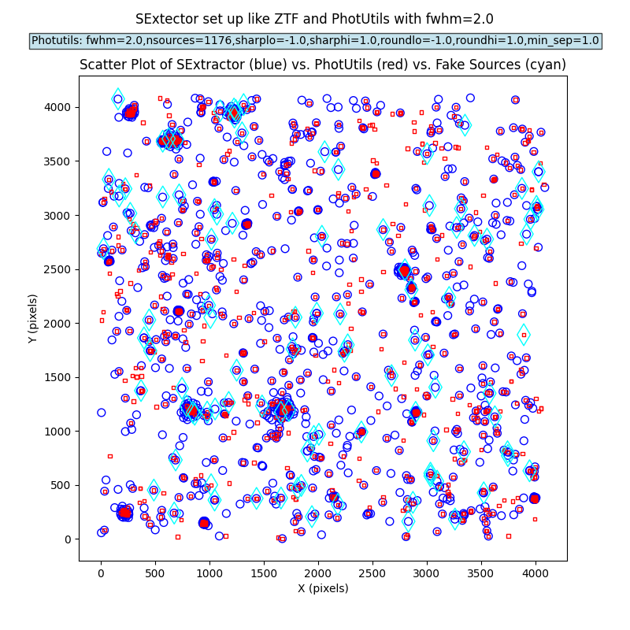
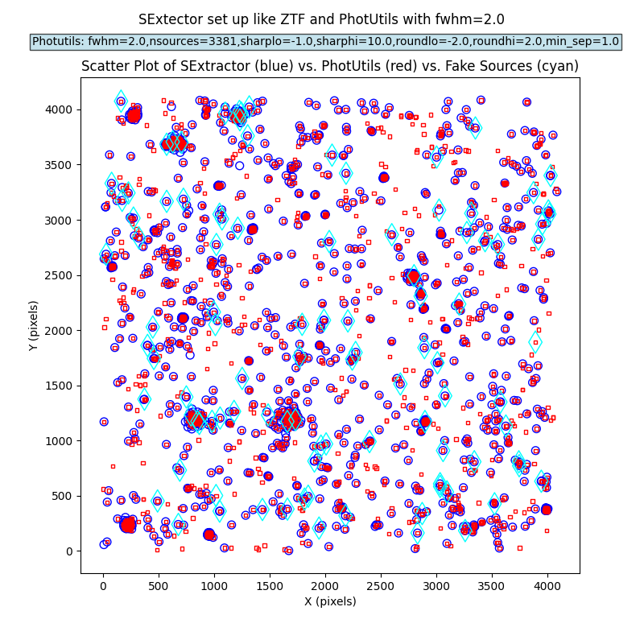

PhotUtils DAOStarFinder Parameter Study
####################################################

Overview
************************************

The analysis described below is for the purpose of understanding
the effects of varying PhotUtils DAOStarFinder input parameters.

Input Difference Image
************************************

ZOGY difference-image products are used.  Here is how to download the input files needed:

.. code-block::

    aws s3 cp s3://rapid-product-files/20250927/jid90828/bkg_subbed_science_image.fits .
    aws s3 cp s3://rapid-product-files/20250927/jid90828/diffimage_masked.fits .
    aws s3 cp s3://rapid-product-files/20250927/jid90828/scorrimage_masked.fits .
    aws s3 cp s3://rapid-product-files/20250927/jid90828/diffimage_uncert_masked.fits .
    aws s3 cp s3://rapid-product-files/20250927/jid90828/diffpsf.fits .
    aws s3 cp s3://rapid-product-files/20250927/jid90828/Roman_TDS_simple_model_Y106_124_5_lite_inject.txt .

Analysis Software
************************************

The following scripts are used to generate catalogs
from the above inputs and make plots (offline, on my laptop):

.. code-block::

    scripts/generate_sexcat.py
    scripts/generate_psfcat.py
    scripts/plot_detections.py

SExtractor Baseline for Comparison
************************************

The SExtractor configuration is similar to ZTF:

===============      ===================      =====================================================================
Parameter                Value                 Description
===============      ===================      =====================================================================
DEBLEND_NTHRESH           4                    Number of deblending sub-thresholds
DEBLEND_MINCONT           0.005                Minimum contrast parameter for deblending
DETECT_MINAREA            1                    Minimum number of pixels above threshold
DETECT_THRESH             5.0                  Detection threshold in number of sigmas
ANALYSIS_THRESH           5.0                  Analysis threshold in number of sigmas
===============      ===================      =====================================================================

The ZOGY scorr image is used for detection and the difference image for analysis.

This yields an SExtractor catalog with 1403 sources.

Fake sources were injected into the input image before ZOGY.  100 fake sources were injected.
In matching within 1.5 pixels, there were 59 matches between SExtractor source positions and fake source positions.

.. note::
    The ``XWIN_IMAGE, YWIN_IMAGE`` pixel coordinates are one-based indices, while the pixel coordinates
    of the fake-source truth list and PhotUtils PSF-fit catalog are zero-based indices.

PhotUtils DAOStarFinder Input-Parameter Variation
************************************

In all cases below, the input threshold is 5 times the clipped standard deviation
of the ZOGY difference image (multiplied by a Gaussian correction factor to account for the data clipping)::

    threshold = 0.2488752235542349

This is the same threshold that was used in the 20250927 test.

===== ==== ======= ======= ======= ======= ======= =========== =============================
Cases fwhm sharplo sharphi roundlo roundhi min_sep num_sources num_matches_with_fake_sources
===== ==== ======= ======= ======= ======= ======= =========== =============================
1     2.0  0.2     1.0     -1.0    1.0     0.0     989         51
2     2.0  -1.0    10.0    -1.0    1.0     0.0     1647        77
3     2.0  -1.0    10.0    -1.0    1.0     1.0     1867        78
4     2.0  -1.0    10.0    -1.0    1.0     2.0     1648        77
5     2.0  -1.0    1.0     -1.0    1.0     1.0     1176        53
6     2.0  -1.0    10.0    -2.0    2.0     1.0     3381        82
7     1.4  0.2     1.0     -1.0    1.0     0.0     1466        72
8     1.4  -1.0    10.0    -1.0    1.0     0.0     1886        77
9     1.0  0.2     1.0     -1.0    1.0     0.0     1707        72
10    1.0  -1.0    10.0    -1.0    1.0     0.0     1936        74
===== ==== ======= ======= ======= ======= ======= =========== =============================

Case #6 gave the largest number of PhotoUtils PSF-fit catalog sources and also the largest number of matches (82).

Plots for all of these cases are given below.

.. image:: sex_vs_psf_fwhm=2.0_sharplo=-1.0_sharphi=10.0_roundlo=-1.0_roundhi=1.0_min_sep=0.0.png
.. image:: sex_vs_psf_fwhm=2.0_sharplo=-1.0_sharphi=10.0_roundlo=-1.0_roundhi=1.0_min_sep=1.0.png
.. image:: sex_vs_psf_fwhm=2.0_sharplo=-1.0_sharphi=10.0_roundlo=-1.0_roundhi=1.0_min_sep=2.0.png

.. image:: sex_vs_psf_fwhm=1.4_sharplo=0.2_sharphi=1.0_roundlo=-1.0_roundhi=1.0_min_sep=0.0.png

.. image:: sex_vs_psf_fwhm=1.0_sharplo=0.2_sharphi=1.0_roundlo=-1.0_roundhi=1.0_min_sep=0.0.png
.. image:: sex_vs_psf_fwhm=1.0_sharplo=-1.0_sharphi=10.0_roundlo=-1.0_roundhi=1.0_min_sep=0.0.png

