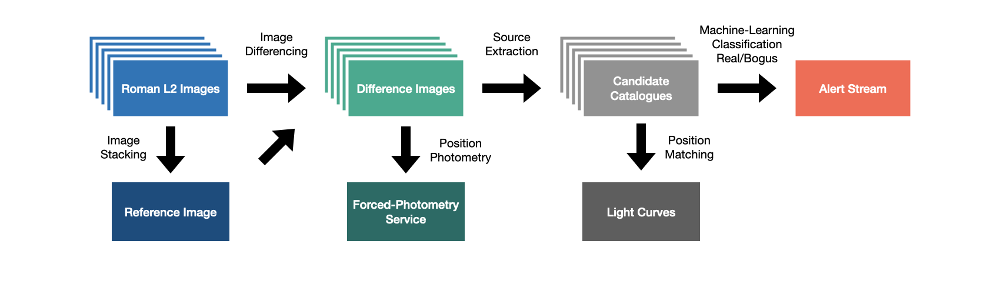
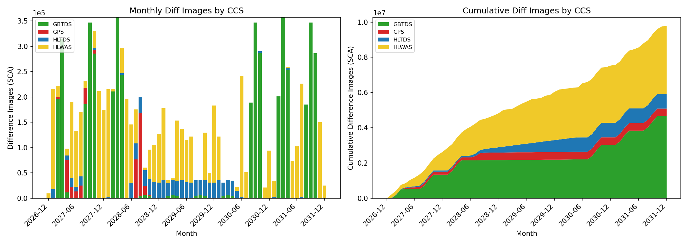
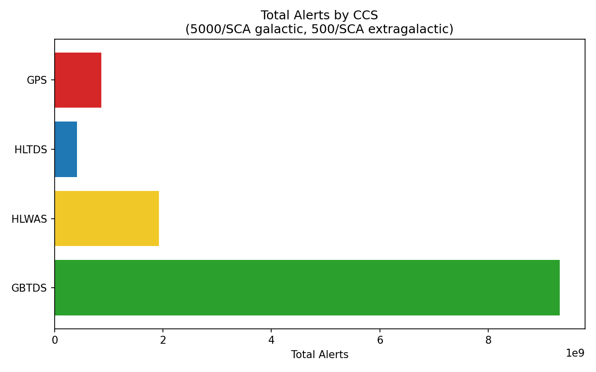
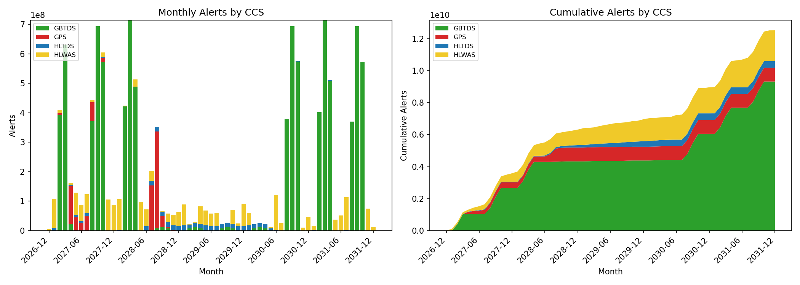
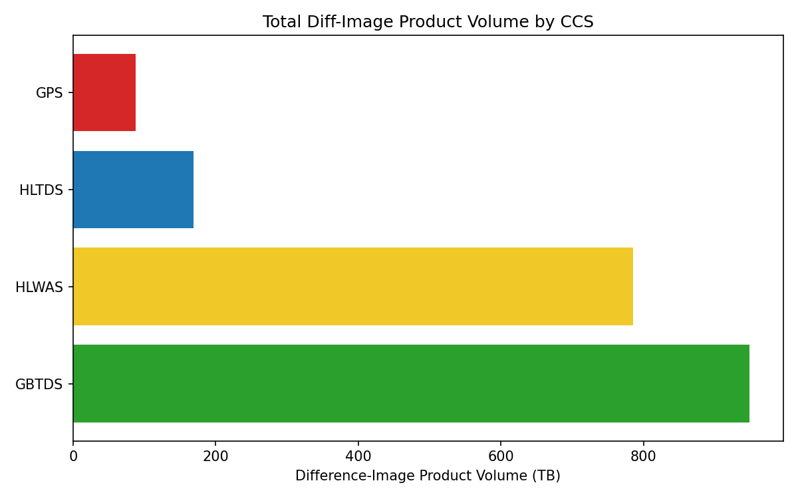
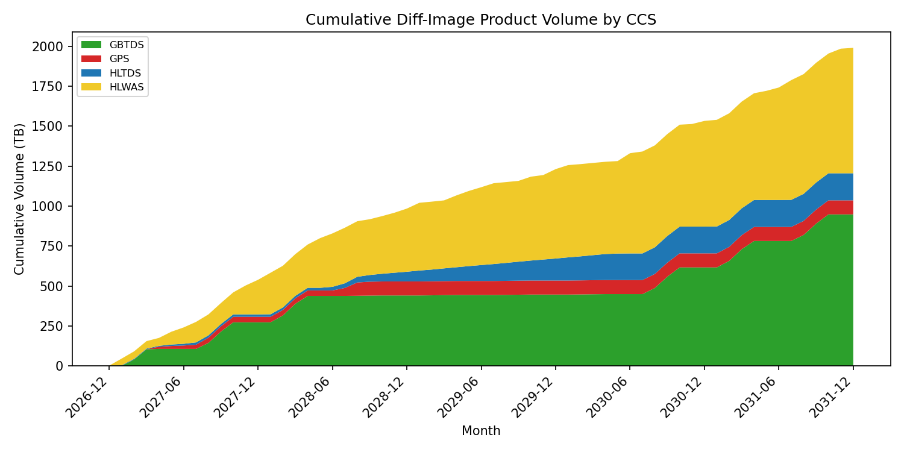
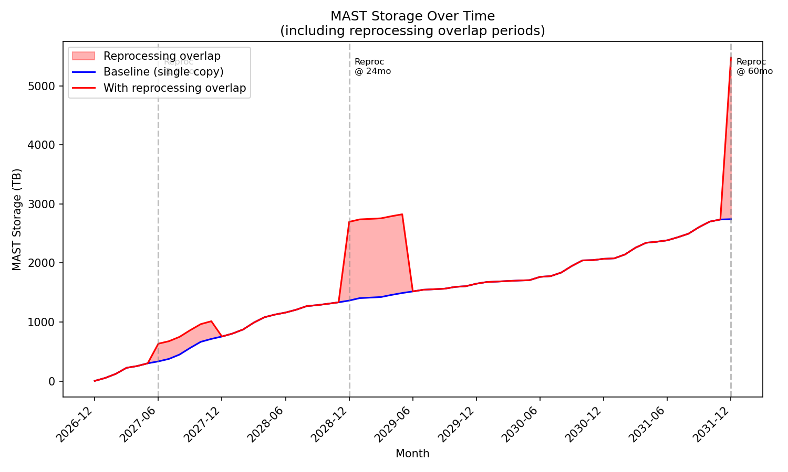
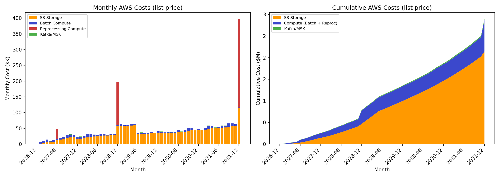

RAPID Archive Deliveries
####################################################

Introduction
************************************

RAPID (Roman Alerts Promptly from Image Differencing) delivers prompt time-domain products and services for the Nancy Grace Roman Space Telescope. The core products are:

* **Difference images** of every new WFI SCA image against a deep reference image
* **Public alert stream** of transient and variable candidates extracted from the difference images
* **Light curves** (source-matched photometry) for every candidate observed more than once
* **Forced photometry** at any observed sky location on request

The goal is to issue alerts within one hour of receiving L2 data from the SOC. Processing is continuous; time-critical products (alerts, difference images) are served directly by RAPID, while accumulated products are rolled up into monthly batch deliveries to the MAST archive.

Full pipeline documentation is available at `RAPID on ReadTheDocs <https://caltech-ipac-rapid.readthedocs.io/en/latest/>`_.

Assumptions and Open Items
************************************

The volume and cost estimates in this document rely on the following assumptions. Items marked *(TBD)* are open and may change the estimates materially.

* GRISM and PRISM (spectroscopic) exposures excluded; RAPID processes imaging modes only
* Observation plan based on the provisional Roman scheduled observations; detailed mission plan is TBD
* Reference images assumed to exist for all observed sky tiles and filters (upper bound on difference-image volume)
* Only ZOGY positive difference-image products delivered to MAST; SFFT, Naive, and negative images excluded
* Alert rates: 2,000 candidates/SCA for galactic surveys (GBTDS, GPS), 500/SCA for extragalactic (HLTDS, HLWAS) *(TBD: filtering thresholds, real/bogus classifier performance)*
* Alert packet size: 60 KB AVRO, consistent with Rubin/LSST estimates *(TBD: final RAPID alert schema and contents)*
* Product sizes measured from the 2026-02-27 pipeline test run (OpenUniverse simulated data)
* Image products converted from FITS to ASDF for MAST delivery; sizes may change slightly *(TBD: conversion pipeline)*
* AWS costs use public on-demand list pricing (us-east-1, March 2026); actual costs depend on negotiated rates
* Three full reprocessings at 6 months, 2 years, and end of mission with 6-month overlap periods *(TBD: reprocessing frequency and scope)*
* Galactic plane survey strategy and its impact on alert rates *(TBD)*
* RISE differencing of stacked images *(TBD)*
* HATS partitioning strategy for light-curve catalogs *(TBD)*
* Roman science product schema compliance for metadata *(TBD)*
* Sample file delivery to MAST required 6+ months before first data release *(TBD)*
* Documentation migration to MAST Confluence *(TBD)*

Processing Architecture
************************************

RAPID processes each of the 18 WFI SCA images from every exposure as an independent pipeline job. This per-SCA granularity enables massive parallelism under AWS Batch and defines the fundamental unit of data production: every volume estimate in this document scales with the number of SCA images processed. RAPID is currently developing under its own AWS account (us-west-2) but will transfer to NASA SMDC in us-east-1 for operations, co-located with the MAST archive infrastructure.

For a detailed description of the pipeline design, see :doc:`/pl/pl`. The :doc:`/sysarch/comp_arch` page describes the computing architecture, and :doc:`/ops/bulk_run` documents the step-by-step pipeline execution with performance benchmarks.

The pipeline produces products at several stages, each on a different timescale:

1. **Reference images** are built once sufficient coverage exists at a sky location for a given filter (see `Reference Images`_).
2. **Difference images** and candidate catalogs are produced for each new SCA image, provided a reference exists (see `Difference Images`_).
3. **Alert packets** are issued for candidates that pass quality filtering (see `Alerts`_).
4. **Light curves** are assembled by matching candidates across repeated observations (see `Light Curves`_).
5. **Forced photometry** is performed at user-requested sky locations (see `Forced-Photometry Service`_).

Observation Model
************************************

Volume estimates in this document are based on the provisional Roman scheduled observations (``consolidated_roman_scheduled_observations.csv``), which covers four Core Community Surveys (CCS) over a five-year nominal mission (2027--2031). RAPID does not process spectroscopic (GRISM/PRISM) exposures; these are excluded from all counts below.

.. list-table:: Mission Summary by CCS (imaging only, 2027--2031)
   :header-rows: 1
   :widths: 15 15 15 15

   * - Survey
     - Exposures
     - SCA Images
     - Filters
   * - GBTDS
     - 258,784
     - 4.66 M
     - 8
   * - HLWAS
     - 214,310
     - 3.86 M
     - 7
   * - HLTDS
     - 46,226
     - 832 K
     - 6
   * - GPS
     - 24,000
     - 432 K
     - 7
   * - **Total**
     - **543,320**
     - **9.78 M**
     -

Detailed calculations, monthly breakdowns, and an Excel workbook are produced by ``rapid_model.py`` in the project repository.

Data Products
************************************

Product Sizes
=============

Product sizes are measured from the 2026-02-27 pipeline test run using OpenUniverse simulated data. The pipeline currently generates products with three differencing methods (ZOGY, SFFT, Naive) in both positive and negative directions. For archive delivery to MAST, only **ZOGY positive** products are planned; SFFT and Naive products are retained internally for algorithm evaluation.

This reduces the per-SCA archive footprint from 816 MB (all methods, both directions) to **204 MB** (ZOGY positive only). The archive volume per SCA is dominated by three 64 MB FITS images (difference image, uncertainty map, and SCORR image), which together account for 99% of the per-SCA footprint. Catalogs and PSFs are negligible by comparison.

Product Inventory
=================

.. list-table:: Data Product Summary
   :header-rows: 1
   :widths: 11 17 7 7 7 7 5 5

   * - Category
     - Product
     - Unit Size
     - Total Count
     - Total Storage
     - Prompt / DR
     - Current
     - Delivery
   * - **Reference** (per tile/filter)
     - Image (7Kx7K coadd)
     - 190 MB
     - 126 K
     - 23 TB
     - DR
     - FITS
     - ASDF
   * -
     - Coverage map
     - 190 MB
     - 126 K
     - 23 TB
     - DR
     - FITS
     - ASDF
   * -
     - Uncertainty image
     - 190 MB
     - 126 K
     - 23 TB
     - DR
     - FITS
     - ASDF
   * -
     - Source catalog
     - 4 MB
     - 126 K
     - 0.6 TB
     - DR
     - Parquet
     - Parquet
   * -
     - PSF model
     - 37 KB
     - 126 K
     - 5 GB
     - DR
     - FITS
     - ASDF
   * -
     - *Subtotal*
     - *611 MB*
     -
     - *70 TB*
     -
     -
     -
   * -
     -
     -
     -
     -
     -
     -
     -
   * - **Difference** (per SCA image)
     - Difference image (ZOGY)
     - 64 MB
     - 9.8 M
     - 587 TB
     - Prompt
     - FITS
     - ASDF
   * -
     - Uncertainty map (ZOGY)
     - 64 MB
     - 9.8 M
     - 587 TB
     - Prompt
     - FITS
     - ASDF
   * -
     - SCORR image (ZOGY)
     - 64 MB
     - 9.8 M
     - 587 TB
     - Prompt
     - FITS
     - ASDF
   * -
     - Difference PSF
     - 29 KB
     - 9.8 M
     - 0.3 TB
     - Prompt
     - FITS
     - ASDF
   * -
     - Source catalogs
     - 3 MB
     - 9.8 M
     - 28 TB
     - Prompt
     - Parquet
     - Parquet
   * -
     - Science image PSF
     - 43 KB
     - 9.8 M
     - 0.5 TB
     - Prompt
     - FITS
     - ASDF
   * -
     - *Subtotal*
     - *195 MB*
     -
     - *1.76 PB*
     -
     -
     -
   * -
     -
     -
     -
     -
     -
     -
     -
   * - **Alerts**
     - Alert packets
     - 60 KB
     - 12.5 G
     - 0.75 PB
     - Prompt / DR
     - AVRO
     - AVRO
   * - **Catalogs**
     - Light curves
     - aggregated
     - 60
     - TBD
     - DR
     - Parquet
     - Parquet
   * -
     - Forced photometry
     - aggregated
     - 60
     - TBD
     - DR
     - Parquet
     - Parquet
   * -
     -
     -
     -
     -
     -
     -
     -
   * - **TOTAL**
     -
     -
     -
     - **2.8 PB**
     -
     -
     -

All products are delivered monthly (60 deliveries over 5 years). Reference products are data releases (DR); difference-image products are prompt. Alerts stream live via Kafka and are archived to MAST monthly.

A complete listing of all pipeline output files (including intermediate and debug products) is in :doc:`/prod/products`.

Reference Images
************************************

Reference images (templates, stacks) are coadds of all prior observations at a given sky location and filter. They are produced by ``awaicgen``, a C-code image coadder derived from the WISE mission, and serve as the baseline against which incoming images are differenced.

Key properties:

* **7000 x 7000 pixels** with buffer regions beyond the sky-tile boundary to ensure complete overlap with arbitrarily oriented science images
* Pixel scale matching individual WFI frames (0.11 arcsec/pixel), north-up orientation
* Fixed photometric zero point (MAGZP = 17.0 mag)
* Defined per **sky tile and filter** (Roman tessellation NSIDE=512, giving 6.3 million tiles), not per SCA --- images from any SCA or exposure that overlaps the tile contribute to the stack
* Quality assessed via the ``cov5percent`` metric and other measures stored in the :doc:`operations database </db/db>`

Each reference image is accompanied by a coverage map, an uncertainty image, a PSF model, and a PhotUtils PSF-fit source catalog.

For details of the tiling scheme and reference-image construction, see :doc:`/pl/pl`. For quality analysis of current reference images, see :doc:`/prod/products`.

Difference Images
************************************

Each incoming SCA image is differenced against the best available reference image for its sky tile and filter. One pipeline job processes one SCA image; each 18-SCA exposure therefore generates up to 18 independent jobs.

The pipeline currently evaluates three differencing methods:

* **ZOGY** --- the primary method, producing a difference image, SCORR (signal-to-noise) image, uncertainty map, and PSF model.
* **SFFT** --- cross-convolution subtraction, producing decorrelated and cross-convolved images.
* **Naive** --- simple pixel-by-pixel subtraction as a diagnostic baseline.

For each method, SourceExtractor and PhotUtils PSF-fit catalogs are generated from both positive and negative difference images. Gain-matching and sub-pixel alignment of the reference image are performed prior to differencing.

.. note::
   For archive delivery to MAST, only **ZOGY positive** difference-image products are planned. SFFT and Naive outputs are used internally for algorithm comparison and are excluded from the volume estimates in this document.

For details on the differencing algorithms and PSF handling, see :doc:`/pl/pl`. A complete listing of all difference-image products is in :doc:`/prod/products`.

Alerts
************************************

RAPID will follow community standards for transient alerts, packaging each event as an Apache AVRO record and publishing via Apache Kafka. The alert stream may be split into multiple Kafka *topics* based on survey, candidate type, or other criteria.

Kafka is a high-throughput messaging system optimized for streaming (hot) data. Alerts will expire from Kafka after a retention window; for long-term preservation, AVRO packets are collected into monthly tarballs and delivered to MAST.

Candidate Filtering
====================

Before alert generation, spurious detections are removed through a multi-stage filtering pipeline adapted from ZTF:

1. **Catalog-level cuts** --- edge distance, signal-to-noise ratio, source elongation, aperture flux ratios
2. **Pixel-level metrics** --- negative-pixel count, bad-pixel count, median-filter sum ratio on a 5x5 cutout
3. **PSF-fit quality cuts** --- reduced chi-squared of the PSF fit, aperture-vs-PSF magnitude consistency
4. **Machine-learning real/bogus classifier** using all features above plus reference-image metadata

Full details are in :doc:`/analyses/pipeline_evaluation_metrics/pipeline_evaluation_metrics`.

Estimated Alert Volume
=======================

Alert rates depend strongly on source density:

* **Galactic surveys** (GBTDS, GPS): 2,000 candidates per SCA image
* **Extragalactic surveys** (HLTDS, HLWAS): 500 candidates per SCA image

Over the five-year mission this yields an estimated **12.5 billion alerts** totaling **0.75 PB** at 60 KB per AVRO packet. The assumed packet size is consistent with the Rubin/LSST alert design, where uncompressed packets are up to 82 KB and gzip-compressed packets average 65 KB (`DMTN-102 <https://dmtn-102.lsst.io/>`_). The final RAPID alert schema is TBD and may differ in cutout stamp and history content. The GBTDS alone accounts for 74% of all alerts, driven by the high source density in the Galactic Bulge. Alert rates are strongly seasonal, following the bulge visibility windows.

.. raw:: html

    

Light Curves
************************************

RAPID builds light curves by cross-matching candidates from successive observations. The matching engine uses the Q3C spatial-indexing library in PostgreSQL with a match radius of 0.1 arcsec (one WFI pixel). Three database tables underpin the light-curve system:

* **Sources** --- individual detections from difference-image catalogs, partitioned by processing date and SCA
* **AstroObjects** --- unique astronomical objects, partitioned by Roman-tessellation sky tile
* **Merges** --- associations linking Sources to AstroObjects

In the 2025-09-27 large-scale test (2,000 SCA images), source matching produced 3.27 M AstroObjects and 58.9 M Merges records in 3.5 hours with 8 parallel processes, including cross-matching across field boundaries.

Light-curve data are stored in the PostgreSQL operations database and periodically exported to Apache Parquet for delivery to MAST. HATS partitioning for compatibility with LINCC is under evaluation.

See the Source Matching section of :doc:`/db/db` for details of the schema and partitioning strategy.

Forced-Photometry Service
************************************

A forced-photometry backend and ``cforcepsfaper`` C module have been developed (as of February 2026). There is demand for a similar service elsewhere within Roman, and collaboration on a shared tool is under discussion.

Based on ZTF experience, the service will require:

* A request-submission interface
* Job-queue and status-reporting infrastructure
* High-performance batch processing to amortize I/O across many requests
* A continuously updated cache of results for commonly requested sources and catalogs

Delivery Schedule
************************************

RAPID will deliver products to MAST on a **monthly** schedule, starting at the beginning of the nominal mission and continuing throughout the survey. Products are retained for a short validation window before each batch delivery. A regular monthly cadence keeps the process routine and predictable for both RAPID and MAST operations.

Each monthly delivery will include:

* New and updated reference images, coverage maps, uncertainty images, and catalogs
* All ZOGY positive difference images, SCORR images, uncertainty maps, PSFs, and catalogs produced since the previous delivery (one set per SCA image)
* Updated light-curve catalogs (Parquet export from the operations database)
* Archived alert packets (AVRO tarballs covering the preceding month)
* Forced-photometry results

Based on the provisional mission schedule, the estimated average monthly delivery is approximately **33 TB** of difference-image products, plus reference-image updates and alert-archive tarballs. The total mission archive volume is estimated at **2.8 PB**:

* 2.0 PB of difference-image products
* 0.75 PB of archived alert packets
* 0.1 PB of reference images and catalogs

.. raw:: html

    

Reprocessing
************************************

RAPID plans three full reprocessings during the mission:

* **6 months** --- incorporate improved calibrations and pipeline tuning from early operations
* **2 years** --- leverage accumulated reference images and refined algorithms at mid-mission
* **End of mission (5 years)** --- produce the definitive archive with final calibrations

Each reprocessing regenerates all products from the beginning of the mission. During a **6-month overlap period**, both old and new product versions coexist in MAST to allow validation and a smooth transition for archive users. After the overlap, the old versions are deleted.

The overlap effectively doubles the storage requirement at each reprocessing event:

* **Baseline final storage**: 2.7 PB (single copy of all products)
* **Peak at end-of-mission reprocessing**: 5.5 PB (old + new versions)
* The 2-year reprocessing peak reaches 2.6 PB (on a 1.3 PB baseline)

Products are versioned in the :doc:`operations database </db/db>` with a ``vbest`` flag indicating the current best version.

Estimated AWS Costs
************************************

The following cost estimates are based on public AWS on-demand pricing for the us-east-1 region (March 2026). All figures use list prices; a discount variable (``AWS_DISCOUNT``) is available in ``rapid_model.py`` for modeling negotiated or reserved-instance rates.

.. list-table:: AWS Cost Components
   :header-rows: 1
   :widths: 25 15 40

   * - Component
     - Pricing Basis
     - Notes
   * - S3 storage
     - $0.021--0.023/GB/month (tiered)
     - Includes reprocessing overlap periods where storage doubles
   * - Batch compute
     - $0.192/hr (m5.xlarge)
     - 4 vCPU, 16 GB; 8 min per science pipeline job, 1 min per post-processing job
   * - Reprocessing compute
     - Same instance rate
     - Full re-run of all SCA images at 6 months, 2 years, and end of mission
   * - Kafka/MSK
     - $0.21/hr per broker
     - 3 x kafka.m5.large brokers, running continuously

.. list-table:: 5-Year Mission Cost Summary (list price)
   :header-rows: 1
   :widths: 30 20

   * - Component
     - Cost
   * - S3 storage
     - $2.1 M
   * - Compute (Batch + Reprocessing)
     - $0.7 M
   * - Kafka/MSK
     - $28 K
   * - **TOTAL**
     - **$2.9 M**
   * - Average per month
     - $48 K
   * - Average per year
     - $571 K

S3 storage dominates (74% of total cost) and grows steadily as the archive accumulates. Compute costs are relatively modest for routine processing but spike during the three reprocessing events, particularly the end-of-mission reprocessing which re-runs all 9.8 M SCA images. Total 5-year cost is estimated at $2.9 M at list price. Kafka/MSK is a minor fixed cost.

These estimates exclude data transfer (egress) costs, database hosting (RDS/EC2 for PostgreSQL), and any operational overhead. Negotiated pricing, reserved instances, or Spot instances for Batch could reduce costs significantly.

Test Data Access
************************************

RAPID pipeline products from testing with OpenUniverse and RimTimSim simulated data are publicly available. See :doc:`/dev/tests` and :doc:`/prod/products` for full details.

The latest large-scale test run (processing date 2026-02-27) is accessible at:

* **Products:** ``https://rapid-product-files.s3.us-west-2.amazonaws.com/20260227/``
* **Logs:** ``https://rapid-pipeline-logs.s3.us-west-2.amazonaws.com/20260227/``
* **File listing:** available from the `products page <https://caltech-ipac-rapid.readthedocs.io/en/latest/prod/products.html>`_

Earlier test runs are available at the same bucket prefixes with their respective processing dates. See :doc:`/dev/tests` for a chronological listing of all test runs and associated pipeline improvements.
