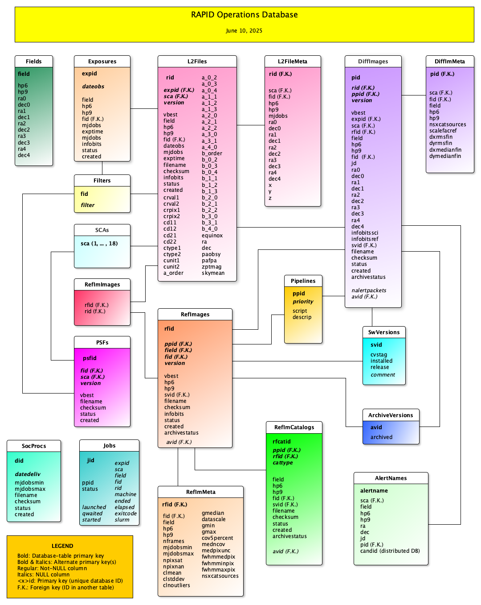

RAPID Operations Database
####################################################

Introduction
************************************

The RAPID pipeline utilizes a PostgreSQL database.  The Q3C library
has been installed as a plug-in for fast queries on sky position.

.. note::
    The database design described below is evolving and subject to change.

The database was built from source code and deployed on the
build machine using the following script:

.. code-block::

   /source-code/location/rapid/database/scripts/buildDatabase.sh

The database-schema files are located under the following path in the RAPID
git repository:

.. code-block::

   /source-code/location/rapid/database/schema

It includes SQL files to define datatabase tables, stored functions,
roles, grants, table spaces, and some basic database-table content.  It also
includes SQL files to drop tables and stored functions as a
convenience (which are not generally needed).

Schema
************************************

A diagram of the database-table schema is given as follows:

There are multiple provisions for indexing on sky position:

* Q3C indexing
* The field column in various tables stores the Roman tessellation index for the sky tile associated with sky position.
  For the RAPID project, the Roman-tessellation parameter setting NSIDE=512 will be used,
  which results in tile sizes somewhat smaller than that of a Roman SCA image,
  and a total of 6,291,458 tiles covering the entire sky.
* Healpix level-6 index (hp6), with an approximate resolution of 0.92 degrees (almost the width of the Roman WFI or 6 SCAs plus gaps).
  There are 49,152 level-6 indices.
* Healpix level-9 index (hp9), with an approximate resolution of 0.11 degrees (almost the width of a Roman SCA).
  There are 3,145,728 level-9 indices.

Record Versioning
************************************

L2 files, difference images, and reference images are versioned in their
respective database tables (L2Files, DiffImages, and RefImages), given by the version column.  The version
is also embedded in the filesystem paths of the corresponding data files.
The best version is given by vbest, a smallint table
column that stores 0 for not best, 1 for best that is usually the
latest version, or 2 if the version is locked.  It is a matter of
policy whether old versions will be kept in the filesystem and/or
database (these could be removed at will).

Sky-Position Queries Using Q3C Library Functions
************************************

The L2FileMeta and DiffImages database tables store the image centers
(ra0, dec0) and their four corners (rai, deci, i=1,...,4).
Database queries involving Q3C functions like the following can find all images that
overlap a given image and acquired before the image of interest,
such as the one with rid = 152336 (rid = L2File primary key), where the (ra, dec) values
below are for that image's center and four corners:

.. code-block::

    select rid, q3c_dist(ra0, dec0, 11.08126328627515, -43.824964752037445) as dist
    from l2filemeta
    where fid = 1                  -- Database ID for F184 filter from Filters table.
    and sca = 2
    and q3c_radial_query(ra0, dec0, 11.08126328627515, -43.824964752037445, 0.18)
    and (q3c_poly_query(ra1, dec1, array[11.136885386567164, -43.900893936840234, 11.185362398873613, -43.78197810436912,11.025782901132052, -43.749009077867875, 10.97701495473218, -43.86785677863402])
    or q3c_poly_query(ra2, dec2, array[11.136885386567164, -43.900893936840234, 11.185362398873613, -43.78197810436912,11.025782901132052, -43.749009077867875, 10.97701495473218, -43.86785677863402])
    or q3c_poly_query(ra3, dec3, array[11.136885386567164, -43.900893936840234, 11.185362398873613, -43.78197810436912,11.025782901132052, -43.749009077867875, 10.97701495473218, -43.86785677863402])
    or q3c_poly_query(ra4, dec4, array[11.136885386567164, -43.900893936840234, 11.185362398873613, -43.78197810436912,11.025782901132052, -43.749009077867875, 10.97701495473218, -43.86785677863402])
    or q3c_poly_query(ra0, dec0, array[11.136885386567164, -43.900893936840234, 11.185362398873613, -43.78197810436912,11.025782901132052, -43.749009077867875, 10.97701495473218, -43.86785677863402]))
    and mjdobs < 62146.911
    and rid != 152336
    order by dist;

Once the relevant rids are found, the filenames can be looked up as follows:

.. code-block::

    select rid,filename
    from l2files
    where rid in (152336, 232345, 172211)
    order by rid;

Reference-Image QA
************************************

The RefImMeta database table stores various QA measures for reference images.

+--------------------+-----------------------------------------------------------------------------------+
| Database column    | Definition                                                                        |
+====================+===================================================================================+
| nframes            | Number of input images in coadd stack                                             |
+--------------------+-----------------------------------------------------------------------------------+
| mjdobsmin          | Minimum MJD of input images in stack                                              |
+--------------------+-----------------------------------------------------------------------------------+
| mjdobsmax          | Maximum MJD of input images in stack                                              |
+--------------------+-----------------------------------------------------------------------------------+
| npixsat            | Number of saturated pixels in reference image                                     |
+--------------------+-----------------------------------------------------------------------------------+
| npixnan            | Number of NaN pixels in reference image                                           |
+--------------------+-----------------------------------------------------------------------------------+
| clmean             | Image pixel mean after 3-sigma data clipping [DN/s]                               |
+--------------------+-----------------------------------------------------------------------------------+
| clstddev           | Image pixel standard deviation after 3-sigma data clipping and reinflating [DN/s] |
+--------------------+-----------------------------------------------------------------------------------+
| clnoutliers        | Number of image pixels discarded in 3-sigma data clipping                         |
+--------------------+-----------------------------------------------------------------------------------+
| gmedian            | Global image pixel median [DN/s]                                                  |
+--------------------+-----------------------------------------------------------------------------------+
| datascale          | Global robust image pixel spread = 0.5*(p84-p16) [DN/s]                           |
+--------------------+-----------------------------------------------------------------------------------+
| gmin               | Global minimum image pixel value [DN/s]                                           |
+--------------------+-----------------------------------------------------------------------------------+
| gmax               | Global maximum image pixel value [DN/s]                                           |
+--------------------+-----------------------------------------------------------------------------------+
| cov5percent        | QA metric to measure coverage depth of at least 5 [percentage]                    |
+--------------------+-----------------------------------------------------------------------------------+
| medncov            | Median of corresponding depth-of-coverage image [count]                           |
+--------------------+-----------------------------------------------------------------------------------+
| medpixunc          | Median of corresponding uncertainty image) [DN/s]                                 |
+--------------------+-----------------------------------------------------------------------------------+
| fwhmmedpix         | Median of FWHM_IMAGE values in RefImage SourceExtractor catalog [pixels]          |
+--------------------+-----------------------------------------------------------------------------------+
| fwhmminpix         | Minimum of FWHM_IMAGE values in RefImage SourceExtractor catalog [pixels]         |
+--------------------+-----------------------------------------------------------------------------------+
| fwhmmaxpix         | Maximum of FWHM_IMAGE values in RefImage SourceExtractor catalog [pixels]         |
+--------------------+-----------------------------------------------------------------------------------+
| nsexcatsources     | Number of sources in RefImage SourceExtractor catalog                             |
+--------------------+-----------------------------------------------------------------------------------+

The quality-assurance metric ``cov5percent``, given by FITS keyword ``COV5PERC``,
is an absolute quantifier for the aggregate areal-depth coverage of a reference image at a
reference depth of 5, corresponding to a coadd depth of at least 5 input images.
It is computed from the reference-image coverage map.
It is defined as a percentage of the sum of the limited coverage of all pixels in an image,
where the limited coverage is all coverage and any coverage greater than 5 that is reset to 5
for scoring purposes, relative to 5 times the total number of pixels in the image.

Difference-Image QA
************************************

The DiffImMeta database table stores various QA measures for difference images.

+--------------------+-------------------------------------------------------------------------------------------+
| Database column    | Definition                                                                                |
+====================+===========================================================================================+
| nsxcatsources      | Number of SourceExtractor sources in difference-image catalog                             |
+--------------------+-------------------------------------------------------------------------------------------+
| scalefacref        | Gain-matching image-data scale factor for reference image w.r.t. science image            |
+--------------------+-------------------------------------------------------------------------------------------+
| dxrmsfin           | Final RMS of matched-isolated-source separations along x axis, fed to ZOGY [pixels]       |
+--------------------+-------------------------------------------------------------------------------------------+
| dyrmsfin           | Final RMS of matched-isolated-source separations along y axis, fed to ZOGY [pixels]       |
+--------------------+-------------------------------------------------------------------------------------------+
| dxmedianfin        | Final median of matched-isolated-source separations along x axis [pixels],                |
|                    | Used to orthogonally subpixel offset reference-image data for ZOGY alignment              |
+--------------------+-------------------------------------------------------------------------------------------+
| dymedianfin        | Final median of matched-isolated-source separations along y axis [pixels],                |
|                    | Used to orthogonally subpixel offset reference-image data for ZOGY alignment              |
+--------------------+-------------------------------------------------------------------------------------------+

