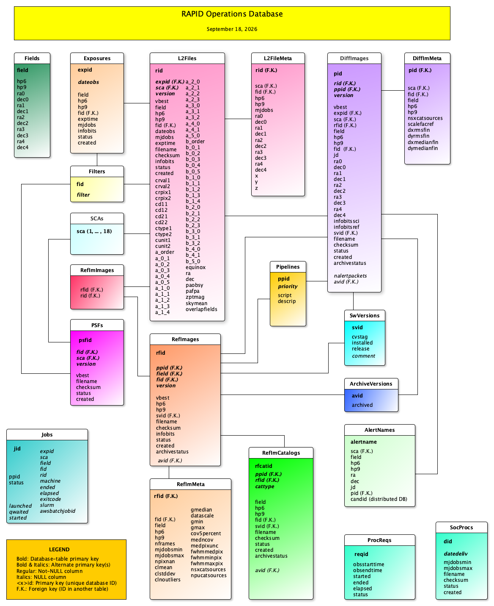
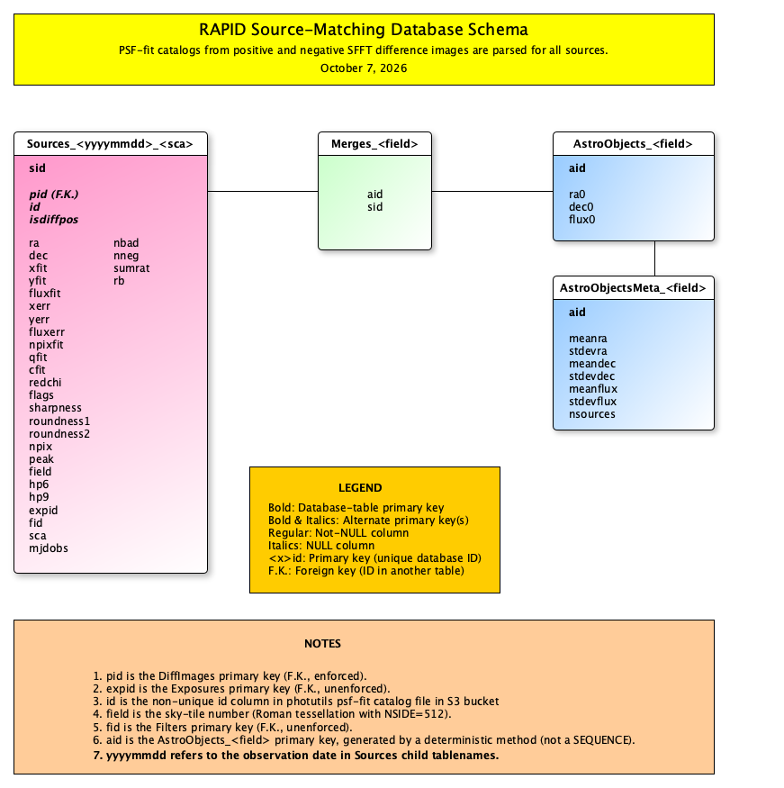

RAPID Operations Database
####################################################

Introduction
************************************

The RAPID pipeline uses a PostgreSQL database with the Q3C library
installed as a plug-in for fast sky-position queries.

.. note::
   This page describes the database design as built on the ``dev``
   branch and is evolving and subject to change. On the ``rebuild``
   branch, the schema is versioned SQL under
   ``database/migrations/`` in the RAPID git repository, applied in
   filename order by ``database/apply-migrations.sh``; see
   ``database/README.md`` for the rules and how to run the applier
   locally. ``dev``'s ``database/scripts/buildDatabase.sh`` and
   ``database/schema/`` are not carried on ``rebuild``.

Schema
************************************

The database-table schema is shown below:

Sky positions are indexed in several ways:

* Q3C indexing
* The field column in various tables stores the Roman tessellation index
  of the sky tile containing the position. RAPID will use the
  Roman-tessellation parameter NSIDE=512, giving 6,291,458 tiles across
  the sky, each somewhat smaller than a Roman SCA image.
* Healpix level-6 index (hp6): 49,152 indices with an approximate
  resolution of 0.92 degrees, almost the width of the Roman WFI
  (6 SCAs plus gaps).
* Healpix level-9 index (hp9): 3,145,728 indices with an approximate
  resolution of 0.11 degrees, almost the width of a Roman SCA.

The L2Files ``overlapfields`` int[] column lists the field numbers
overlapped by a Roman SCA image at its particular sky orientation.
The overlap algorithm omits fields with less than 25 pixels of overlap.

Record Versioning
************************************

L2 files, difference images, and reference images carry a version in
their respective tables (L2Files, DiffImages, and RefImages), in the
version column and in the corresponding data files' filesystem paths.
The smallint column vbest identifies the best version:

* 0: not best
* 1: best, usually the latest version
* 2: locked version

Policy determines whether old versions remain in the filesystem and/or
database; they can be removed at will.

Sky-Position Queries Using Q3C Library Functions
**********************************************

L2FileMeta and DiffImages store image centers (ra0, dec0) and four corners
(rai, deci, i=1,...,4). Q3C queries can find all images that overlap a
given image and were acquired before it. This example uses rid = 152336
(rid = L2File primary key); the (ra, dec) values are that image's center
and four corners:

.. code-block::

    select rid, q3c_dist(ra0, dec0, 11.08126328627515, -43.824964752037445) as dist
    from l2filemeta
    where fid = 1                  -- Database ID for F184 filter from Filters table.
    and sca = 2
    and q3c_radial_query(ra0, dec0, 11.08126328627515, -43.824964752037445, 0.18)
    and (q3c_poly_query(ra1, dec1, array[11.136885386567164, -43.900893936840234, 11.185362398873613, -43.78197810436912,11.025782901132052, -43.749009077867875, 10.97701495473218, -43.86785677863402])
    or q3c_poly_query(ra2, dec2, array[11.136885386567164, -43.900893936840234, 11.185362398873613, -43.78197810436912,11.025782901132052, -43.749009077867875, 10.97701495473218, -43.86785677863402])
    or q3c_poly_query(ra3, dec3, array[11.136885386567164, -43.900893936840234, 11.185362398873613, -43.78197810436912,11.025782901132052, -43.749009077867875, 10.97701495473218, -43.86785677863402])
    or q3c_poly_query(ra4, dec4, array[11.136885386567164, -43.900893936840234, 11.185362398873613, -43.78197810436912,11.025782901132052, -43.749009077867875, 10.97701495473218, -43.86785677863402])
    or q3c_poly_query(ra0, dec0, array[11.136885386567164, -43.900893936840234, 11.185362398873613, -43.78197810436912,11.025782901132052, -43.749009077867875, 10.97701495473218, -43.86785677863402]))
    and mjdobs < 62146.911
    and rid != 152336
    order by dist;

Use the relevant rids to look up filenames:

.. code-block::

    select rid,filename
    from l2files
    where rid in (152336, 232345, 172211)
    order by rid;

Reference-Image QA
************************************

RefImMeta stores reference-image QA measures:

+--------------------+-----------------------------------------------------------------------------------+
| Database column    | Definition                                                                        |
+====================+===================================================================================+
| nframes            | Number of input images in coadd stack                                             |
+--------------------+-----------------------------------------------------------------------------------+
| mjdobsmin          | Minimum MJD of input images in stack                                              |
+--------------------+-----------------------------------------------------------------------------------+
| mjdobsmax          | Maximum MJD of input images in stack                                              |
+--------------------+-----------------------------------------------------------------------------------+
| npixsat            | Number of saturated pixels in reference image                                     |
+--------------------+-----------------------------------------------------------------------------------+
| npixnan            | Number of NaN pixels in reference image                                           |
+--------------------+-----------------------------------------------------------------------------------+
| clmean             | Image pixel mean after 3-sigma data clipping [DN/s]                               |
+--------------------+-----------------------------------------------------------------------------------+
| clstddev           | Image pixel standard deviation after 3-sigma data clipping and reinflating [DN/s] |
+--------------------+-----------------------------------------------------------------------------------+
| clnoutliers        | Number of image pixels discarded in 3-sigma data clipping                         |
+--------------------+-----------------------------------------------------------------------------------+
| gmedian            | Global image pixel median [DN/s]                                                  |
+--------------------+-----------------------------------------------------------------------------------+
| datascale          | Global robust image pixel spread = 0.5*(p84-p16) [DN/s]                           |
+--------------------+-----------------------------------------------------------------------------------+
| gmin               | Global minimum image pixel value [DN/s]                                           |
+--------------------+-----------------------------------------------------------------------------------+
| gmax               | Global maximum image pixel value [DN/s]                                           |
+--------------------+-----------------------------------------------------------------------------------+
| cov5percent        | QA metric to measure coverage depth of at least 5 [percentage]                    |
+--------------------+-----------------------------------------------------------------------------------+
| medncov            | Median of corresponding depth-of-coverage image [count]                           |
+--------------------+-----------------------------------------------------------------------------------+
| medpixunc          | Median of corresponding uncertainty image) [DN/s]                                 |
+--------------------+-----------------------------------------------------------------------------------+
| fwhmmedpix         | Median of FWHM_IMAGE values in RefImage SourceExtractor catalog [pixels]          |
+--------------------+-----------------------------------------------------------------------------------+
| fwhmminpix         | Minimum of FWHM_IMAGE values in RefImage SourceExtractor catalog [pixels]         |
+--------------------+-----------------------------------------------------------------------------------+
| fwhmmaxpix         | Maximum of FWHM_IMAGE values in RefImage SourceExtractor catalog [pixels]         |
+--------------------+-----------------------------------------------------------------------------------+
| nsexcatsources     | Number of sources in RefImage SourceExtractor catalog                             |
+--------------------+-----------------------------------------------------------------------------------+

The quality-assurance metric ``cov5percent`` (FITS keyword ``COV5PERC``)
is an absolute measure of aggregate areal-depth coverage at a reference
depth of 5, corresponding to a coadd depth of at least 5 input images.
It is computed from the reference-image coverage map: cap each pixel's
coverage at 5, sum the capped values, and express the result as a
percentage of 5 times the total number of image pixels.

Difference-Image QA
************************************

DiffImMeta stores difference-image QA measures:

+--------------------+-------------------------------------------------------------------------------------------+
| Database column    | Definition                                                                                |
+====================+===========================================================================================+
| nsxcatsources      | Number of SourceExtractor sources in difference-image catalog                             |
+--------------------+-------------------------------------------------------------------------------------------+
| scalefacref        | Gain-matching image-data scale factor for reference image w.r.t. science image            |
+--------------------+-------------------------------------------------------------------------------------------+
| dxrmsfin           | Final measured RMS of matched-isolated-source separations along x axis [pixels]           |
+--------------------+-------------------------------------------------------------------------------------------+
| dyrmsfin           | Final measured RMS of matched-isolated-source separations along y axis [pixels]           |
+--------------------+-------------------------------------------------------------------------------------------+
| dxmedianfin        | Final median of matched-isolated-source separations along x axis [pixels],                |
|                    | used to orthogonally subpixel offset reference-image data for difference-image alignment  |
+--------------------+-------------------------------------------------------------------------------------------+
| dymedianfin        | Final median of matched-isolated-source separations along y axis [pixels],                |
|                    | used to orthogonally subpixel offset reference-image data for difference-image alignment  |
+--------------------+-------------------------------------------------------------------------------------------+

Source Matching
************************************

Four PostgreSQL tables support cross-matching sources from PSF-fit
catalogs made by the Python photutils package from SFFT difference
images, and curating source-extracted lightcurves. These methods are used
until a final decision on the best image-differencing and source-extraction
methods:

* Sources (extracted/selected from catalogs)
* AstroObjects (astronomical objects for which time-dependent sources form light curves)
* Merges (associations between Sources and AstroObjects via source cross-matching)
* AstroObjectsMeta (statistics on astronomical-object lightcurves added after source matching)

The source-matching schema is shown below:

Partitioning
============

The parent or prototype tables, Sources, Merges, AstroObjects, and
AstroObjectsMeta, contain no actual records. Records reside in child
tables, partitioned into manageable chunks:

* Sources child tables are created and named by observation date and SCA
  (time and chip number). Each can contain different fields, filters,
  and exposures. This balances parallel processing against table
  proliferation. Most sources to be matched are expected to be spurious;
  the scheme will need reassessment when source counts are better estimated.
* Merges, AstroObjects, and AstroObjectsMeta tables are created for each
  Roman-tessellation sky tile or field and named by field number. Objects
  and their source associations are therefore partitioned by sky position.

Inheritance can tie child tables to their parents; currently only
Sources uses it. Querying the Sources parent is the easiest way to
associate a source ID in Merges with a record in the correct child table.

Each AstroObjects_<field> record has a unique index, ``aid``, computed
deterministically rather than through a database sequence. The method
scales (ra, dec) to 1/3300-arcsecond precision and concatenates the scaled
coordinates. The result fits in an ``int64`` data type.

Source Loading and Attributes
=============================

PhotUtils-catalog source extractions are loaded into Sources in parallel,
in observation-date-time order, regardless of their bit-wise ``flags``
attribute.

RAPID makes PSF-fit catalogs for both positive difference images
("science image minus reference image") and negative difference images
("reference image minus science image"). The Sources boolean column
``isdiffpos`` records which extraction type produced each source.

The Sources float column ``rb`` stores real-bogus scores from a
Machine-Learning algorithm optimized for Roman WFI data. A score is a
fractional number in [0.0, 1.0] corresponding to the likelihood that the
source is real rather than bogus.

Cross-Matching
==============

The Q3C-library PostgreSQL extension's join function cross-matches Sources
and AstroObjects in the appropriate partitions. Matching considers only
sources with ``flags = 0`` and proceeds one observation at a time, across
all SCAs, in ascending observing-time order. Matches populate the
associated Merges tables; unmatched sources become new AstroObjects
records. The resulting records are loaded into Merges_<field> and
AstroObjects_<fields> tables.

Matching runs in parallel by field, using multiple database-server cores,
and extends across field boundaries for sources near field edges. The
architecture can scale by moving the database server to a machine with
more cores and memory, as affordable.

Lightcurve Statistics and Maintenance
=====================================

A separate process computes lightcurve statistics after cross-matching
and stores them in AstroObjectsMeta_<fields>. Its script drops and
recreates all AstroObjectsMeta_<fields> tables before computing and
inserting statistics, then explicitly vacuums and analyzes them at the end.

Reprocessing generates new product versions, usually with the latest
designated best. Separate processes remove not-best lightcurve data
points from Sources and Merges_<field>, then explicitly cluster, vacuum,
and analyze those tables.

SOC-Sim Test Results
====================

The 7/22/2026 test with SOC sims covered 360 different fields, using a
match radius of 0.055 arcsec, or half a Roman WFI pixel:

* ~250 million sources, regardless of ``flags`` value, were loaded into
  Sources_<yyyymmdd>_<sca> child tables in 1.3 hours with 8 parallel processes.
* ~198 million sources with ``flags = 0`` were cross-matched in
  35 minutes with 8 parallel processes.
* ~90 million AstroObjects records and 211,394,526 Merges records were
  loaded into PostgreSQL. Of those merges (a.k.a. lightcurve data points),
  33,223 came from cross-matching across field boundaries, where the match
  radius can extend across a boundary, increasing the merge count by 0.0157%.
* Computing statistics for ~90 million AstroObjects took 1.6 hours with
  8 parallel processes.
