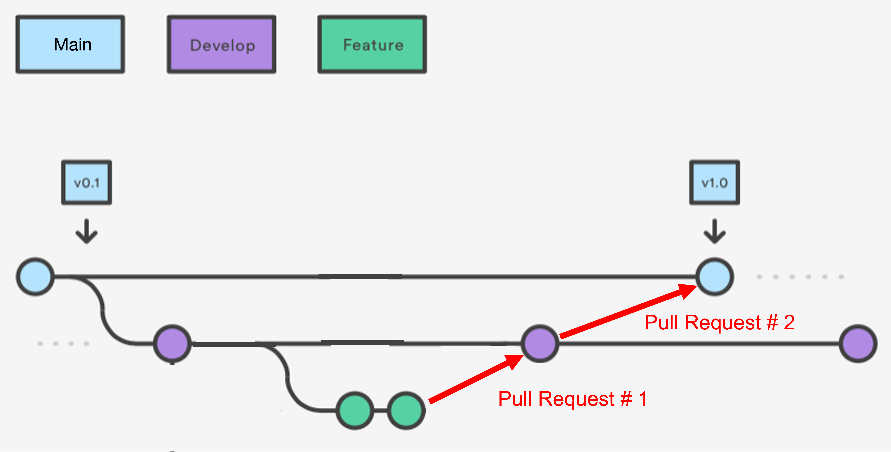

RAPID Pipeline Development
####################################################

Increasing AWS Cloud Limits
************************************

Submit a ticket to the IPAC Support Group (ISG) requesting an AWS increase
in the relevant limit for the RAPID project
(this involves Wendy submitting a ticket to AWS).

`ISG Request URL <https://jira.ipac.caltech.edu/servicedesk/customer/portal/4/>`_

Login with your IPAC credentials (not sure whether VPN must be running).

Development Guidelines
************************************

#. Set up your text editor to clip trailing spaces when saving source-code file
   (e.g., BBEdit has a setting that does this).

#. Ensure no tab characters are used for indentation in your Python code; use spaces always
   (e.g., BBEdit has a setting that does this).

#. Think strategically when pushing a source-code file to the git repo whether a simple git diff between revisions
   will allow a clear and unambiguous indication of the code changes.  For example, numerous stylistic changes can
   hide substantive changes that affect code behavior and should be deferred to a separate revision.

#. Before checking into the git repo modifications to someone else's source code,
   let that person know what to expect (and assure there is the expected level of trust beforehand).

#. Your git commits should have self-explanatory descriptive messages (saves time not having to review source code later for reports).

#. Always test code changes before the code is put into operations; the development is not done until
   the code changes have been tested.

#. Include a sufficiency of comments in your source code!

#. Remember to ``git pull`` before any ``git push`` and often, in order to make sure your RAPID git repo is up to date.

#. For exitcodes, we follow the Spitzer convention:

==============   ================
Exitcode range   Definition
==============   ================
[0,31]           Normal termination, with messages
[32,61]          Warnings
[64+]            Error
==============   ================

GitHub Merging, Branching, and Pull Requests
********************************************

This section describes the recommended git workflow for contributing to the
RAPID code base.

.. note::

   Pending approval of the team, we will be migrating to a ``dev`` branch
   workflow and **disabling direct pushes to** ``main``. Once this is in
   effect, all routine development will target ``dev``, and changes will
   reach ``main`` only through pull requests. The instructions
   below assume this workflow.

GitHub Branches
============================================

The RAPID repository follows a two-branch model:

* ``main`` — the stable, production branch. Direct pushes will be disabled;
  it is updated only via approved pull requests.
* ``dev`` — the active development branch. Day-to-day work lands here.

The general rule of thumb: **small changes can go straight to** ``dev``, while
**large changes or new features get their own branch** off ``dev`` and can be
merged back via a pull request. The diagram below illustrates the full flow:
a feature branch off ``dev``, two commits of work, a pull request merging the
feature back into ``dev``, and ``dev`` later merging into ``main``.

   Source: `Code/Astro Workshop <https://ciera.northwestern.edu/programs/code-astro/>`__

Small Changes
============================================

Small, low-risk changes (a bug fix, a comment, a one-line tweak) can be
pushed directly to ``dev``. The basic cycle is **pull, commit, push**:

.. code-block:: bash

   git pull
   git add <files>
   git commit -m "Describe your change"
   git push

If you have unsaved changes and ``git pull`` reports a
conflict, stash your changes, pull, then re-apply your stash:

.. code-block:: bash

   git stash
   git pull
   git stash pop

After ``git stash pop``, resolve any conflicts that git reports
(see merge conflicts, below), then commit and push as above.

If you have a local commit that conflicts with a pulled commit, causing
``git pull`` to fail:

.. code-block:: bash

   git pull --rebase

This will move HEAD to the latest commit from the remote branch and replay
your changes on top. Resolve the merge conflict (see below), and run:

.. code-block:: bash

   git add <files you want>
   git rebase --continue

Large Changes / Feature Additions
============================================

For larger changes or new features, create a dedicated branch off ``dev``
so that work-in-progress does not destabilize the shared branch.

Create a branch from ``dev``
--------------------------------------------

If you are already on ``dev``, create and switch to a new branch:

.. code-block:: bash

   git checkout -b my_branch
   # or
   git checkout -b my_branch dev # if you are on another branch

Then push the branch to GitHub and set it to track the remote, so that
future ``git push`` / ``git pull`` commands work without extra arguments:

.. code-block:: bash

   git push -u origin my_branch

After this, make commits as normal to your new branch.

Open a Pull Request back to ``dev``
--------------------------------------------

When you are done with your feature branch or have completed major changes,
open a pull request on GitHub to merge it into ``dev``:

1. Push your latest commits (``git push``).
2. On GitHub, navigate to the repository. A banner usually appears offering
   to **Compare & pull request** for your recently pushed branch — click it.
   Otherwise, go to the **Pull requests** tab and click **New pull request**.

   .. image:: pull_request_open.png
      :width: 600
      :alt: GitHub Compare & pull request banner

3. Set the **base** branch to ``dev`` and the **compare** branch to
   ``my_branch``. Double-check that the base is ``dev`` and **not** ``main``.
4. Give the PR a descriptive title and summary, then click
   **Create pull request**.

   .. image:: pull_request_create.png
      :width: 600
      :alt: Selecting base=dev and compare=my_branch

5. Request a reviewer if required, and address any review comments by
   pushing additional commits to ``my_branch`` (the PR updates
   automatically).
6. Once approved, click **Merge pull request** to merge into ``dev``.

   .. image:: pull_request_merge.png
      :width: 600
      :alt: Merge pull request button

Close the branch after merging (optional)
--------------------------------------------

Once the pull request is merged, if you are finished editing a particular
feature, delete the branch to keep the repository tidy. On GitHub, click the
**Delete branch** button shown on the merged pull request. To delete the
branch locally and on the remote from the command line:

.. code-block:: bash

   git checkout dev
   git pull
   git branch -d my_branch
   git push origin --delete my_branch

The ``git pull`` on ``dev`` brings in your just-merged changes. Use
``git branch -d`` (lowercase) to delete only a branch that has been fully
merged; ``git branch -D`` (uppercase) forces deletion of an unmerged
branch, so use it with care.

Merging changes from ``dev``
--------------------------------------------

If ``dev`` has moved ahead and you need those changes in your branch,
fetch the latest refs and merge ``dev`` into your branch:

.. code-block:: bash

   git fetch origin
   git merge origin/dev

Resolve any conflicts git reports, then commit the merge and push:

.. code-block:: bash

   git add <files>
   git commit
   git push

Resolving Merge Conflicts
============================================

A conflict happens when two changes touch the same lines of a file and git
cannot decide which to keep. This can come up after any of the operations
above. Git will report which files conflicted, for example::

   Auto-merging pipeline.py
   CONFLICT (content): Merge conflict in pipeline.py
   Automatic merge failed; fix conflicts and then commit the result.

You can always list the files that still need attention:

.. code-block:: bash

   git status

Conflicted files are shown under **"Unmerged paths"**.

Editing the conflict markers
--------------------------------------------

Open each conflicted file. Git inserts markers around the disagreeing
sections:

.. code-block:: text

   <<<<<<< HEAD
   your version of the lines
   =======
   the incoming version of the lines
   >>>>>>> origin/dev

The block above ``=======`` is your current branch's version (``HEAD``);
the block below is the incoming version (here, ``origin/dev``). Edit the
file so it contains exactly what you want the final result to be, and
**delete all three marker lines** (``<<<<<<<``, ``=======``, ``>>>>>>>``).

.. note::

   VS Code makes this easier: it highlights each conflict and offers
   **Accept Current Change**, **Accept Incoming Change**, **Accept Both
   Changes**, or **Compare Changes** buttons directly above the conflict.
   Click the one you want, or edit manually, then save the file.

Completing the merge
--------------------------------------------

Once a file looks correct, stage it to mark the conflict resolved, then
repeat for every conflicted file:

.. code-block:: bash

   git add <file>

When ``git status`` shows no remaining unmerged paths, finish the
operation:

* After a **merge** or **stash pop**, commit the result:

  .. code-block:: bash

     git commit

* After a **pull** that started a rebase, continue it instead:

  .. code-block:: bash

     git rebase --continue

Then push as usual.

Bailing out
--------------------------------------------

If things get tangled and you want to start over, you can abort and return
to the state before the operation began:

.. code-block:: bash

   git merge --abort      # during a conflicted merge
   git rebase --abort     # during a conflicted rebase

If you applied a stash with ``git stash pop`` and want to undo it, note that
``pop`` removes the stash once applied; use ``git stash apply`` instead when
you want to keep the stash entry around as a safety net while resolving.

Log into EC2 Instance Machine
********************************************

This assumes you have already set up an EC2 instance under the AWS console, and that the EC2 instance is stopped.
Also, a key pair has been assigned to the EC2 instance, and the private key is installed in a ``.pem`` file on your laptop.

1. Ensure the following environment variables are set on your laptop:

.. code-block::

   AWS_DEFAULT_REGION
   AWS_SECRET_ACCESS_KEY
   AWS_EC2_INSTANCE_ID
   AWS_ACCESS_KEY_ID
   AWS_EC2_VOLUME_ID
   AWS_EC2_VOLUME_DEVICE

The two latter ones are only needed if your EC2 instance is to have an EBS volume attached.

Your EC2 instance should have a large enough book-disk volume as ``docker build`` requires a lot of space; at least 32 GB is recommended.

2. Ensure python3 is installed on your laptop and restart your EC2 instance:

.. code-block::

   python /source-code/location/rapid/aws/start_ec2_instance.py

Here is how to stop your EC2 instance later:

.. code-block::

   python /source-code/location/rapid/aws/stop_ec2_instance.py

3. Log into your EC2 instance:

.. code-block::

   ssh -i ~/.ssh/my_ec2.pem ubuntu@ec2-54-212-213-65.us-west-2.compute.amazonaws.com

Build Docker Image for RAPID Science Pipeline
*********************************************

Check your latest source-code changes into the RAPID git repo.

Under root on your EC2 instance, check out the latest source code from the RAPID git repo,
and then build the Docker image for the RAPID pipeline:

.. code-block::

   sudo su
   cd /home/ubuntu/rapid
   git pull

The following command removes ALL Docker images from your EC2 instance,
but has the advantage of removing all Docker debris from the boot-disk volume,
thus reclaiming disk space:

.. code-block::

   docker system prune -a -f

.. warning::

   The above ``docker system prune`` command and the ``docker build`` command below will not work properly or as intended,
   meaning the expected disk space will not be reclaimed,
   unless all containers running the Docker image ``rapid_science_pipeline:1.0`` are stopped!

Here is how to get a listing of your Docker containers that are running:

.. code-block::

   docker ps

Here is how to get a listing of your Docker images:

.. code-block::

   docker image ls

Rebuild the Docker image from scratch:

.. code-block::

   cd /home/ubuntu/rapid
   docker build --build-arg RAPID_BRANCH=<current branch> --file /home/ubuntu/rapid/docker/Dockerfile_ubuntu_runSingleSciencePipeline --tag rapid_science_pipeline:1.0 .

Push Docker image to the Amazon public elastic container registry (ECR):

Note that the RAPID-pipeline image has already been registered at

.. code-block::

   public.ecr.aws/y9b1s7h8/rapid_science_pipeline

and so this step involves simply updating the Docker image in the registry.

Authenticate your Docker client to the registry as follows:

.. code-block::

   aws ecr-public get-login-password --region us-east-1 | docker login --username AWS --password-stdin public.ecr.aws/y9b1s7h8

Now get the Docker image ID as follows:

.. code-block::

   docker image ls

The response will be something like:

.. code-block::

   REPOSITORY               TAG       IMAGE ID       CREATED         SIZE
   rapid_science_pipeline   1.0       a76b1373bfe2   6 minutes ago   2.36GB

Tag the Docker image with "latest" and push to ECR with these two commands:

.. code-block::

   docker tag a76b1373bfe2 public.ecr.aws/y9b1s7h8/rapid_science_pipeline:latest
   docker push public.ecr.aws/y9b1s7h8/rapid_science_pipeline:latest

Running an Instance of the RAPID Science Pipeline under AWS Batch
*****************************************************************

The following shows commands to launch an instance of the RAPID science pipeline as AWS Batch job.
The to-be-run-under-AWS-Batch Docker container rapid_science_pipeline:1.0 has /code built in,
so there is no need to mount an external volume for /code.
The container name is arbitrary, and is set to "russ-test-jobsubmit" in the example below.
Since this Docker image contains the ENTRYPOINT instruction, you must override it  with the ``--entrypoint bash`` option
(and do not put ``bash`` at the end of the command).

.. code-block::

   mkdir -p /home/ubuntu/work/test_20250314
   cd /home/ubuntu/work/test_20250314
   aws s3 cp s3://rapid-pipeline-files/roman_tessellation_nside512.db /home/ubuntu/work/test_20250314/roman_tessellation_nside512.db

   sudo su

   docker stop russ-test-jobsubmit
   docker rm russ-test-jobsubmit

   docker run -it --entrypoint bash --name russ-test-jobsubmit -v /home/ubuntu/work/test_20250314:/work public.ecr.aws/y9b1s7h8/rapid_science_pipeline:latest

   export DBPORT=5432
   export DBNAME=rapidopsdb
   export DBUSER=rapidporuss
   export DBSERVER=35.165.53.98
   export DBPASS="????"
   export AWS_DEFAULT_REGION=us-west-2
   export AWS_SECRET_ACCESS_KEY=????
   export AWS_ACCESS_KEY_ID=????
   export LD_LIBRARY_PATH=/code/c/lib
   export PATH=/code/c/bin:$PATH
   export export RAPID_SW=/code
   export export RAPID_WORK=/work
   export PYTHONPATH=/code
   export PYTHONUNBUFFERED=1

   git config --global --add safe.directory /code

   cd /tmp
   export ROMANTESSELLATIONDBNAME=/work/roman_tessellation_nside512.db
   export RID=172211
   python3.11 /code/pipeline/awsBatchSubmitJobs_launchSingleSciencePipeline.py

   exit

Python 3.11 is required and it is installed inside the Docker image (/usr/bin/python3.11).

After the AWS Batch job finishes, there are files written to S3 buckets that can be examined:

.. code-block::

   aws s3 ls --recursive s3://rapid-pipeline-files/20250314/ | grep jid1\\.

   2025-03-14 11:22:33       3784 20250314/input_images_for_refimage_jid1.csv
   2025-03-14 11:22:33      14307 20250314/job_config_jid1.ini

.. code-block::

   aws s3 ls --recursive s3://rapid-pipeline-logs/20250314/ | grep jid1_

   2025-03-14 11:28:38     207277 20250314/rapid_pipeline_job_20250314_jid1_log.txt

.. code-block::

   aws s3 ls --recursive s3://rapid-product-files/20250314/jid1/

   2025-03-14 11:24:03   21813719 20250314/jid1/Roman_TDS_simple_model_F184_1856_2_lite.fits.gz
   2025-03-14 11:26:59   66888000 20250314/jid1/Roman_TDS_simple_model_F184_1856_2_lite_reformatted.fits
   2025-03-14 11:27:01   66888000 20250314/jid1/Roman_TDS_simple_model_F184_1856_2_lite_reformatted_pv.fits
   2025-03-14 11:27:00   66888000 20250314/jid1/Roman_TDS_simple_model_F184_1856_2_lite_reformatted_unc.fits
   2025-03-14 11:26:14  196004160 20250314/jid1/awaicgen_output_mosaic_cov_map.fits
   2025-03-14 11:27:03   66890880 20250314/jid1/awaicgen_output_mosaic_cov_map_resampled.fits
   2025-03-14 11:26:36  196007040 20250314/jid1/awaicgen_output_mosaic_image.fits
   2025-03-14 11:27:02   66890880 20250314/jid1/awaicgen_output_mosaic_image_resampled.fits
   2025-03-14 11:28:34  133770240 20250314/jid1/awaicgen_output_mosaic_image_resampled_gainmatched.fits
   2025-03-14 11:27:17    1248727 20250314/jid1/awaicgen_output_mosaic_image_resampled_refgainmatchsexcat.txt
   2025-03-14 11:26:30    3465552 20250314/jid1/awaicgen_output_mosaic_refimsexcat.txt
   2025-03-14 11:26:43  196007040 20250314/jid1/awaicgen_output_mosaic_uncert_image.fits
   2025-03-14 11:27:04   66890880 20250314/jid1/awaicgen_output_mosaic_uncert_image_resampled.fits
   2025-03-14 11:28:33   66890880 20250314/jid1/bkg_subbed_science_image.fits
   2025-03-14 11:27:17     436195 20250314/jid1/bkg_subbed_science_image_scigainmatchsexcat.txt
   2025-03-14 11:28:30   66890880 20250314/jid1/diffimage_masked.fits
   2025-03-14 11:28:32     148657 20250314/jid1/diffimage_masked.txt
   2025-03-14 11:28:36     216901 20250314/jid1/diffimage_masked_psfcat.txt
   2025-03-14 11:28:36   66885120 20250314/jid1/diffimage_masked_psfcat_residual.fits
   2025-03-14 11:28:31   66888000 20250314/jid1/diffimage_uncert_masked.fits
   2025-03-14 11:28:32      28800 20250314/jid1/diffpsf.fits
   2025-03-14 09:19:39   66853440 20250314/jid1/refiminputs/Roman_TDS_simple_model_F184_1087_7_lite_reformatted.fits
   2025-03-14 09:19:51   66853440 20250314/jid1/refiminputs/Roman_TDS_simple_model_F184_1087_7_lite_reformatted_unc.fits
   2025-03-14 09:19:43   66853440 20250314/jid1/refiminputs/Roman_TDS_simple_model_F184_1087_8_lite_reformatted.fits
   2025-03-14 09:19:56   66853440 20250314/jid1/refiminputs/Roman_TDS_simple_model_F184_1087_8_lite_reformatted_unc.fits
   2025-03-14 09:19:42   66853440 20250314/jid1/refiminputs/Roman_TDS_simple_model_F184_1476_11_lite_reformatted.fits
   2025-03-14 09:19:55   66853440 20250314/jid1/refiminputs/Roman_TDS_simple_model_F184_1476_11_lite_reformatted_unc.fits
   2025-03-14 09:19:34   66853440 20250314/jid1/refiminputs/Roman_TDS_simple_model_F184_1476_14_lite_reformatted.fits
   2025-03-14 09:19:46   66853440 20250314/jid1/refiminputs/Roman_TDS_simple_model_F184_1476_14_lite_reformatted_unc.fits
   2025-03-14 09:19:41   66853440 20250314/jid1/refiminputs/Roman_TDS_simple_model_F184_1481_16_lite_reformatted.fits
   2025-03-14 09:19:54   66853440 20250314/jid1/refiminputs/Roman_TDS_simple_model_F184_1481_16_lite_reformatted_unc.fits
   2025-03-14 09:19:35   66853440 20250314/jid1/refiminputs/Roman_TDS_simple_model_F184_317_9_lite_reformatted.fits
   2025-03-14 09:19:47   66853440 20250314/jid1/refiminputs/Roman_TDS_simple_model_F184_317_9_lite_reformatted_unc.fits
   2025-03-14 09:19:38   66853440 20250314/jid1/refiminputs/Roman_TDS_simple_model_F184_322_2_lite_reformatted.fits
   2025-03-14 09:19:50   66853440 20250314/jid1/refiminputs/Roman_TDS_simple_model_F184_322_2_lite_reformatted_unc.fits
   2025-03-14 09:19:37   66853440 20250314/jid1/refiminputs/Roman_TDS_simple_model_F184_322_3_lite_reformatted.fits
   2025-03-14 09:19:49   66853440 20250314/jid1/refiminputs/Roman_TDS_simple_model_F184_322_3_lite_reformatted_unc.fits
   2025-03-14 09:19:40   66853440 20250314/jid1/refiminputs/Roman_TDS_simple_model_F184_327_14_lite_reformatted.fits
   2025-03-14 09:19:53   66853440 20250314/jid1/refiminputs/Roman_TDS_simple_model_F184_327_14_lite_reformatted_unc.fits
   2025-03-14 09:19:36   66853440 20250314/jid1/refiminputs/Roman_TDS_simple_model_F184_327_15_lite_reformatted.fits
   2025-03-14 09:19:48   66853440 20250314/jid1/refiminputs/Roman_TDS_simple_model_F184_327_15_lite_reformatted_unc.fits
   2025-03-14 09:19:31   66853440 20250314/jid1/refiminputs/Roman_TDS_simple_model_F184_702_8_lite_reformatted.fits
   2025-03-14 09:19:44   66853440 20250314/jid1/refiminputs/Roman_TDS_simple_model_F184_702_8_lite_reformatted_unc.fits
   2025-03-14 09:19:32   66853440 20250314/jid1/refiminputs/Roman_TDS_simple_model_F184_707_1_lite_reformatted.fits
   2025-03-14 09:19:45   66853440 20250314/jid1/refiminputs/Roman_TDS_simple_model_F184_707_1_lite_reformatted_unc.fits
   2025-03-14 09:19:57        682 20250314/jid1/refiminputs/refimage_sci_inputs.txt
   2025-03-14 09:19:57        730 20250314/jid1/refiminputs/refimage_unc_inputs.txt
   2025-03-14 11:28:32   66890880 20250314/jid1/scorrimage_masked.fits

The general scheme for how the output files are organized in the S3 buckets is according to
processing date (Pacific Time) and the associated job ID.  The same job ID can exist under
different processing dates if reprocessing occurred on different dates (reprocessing on the same date will overwrite products).

The files under ``refiminputs`` are only written if the ``upload_inputs`` flag in the software is set to True.  These are for
off-line analysis and rerunning awaicgen for experimental and tuning purposes.

The reference-image products from ``awaicgen``
are initially given generic filenames in these buckets, and, later, will be renamed to filenames like:

.. code-block::

   rapid_field1234567_fid7_ppid15_v2_rfid12394758_refimage.fits
   rapid_field1234567_fid7_ppid15_v2_rfid12394758_covmap.fits

The above filenames are created after these products are registered in the RAPID pipeline operations database.
The products are then copied to
a more permanent location (and ultimately archived in MAST).  The ``ppid`` gives the pipeline number
that generated the reference image, which could be either the difference-image pipeline (``ppid=15``)
or a dedicated reference-image pipeline (``ppid=12``).

Download and examine log file:

.. code-block::

   aws s3 cp s3://rapid-pipeline-logs/20250314/rapid_pipeline_job_20250314_jid1_log.txt rapid_pipeline_job_20250314_jid1_log.txt
   cat rapid_pipeline_job_20250314_jid1_log.txt

Last modified: Tue 2026 Jun 16 8:48 a.m.

