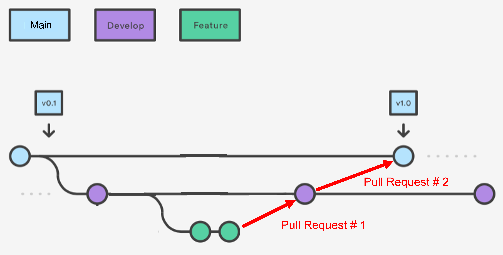

RAPID Pipeline Development
####################################################

Increasing AWS Cloud Limits
************************************

Submit a ticket to the IPAC Support Group (ISG) requesting an increase in
the relevant AWS limit for RAPID. Wendy then submits a ticket to AWS.

`ISG Request URL <https://jira.ipac.caltech.edu/servicedesk/customer/portal/4/>`_

Log in with your IPAC credentials; whether VPN must be running is uncertain.

Development Guidelines
************************************

#. Configure your editor to remove trailing spaces on save and use spaces,
   never tabs, for Python indentation. BBEdit has settings for both.

#. Keep revision diffs clear and unambiguous. Put extensive stylistic
   changes in a separate revision so they do not hide behavior changes.

#. Before committing changes to someone else's code, establish the expected
   level of trust and tell the author what to expect.

#. Write descriptive, self-explanatory commit messages so reports do not
   require rereading the source code.

#. Test changes before putting code into operations. Development is not
   complete until the changes have been tested.

#. Include enough source-code comments.

#. Run ``git pull`` often and before every ``git push`` to keep your RAPID
   git repo up to date.

Exitcodes follow the Spitzer convention:

==============   =================================
Exitcode range   Definition
==============   =================================
[0,31]           Normal termination, with messages
[32,61]          Warnings
[64+]            Error
==============   =================================

GitHub Merging, Branching, and Pull Requests
********************************************

.. note::

   Migration to a ``dev`` branch workflow and **disabling direct pushes to**
   ``main`` are pending team approval. Once in effect, routine development
   will target ``dev``, and changes will reach ``main`` only through pull
   requests. The recommended contribution workflow below assumes this model.

GitHub Branches
============================================

The RAPID repository follows a two-branch model:

* ``main``: the stable, production branch. Direct pushes will be disabled;
  it is updated only via approved pull requests.
* ``dev``: the active development branch. Day-to-day work lands here.

**Small changes can go straight to** ``dev``; **large changes or new features
get their own branch** off ``dev`` and can merge back through a pull request.
The diagram shows a feature branch off ``dev``, two commits, a pull request
back into ``dev``, and a later merge of ``dev`` into ``main``.

   Source: `Code/Astro Workshop <https://ciera.northwestern.edu/programs/code-astro/>`__

Small Changes
============================================

Small, low-risk changes (a bug fix, a comment, a one-line tweak) can be
pushed directly to ``dev``. The basic cycle is **pull, commit, push**:

.. code-block:: bash

   git pull
   git add <files>
   git commit -m "Describe your change"
   git push

If ``git pull`` reports a conflict with unsaved changes, stash them, pull,
then re-apply the stash:

.. code-block:: bash

   git stash
   git pull
   git stash pop

After ``git stash pop``, resolve any conflicts (see Resolving Merge
Conflicts below), then commit and push as above.

If ``git pull`` fails because a local commit conflicts with a pulled commit:

.. code-block:: bash

   git pull --rebase

This moves HEAD to the remote branch's latest commit and replays your
changes on top. Resolve the conflict (see Resolving Merge Conflicts below),
then run:

.. code-block:: bash

   git add <files you want>
   git rebase --continue

Large Changes / Feature Additions
============================================

Use a dedicated branch off ``dev`` for larger changes or new features to
keep work-in-progress from destabilizing the shared branch.

Create a branch from ``dev``
--------------------------------------------

If you are already on ``dev``, create and switch to a new branch:

.. code-block:: bash

   git checkout -b my_branch
   # or
   git checkout -b my_branch dev # if you are on another branch

Push to GitHub and enable remote tracking so future ``git push`` /
``git pull`` commands need no extra arguments:

.. code-block:: bash

   git push -u origin my_branch

Commit to the new branch as usual.

Open a Pull Request back to ``dev``
--------------------------------------------

When the feature or major changes are complete, open a GitHub pull request
to merge the branch into ``dev``:

1. Push your latest commits (``git push``).
2. In the GitHub repository, click the **Compare & pull request** banner
   that usually appears for a recently pushed branch. Otherwise, open
   **Pull requests** and click **New pull request**.

   .. image:: pull_request_open.png
      :width: 600
      :alt: GitHub Compare & pull request banner

3. Set the **base** branch to ``dev`` and the **compare** branch to
   ``my_branch``. Double-check that the base is ``dev`` and **not** ``main``.
4. Give the PR a descriptive title and summary, then click
   **Create pull request**.

   .. image:: pull_request_create.png
      :width: 600
      :alt: Selecting base=dev and compare=my_branch

5. Request a reviewer if required, and address any review comments by
   pushing additional commits to ``my_branch`` (the PR updates
   automatically).
6. Once approved, click **Merge pull request** to merge into ``dev``.

   .. image:: pull_request_merge.png
      :width: 600
      :alt: Merge pull request button

Close the branch after merging (optional)
--------------------------------------------

After merging, delete the branch if work on the feature is finished.
On GitHub, click **Delete branch** on the merged pull request. To delete
it locally and remotely from the command line:

.. code-block:: bash

   git checkout dev
   git pull
   git branch -d my_branch
   git push origin --delete my_branch

The ``git pull`` on ``dev`` brings in your just-merged changes. Use
``git branch -d`` (lowercase) to delete only a branch that has been fully
merged; ``git branch -D`` (uppercase) forces deletion of an unmerged
branch, so use it with care.

Merging changes from ``dev``
--------------------------------------------

If ``dev`` has moved ahead and you need those changes in your branch,
fetch the latest refs and merge ``dev`` into your branch:

.. code-block:: bash

   git fetch origin
   git merge origin/dev

Resolve any conflicts git reports, then commit the merge and push:

.. code-block:: bash

   git add <files>
   git commit
   git push

Resolving Merge Conflicts
============================================

A conflict occurs when changes touch the same lines and git cannot choose
which to keep. Any operation above can cause one. Git reports the affected
files, for example::

   Auto-merging pipeline.py
   CONFLICT (content): Merge conflict in pipeline.py
   Automatic merge failed; fix conflicts and then commit the result.

List files that still need attention:

.. code-block:: bash

   git status

Conflicted files are shown under **"Unmerged paths"**.

Editing the conflict markers
--------------------------------------------

Open each conflicted file and find git's conflict markers:

.. code-block:: text

   <<<<<<< HEAD
   your version of the lines
   =======
   the incoming version of the lines
   >>>>>>> origin/dev

Above ``=======`` is your current branch's version (``HEAD``); below it is
the incoming version (here, ``origin/dev``). Edit the file to the desired
result and **delete all three marker lines** (``<<<<<<<``, ``=======``,
``>>>>>>>``).

.. note::

   VS Code highlights conflicts and offers
   **Accept Current Change**, **Accept Incoming Change**, **Accept Both
   Changes**, or **Compare Changes** buttons directly above the conflict.
   Click the one you want, or edit manually, then save the file.

Completing the merge
--------------------------------------------

Stage each corrected file to mark its conflict resolved:

.. code-block:: bash

   git add <file>

When ``git status`` shows no remaining unmerged paths, finish the
operation:

* After a **merge** or **stash pop**, commit the result:

  .. code-block:: bash

     git commit

* After a **pull** that started a rebase, continue it instead:

  .. code-block:: bash

     git rebase --continue

Then push as usual.

Bailing out
--------------------------------------------

To start over, abort and return to the state before the operation:

.. code-block:: bash

   git merge --abort      # during a conflicted merge
   git rebase --abort     # during a conflicted rebase

If you want to undo a stash applied with ``git stash pop``, remember that
``pop`` removes it once applied. Use ``git stash apply`` instead to keep the
stash as a safety net while resolving conflicts.

Log into EC2 Instance Machine
********************************************

Start with a stopped EC2 instance already set up in the AWS console, an
assigned key pair, and its private key in a ``.pem`` file on your laptop.
The instance needs enough boot-disk space for ``docker build``; at least
32 GB is recommended.

1. Ensure the following environment variables are set on your laptop:

.. code-block::

   AWS_DEFAULT_REGION
   AWS_SECRET_ACCESS_KEY
   AWS_EC2_INSTANCE_ID
   AWS_ACCESS_KEY_ID
   AWS_EC2_VOLUME_ID
   AWS_EC2_VOLUME_DEVICE

The last two variables are needed only when attaching an EBS volume.

2. Ensure python3 is installed on your laptop and restart your EC2 instance:

.. code-block::

   python /source-code/location/rapid/aws/start_ec2_instance.py

To stop the instance later:

.. code-block::

   python /source-code/location/rapid/aws/stop_ec2_instance.py

3. Log into your EC2 instance:

.. code-block::

   ssh -i ~/.ssh/my_ec2.pem ubuntu@ec2-54-212-213-65.us-west-2.compute.amazonaws.com

Build Docker Image for RAPID Science Pipeline
*********************************************

Check your latest source-code changes into the RAPID git repo, then fetch
the latest code as root on your EC2 instance:

.. code-block::

   sudo su
   cd /home/ubuntu/rapid
   git pull

.. warning::

   Stop all containers running ``rapid_science_pipeline:1.0`` before the
   ``docker system prune`` and ``docker build`` commands below. Otherwise,
   the commands will not work as intended and will not reclaim the expected
   disk space.

List running Docker containers:

.. code-block::

   docker ps

List Docker images:

.. code-block::

   docker image ls

Remove ALL Docker images and debris from the instance's boot-disk volume
to reclaim space:

.. code-block::

   docker system prune -a -f

Rebuild the Docker image from scratch:

.. code-block::

   cd /home/ubuntu/rapid
   docker build --build-arg RAPID_BRANCH=<current branch> --file /home/ubuntu/rapid/docker/Dockerfile_ubuntu_runSingleSciencePipeline --tag rapid_science_pipeline:1.0 .

Push to Amazon public elastic container registry (ECR)
======================================================

The RAPID-pipeline image is already registered at:

.. code-block::

   public.ecr.aws/<ecr-public-alias>/rapid_science_pipeline

This step updates that registry image.

Authenticate your Docker client:

.. code-block::

   aws ecr-public get-login-password --region us-east-1 | docker login --username AWS --password-stdin public.ecr.aws/<ecr-public-alias>

Get the Docker image ID:

.. code-block::

   docker image ls

Example response:

.. code-block::

   REPOSITORY               TAG       IMAGE ID       CREATED         SIZE
   rapid_science_pipeline   1.0       a76b1373bfe2   6 minutes ago   2.36GB

Tag the image with "latest" and push to ECR with these two commands:

.. code-block::

   docker tag a76b1373bfe2 public.ecr.aws/<ecr-public-alias>/rapid_science_pipeline:latest
   docker push public.ecr.aws/<ecr-public-alias>/rapid_science_pipeline:latest

Running an Instance of the RAPID Science Pipeline under AWS Batch
*****************************************************************

Launch the RAPID science pipeline as an AWS Batch job with the commands
below. The Docker container rapid_science_pipeline:1.0 includes /code, so
no external volume is needed for /code. Its name is arbitrary; this example
uses "russ-test-jobsubmit". Override the image's ENTRYPOINT instruction
with ``--entrypoint bash``; do not put ``bash`` at the end of the command.

Python 3.11 is required and installed in the image at /usr/bin/python3.11.

.. code-block::

   mkdir -p /home/ubuntu/work/test_20250314
   cd /home/ubuntu/work/test_20250314
   aws s3 cp s3://rapid-pipeline-files/roman_tessellation_nside512.db /home/ubuntu/work/test_20250314/roman_tessellation_nside512.db

   sudo su

   docker stop russ-test-jobsubmit
   docker rm russ-test-jobsubmit

   docker run -it --entrypoint bash --name russ-test-jobsubmit -v /home/ubuntu/work/test_20250314:/work public.ecr.aws/<ecr-public-alias>/rapid_science_pipeline:latest

   export DBPORT=5432
   export DBNAME=rapidopsdb
   export DBUSER=rapidporuss
   export DBSERVER=???
   export DBPASS="????"
   export AWS_DEFAULT_REGION=us-west-2
   export AWS_SECRET_ACCESS_KEY=????
   export AWS_ACCESS_KEY_ID=????
   export LD_LIBRARY_PATH=/code/c/lib
   export PATH=/code/c/bin:$PATH
   export export RAPID_SW=/code
   export export RAPID_WORK=/work
   export PYTHONPATH=/code
   export PYTHONUNBUFFERED=1

   git config --global --add safe.directory /code

   cd /tmp
   export ROMANTESSELLATIONDBNAME=/work/roman_tessellation_nside512.db
   export RID=172211
   python3.11 /code/pipeline/awsBatchSubmitJobs_launchSingleSciencePipeline.py

   exit

Examine outputs
============================================

After the AWS Batch job finishes, examine the files written to S3 buckets:

.. code-block::

   aws s3 ls --recursive s3://rapid-pipeline-files/20250314/ | grep jid1\\.

   2025-03-14 11:22:33       3784 20250314/input_images_for_refimage_jid1.csv
   2025-03-14 11:22:33      14307 20250314/job_config_jid1.ini

.. code-block::

   aws s3 ls --recursive s3://rapid-pipeline-logs/20250314/ | grep jid1_

   2025-03-14 11:28:38     207277 20250314/rapid_pipeline_job_20250314_jid1_log.txt

.. code-block::

   aws s3 ls --recursive s3://rapid-product-files/20250314/jid1/

   2025-03-14 11:24:03   21813719 20250314/jid1/Roman_TDS_simple_model_F184_1856_2_lite.fits.gz
   2025-03-14 11:26:59   66888000 20250314/jid1/Roman_TDS_simple_model_F184_1856_2_lite_reformatted.fits
   2025-03-14 11:27:01   66888000 20250314/jid1/Roman_TDS_simple_model_F184_1856_2_lite_reformatted_pv.fits
   2025-03-14 11:27:00   66888000 20250314/jid1/Roman_TDS_simple_model_F184_1856_2_lite_reformatted_unc.fits
   2025-03-14 11:26:14  196004160 20250314/jid1/awaicgen_output_mosaic_cov_map.fits
   2025-03-14 11:27:03   66890880 20250314/jid1/awaicgen_output_mosaic_cov_map_resampled.fits
   2025-03-14 11:26:36  196007040 20250314/jid1/awaicgen_output_mosaic_image.fits
   2025-03-14 11:27:02   66890880 20250314/jid1/awaicgen_output_mosaic_image_resampled.fits
   2025-03-14 11:28:34  133770240 20250314/jid1/awaicgen_output_mosaic_image_resampled_gainmatched.fits
   2025-03-14 11:27:17    1248727 20250314/jid1/awaicgen_output_mosaic_image_resampled_refgainmatchsexcat.txt
   2025-03-14 11:26:30    3465552 20250314/jid1/awaicgen_output_mosaic_refimsexcat.txt
   2025-03-14 11:26:43  196007040 20250314/jid1/awaicgen_output_mosaic_uncert_image.fits
   2025-03-14 11:27:04   66890880 20250314/jid1/awaicgen_output_mosaic_uncert_image_resampled.fits
   2025-03-14 11:28:33   66890880 20250314/jid1/bkg_subbed_science_image.fits
   2025-03-14 11:27:17     436195 20250314/jid1/bkg_subbed_science_image_scigainmatchsexcat.txt
   2025-03-14 11:28:30   66890880 20250314/jid1/diffimage_masked.fits
   2025-03-14 11:28:32     148657 20250314/jid1/diffimage_masked.txt
   2025-03-14 11:28:36     216901 20250314/jid1/diffimage_masked_psfcat.txt
   2025-03-14 11:28:36   66885120 20250314/jid1/diffimage_masked_psfcat_residual.fits
   2025-03-14 11:28:31   66888000 20250314/jid1/diffimage_uncert_masked.fits
   2025-03-14 11:28:32      28800 20250314/jid1/diffpsf.fits
   2025-03-14 09:19:39   66853440 20250314/jid1/refiminputs/Roman_TDS_simple_model_F184_1087_7_lite_reformatted.fits
   2025-03-14 09:19:51   66853440 20250314/jid1/refiminputs/Roman_TDS_simple_model_F184_1087_7_lite_reformatted_unc.fits
   2025-03-14 09:19:43   66853440 20250314/jid1/refiminputs/Roman_TDS_simple_model_F184_1087_8_lite_reformatted.fits
   2025-03-14 09:19:56   66853440 20250314/jid1/refiminputs/Roman_TDS_simple_model_F184_1087_8_lite_reformatted_unc.fits
   2025-03-14 09:19:42   66853440 20250314/jid1/refiminputs/Roman_TDS_simple_model_F184_1476_11_lite_reformatted.fits
   2025-03-14 09:19:55   66853440 20250314/jid1/refiminputs/Roman_TDS_simple_model_F184_1476_11_lite_reformatted_unc.fits
   2025-03-14 09:19:34   66853440 20250314/jid1/refiminputs/Roman_TDS_simple_model_F184_1476_14_lite_reformatted.fits
   2025-03-14 09:19:46   66853440 20250314/jid1/refiminputs/Roman_TDS_simple_model_F184_1476_14_lite_reformatted_unc.fits
   2025-03-14 09:19:41   66853440 20250314/jid1/refiminputs/Roman_TDS_simple_model_F184_1481_16_lite_reformatted.fits
   2025-03-14 09:19:54   66853440 20250314/jid1/refiminputs/Roman_TDS_simple_model_F184_1481_16_lite_reformatted_unc.fits
   2025-03-14 09:19:35   66853440 20250314/jid1/refiminputs/Roman_TDS_simple_model_F184_317_9_lite_reformatted.fits
   2025-03-14 09:19:47   66853440 20250314/jid1/refiminputs/Roman_TDS_simple_model_F184_317_9_lite_reformatted_unc.fits
   2025-03-14 09:19:38   66853440 20250314/jid1/refiminputs/Roman_TDS_simple_model_F184_322_2_lite_reformatted.fits
   2025-03-14 09:19:50   66853440 20250314/jid1/refiminputs/Roman_TDS_simple_model_F184_322_2_lite_reformatted_unc.fits
   2025-03-14 09:19:37   66853440 20250314/jid1/refiminputs/Roman_TDS_simple_model_F184_322_3_lite_reformatted.fits
   2025-03-14 09:19:49   66853440 20250314/jid1/refiminputs/Roman_TDS_simple_model_F184_322_3_lite_reformatted_unc.fits
   2025-03-14 09:19:40   66853440 20250314/jid1/refiminputs/Roman_TDS_simple_model_F184_327_14_lite_reformatted.fits
   2025-03-14 09:19:53   66853440 20250314/jid1/refiminputs/Roman_TDS_simple_model_F184_327_14_lite_reformatted_unc.fits
   2025-03-14 09:19:36   66853440 20250314/jid1/refiminputs/Roman_TDS_simple_model_F184_327_15_lite_reformatted.fits
   2025-03-14 09:19:48   66853440 20250314/jid1/refiminputs/Roman_TDS_simple_model_F184_327_15_lite_reformatted_unc.fits
   2025-03-14 09:19:31   66853440 20250314/jid1/refiminputs/Roman_TDS_simple_model_F184_702_8_lite_reformatted.fits
   2025-03-14 09:19:44   66853440 20250314/jid1/refiminputs/Roman_TDS_simple_model_F184_702_8_lite_reformatted_unc.fits
   2025-03-14 09:19:32   66853440 20250314/jid1/refiminputs/Roman_TDS_simple_model_F184_707_1_lite_reformatted.fits
   2025-03-14 09:19:45   66853440 20250314/jid1/refiminputs/Roman_TDS_simple_model_F184_707_1_lite_reformatted_unc.fits
   2025-03-14 09:19:57        682 20250314/jid1/refiminputs/refimage_sci_inputs.txt
   2025-03-14 09:19:57        730 20250314/jid1/refiminputs/refimage_unc_inputs.txt
   2025-03-14 11:28:32   66890880 20250314/jid1/scorrimage_masked.fits

S3 output files are organized by processing date (Pacific Time) and job ID.
Reprocessing on different dates can place the same job ID under multiple
dates; reprocessing on the same date overwrites products.

Files under ``refiminputs`` are written only when the software's
``upload_inputs`` flag is True. They support off-line analysis and rerunning
awaicgen for experiments and tuning.

Reference-image products from ``awaicgen`` initially have generic filenames
in these buckets. After registration in the RAPID pipeline operations
database, they are renamed to filenames such as:

.. code-block::

   rapid_field1234567_fid7_ppid15_v2_rfid12394758_refimage.fits
   rapid_field1234567_fid7_ppid15_v2_rfid12394758_covmap.fits

The products are then copied to a more permanent location and ultimately
archived in MAST. The ``ppid`` identifies the pipeline that generated the
reference image: either the difference-image pipeline (``ppid=15``) or a
dedicated reference-image pipeline (``ppid=12``).

Download and examine the log file:

.. code-block::

   aws s3 cp s3://rapid-pipeline-logs/20250314/rapid_pipeline_job_20250314_jid1_log.txt rapid_pipeline_job_20250314_jid1_log.txt
   cat rapid_pipeline_job_20250314_jid1_log.txt

Last modified: Tue 2026 Jun 16 8:48 a.m.
