Testing with OpenUniverse Simulated Data
####################################################

Overview
************************************

The tests described below are organized by processing date.

OpenUniverse simulated data are used, which cover the following observation range::

    rapidopsdb=> select min(dateobs),max(dateobs) from l2files;
               min           |          max
    -------------------------+------------------------
     2028-08-17 00:30:48.096 | 2032-11-27 01:23:22.56
    (1 row)

The last exposure containing injected transients has ``DATE-OBS = 2030-08-15 01:23:31.2``.
There is a gap in the dataset for ``MJD-OBS`` from 62,728 to 63,550 days, and subsequently a later
"post-survey" exposure set consisting of 1,155 exposures devoid of transients (starting with
``DATE-OBS = 2032-11-14 00:30:48.096``).  Here is a breakdown by filter of the transient-free, post-survey exposures::

    select fid,count(*)
    from exposures
    where dateobs>='2032-11-14'
    group by fid
    order by fid;

     fid | count
    -----+-------
       1 |   165
       2 |   165
       3 |   165
       4 |   165
       5 |   165
       6 |   165
       7 |   165
    (7 rows)

All 18 SCAs are included per exposure in the OpenUniverse simulated-image dataset.
There are 7 filters covered by the OpenUniverse dataset (fid=8 or W146 is not included).

Look-up table all of the filter IDs versus Roman Space Telescope filter names included in the database:

.. code-block::

    rapidopsdb=> select * from filters order by fid;
     fid | filter
    -----+--------
       1 | F184
       2 | H158
       3 | J129
       4 | K213
       5 | R062
       6 | Y106
       7 | Z087
       8 | W146
    (8 rows)

Here is a 2-D histogram of numbers ofOpenUniverse exposure-SCA images versus sky position for the F184 filter:

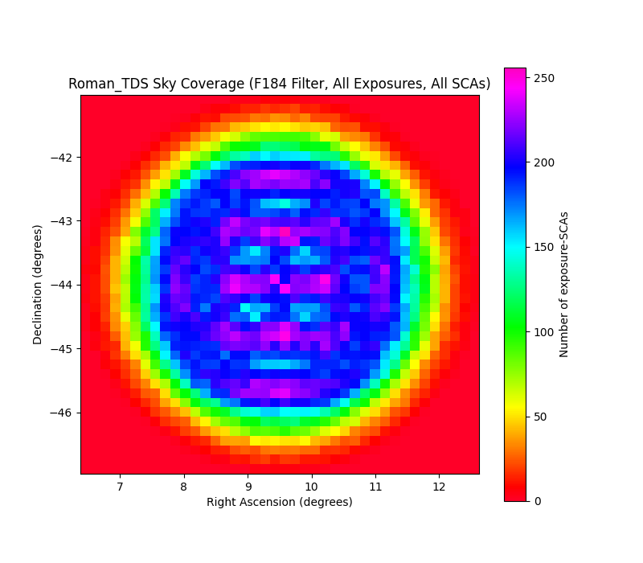

All filters are covered uniformly in the OpenUniverse dataset, so the above figure is indicative of any of the available filters.

Summary of successful tests conducted thus far:

=========================  =============  =======================  ===================  ===================  ============================================================================================
Test                       No. of images  No. of ref. images made  Start obs. datetime  End obs. datetime    Description
=========================  =============  =======================  ===================  ===================  ============================================================================================
4/28/2025 "standard test"         2,069              1,696         2028-09-07 00:00:00  2028-09-08 08:30:00  All images in obs. range
4/30/2025                         5,222              None          2029-03-15 00:00:00  2029-07-15 00:00:00  Only fields with superior ref. images
5/5/2025                         10,859              None          2029-07-15 00:00:00  2030-03-15 00:00:00  Only fields with superior ref. images
5/6/2025                          4,858              3,995         2028-09-08 08:30:00  2028-09-12 00:00:00  All images in obs. range
5/8/2025                          3,020              1,500         2028-09-12 00:00:00  2028-09-15 00:00:00  All images in obs. range
5/10/2025                        13,850              4,876         2028-09-15 00:00:00  2028-09-25 00:00:00  All images in obs. range
5/14/2025                         2,069              None          2028-09-07 00:00:00  2028-09-08 08:30:00  Repeat standard test with SFFT ``--crossconv`` flag.  Use existing ref. images.
6/12/2025                         3,545                 79         2028-09-07 00:00:00  2029-09-20 00:00:00  Only ZOGY difference-image products were made
6/13/2025                         2,783              None          2029-09-20 00:00:00  2030-09-20 00:00:00  Only ZOGY difference-image products were made
6/17/2025                           547              None          2028-08-17 00:00:00  2028-09-07 00:00:00  Only ZOGY difference-image products were made
6/20/2025                         6,875              None          2028-08-17 00:00:00  2030-09-20 00:00:00  Both ZOGY and SFFT difference-image products were made.  Ran SFFT with ``--crossconv`` flag.
7/10/2025                         6,875              None          2028-08-17 00:00:00  2030-09-20 00:00:00  Like the 6/20/2025 test with new PhotUtils PSF-fit star-finder catalog in separate file.
8/23/2025                         6,875                79          2028-08-17 00:00:00  2030-09-20 00:00:00  Similar to the 7/10/2025 test, with several exceptions (see below for details).
=========================  =============  =======================  ===================  ===================  ============================================================================================

In the above table, superior reference images are defined as having ``nframes >= 10`` and ``cov5percent >= 60%``.  In other words, superior
reference images have at least 10 frames stacked somewhere in the field, although the overlap will vary, and 60% or more of the reference-image pixels
have a coverage depth of at least 5 frames.

Here is Perl code (``elapsed.pl``) to query the operations database
for science-pipeline performance results::

    use strict;
    my $starthourorigin;

    my $procdate = '20250430';

    print"count,nframes,startedhours,elapsedseconds\n";

    my $q;
    $q="select nframes,extract(day from started) * 24.0 + extract(hour from started) + ".
       "extract(minute from started)/60.0 + extract(second from started)/3600.0 ".
       "as startedhours, extract(hour from elapsed)*3600 + ".
       "extract(minute from elapsed)*60 + extract(second from elapsed) as elapsedseconds ".
       "from jobs a, diffimages b, diffimmeta c, refimmeta d ".
       "where a.rid=b.rid and a.ppid=15 and b.pid=c.pid and b.vbest>0 and b.rfid=d.rfid ".
       "and exitcode=0 and cast(launched as date) ='".$procdate."' order by started; ";

    my @op=`psql -h 35.165.53.98 -d rapidopsdb -p 5432 -U rapidporuss -c \"$q\"`;
    my $i=0;
    shift @op;
    shift @op;
    foreach my $op (@op) {
        if ($op =~ /row/) { last; }
        chomp $op;
        $op =~ s/^\s+|\s+$//g;
        my (@f) = split(/\s*\|\s*/, $op);
        my $nframes = $f[0];
        my $startedhours = $f[1];
        my $elapsedtimeseconds = $f[2];
        if ($i==0) {
            $starthourorigin = $startedhours;
        }
        $startedhours = $startedhours - $starthourorigin;
        $i++;
        print"$i,$nframes,$startedhours,$elapsedtimeseconds\n";
    }

4/28/2025
************************************

The following test is hereby know as the "standard test".
The standard test processes 2,069 exposure-SCAs
with all reference images cleared from database
(``status=0`` for ``vbest>0``).
Thus, the science pipeline generates new reference images on the fly.
AWS Batch machines for science-pipeline jobs
have 2 vCPUs and 16 GB memory.

.. code-block::

    export STARTDATETIME="2028-09-07 00:00:00"
    export ENDDATETIME="2028-09-08 08:30:00"
    python3.11 /code/pipeline/awsBatchSubmitJobs_launchSciencePipelinesForDateTimeRange.py >& awsBatchSubmitJobs_launchSciencePipelinesForDateTimeRange.out &

Two jobs had empty reference images in difference-image regions, so ``SFFT``
did not produce results, and 33 jobs had no reference images.

.. code-block::

    rapidopsdb=> select exitcode,count(*) from jobs where ppid=15 and cast(launched as date) = '20250428' group by exitcode order by exitcode;
     exitcode | count
    ----------+-------
            0 |  1987
            4 |     2
           33 |    80
    (3 rows)

Here is a histogram of the AWS Batch queue wait times for an available AWS Batch machine on which to run a pipeline job:

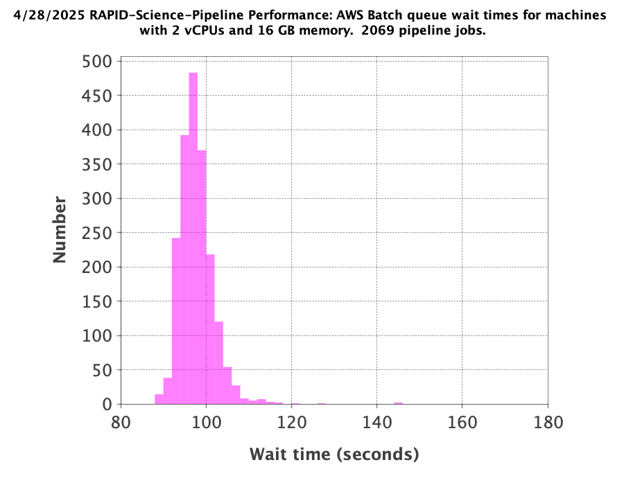

Here is a histogram of the job execution times, measured from pipeline start to pipeline finish on an AWS Batch machine:

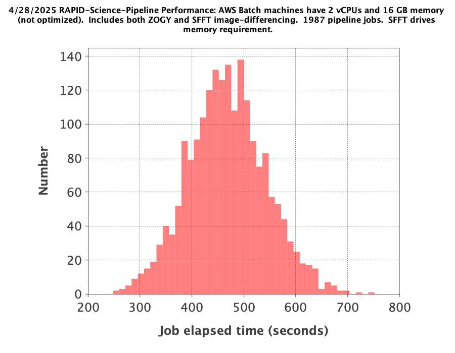

These job elapsed times include additional time for reference-image generation, which would not be needed if reference images
already existed for the fields covered by the input exposure-SCA images of the standard test.

The standard test generated 1,696 reference images total, for 4 different filters and a variety of fields.  The number of fields
for each of the filter IDs included is listed as follows:

.. code-block::

    rapidopsdb=> select fid,count(*) from refimages where vbest>0 group by fid order by fid;
     fid | count
    -----+-------
       1 |   806
       2 |   812
       3 |    48
       4 |    30
    (4 rows)

Here are all of the filter IDs versus filter names included in the entire OpenUniverse simulated dataset
(of which a tiny subset is covered by the standard test):

.. code-block::

    rapidopsdb=> select * from filters order by fid;
     fid | filter
    -----+--------
       1 | F184
       2 | H158
       3 | J129
       4 | K213
       5 | R062
       6 | Y106
       7 | Z087
       8 | W146
    (8 rows)

4/29/2025
************************************

New large test on selectly chosen 5222 exposure-SCAs acquired 6 months after the data from the standard test,
using a subset of the reference images existing in the database that were generated on 4/28/2025.  The exposure-SCAs
are all associated with fields having reference images that have ``nframes >= 10`` and ``cov5percent >= 60%``.
AWS Batch machines for science-pipeline jobs have 2 vCPUs and 16 GB memory.

.. code-block::

    export STARTDATETIME="2029-03-15 00:00:00"
    export ENDDATETIME="2029-07-15 00:00:00"
    export NFRAMES=10
    export COV5PERCENT=60
    python3.11 /code/pipeline/awsBatchSubmitJobs_launchSciencePipelinesForDateTimeRangeAndSuperiorRefImages.py >& awsBatchSubmitJobs_launchSciencePipelinesForDateTimeRangeAndSuperiorRefImages.out &

There were 115 jobs that failed due to the following AWS Batch error:
``Timeout waiting for network interface provisioning to complete``.
Need to reconfigure the job definition to have retry attempts.

.. code-block::

    rapidopsdb=> select exitcode,count(*) from jobs where ppid=15 and cast(launched as date) = '20250429' group by exitcode order by exitcode;
    exitcode | count
    ---------+-------
           0 |  5107
             |   115
    (2 rows)

4/30/2025
************************************

Rerun of 4/29/2025 large test on selectively chosen 5,222 exposure-SCAs acquired 6 months after the data from the standard test,
using a subset of the reference images existing in the database that were generated on 4/28/2025.  The exposure-SCAs
are all associated with fields having reference images that have ``nframes >= 10`` and ``cov5percent >= 60%``.
AWS Batch machines for science-pipeline jobs have 2 vCPUs and 16 GB memory.

.. code-block::

    export STARTDATETIME="2029-03-15 00:00:00"
    export ENDDATETIME="2029-07-15 00:00:00"
    export NFRAMES=10
    export COV5PERCENT=60
    python3.11 /code/pipeline/awsBatchSubmitJobs_launchSciencePipelinesForDateTimeRangeAndSuperiorRefImages.py >& awsBatchSubmitJobs_launchSciencePipelinesForDateTimeRangeAndSuperiorRefImages.out &

After reconfiguring the AWS Batch science-pipeline job definition to attempt to run a job 3 times, if necessary, all jobs successfully ran:

.. code-block::

    rapidopsdb=> select exitcode,count(*) from jobs where ppid=15 and cast(launched as date) = '20250430' group by exitcode order by exitcode;
     exitcode | count
    ----------+-------
            0 |  5222
    (1 row)

Here is a histogram of the AWS Batch queue wait times for an available AWS Batch machine on which to run a pipeline job:

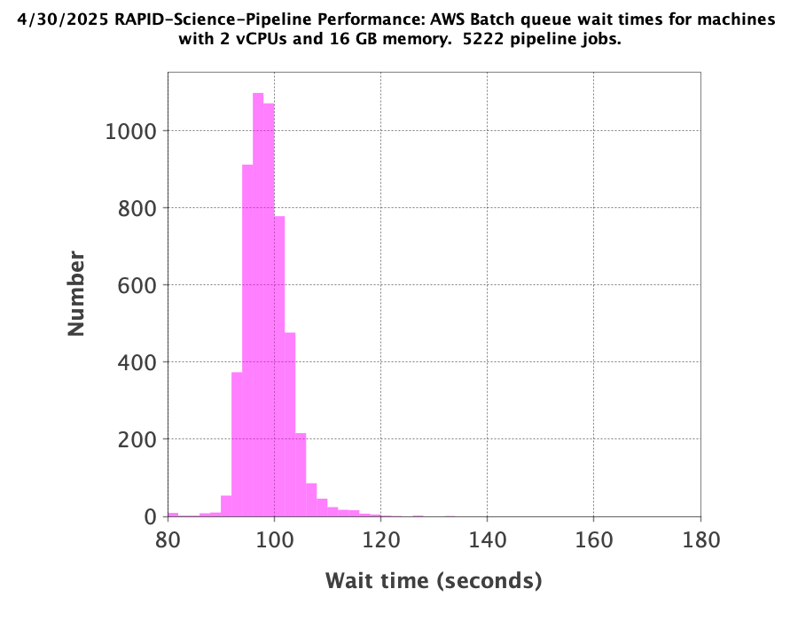

Here is a histogram of the job execution times, measured from pipeline start to pipeline finish on an AWS Batch machine:

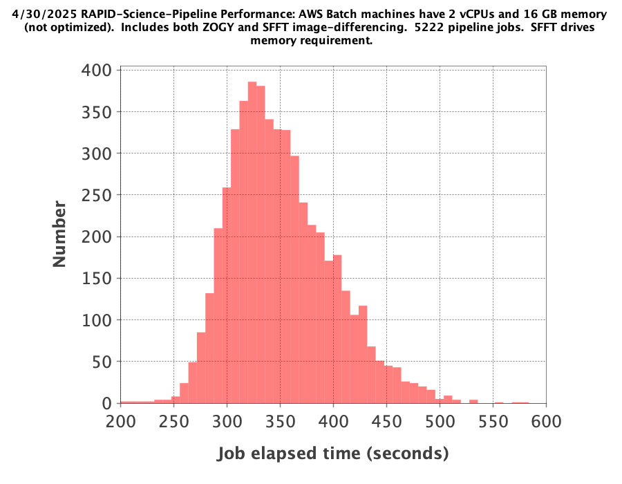

The mode of the histogram indicates the job elapsed times are approximately 3 minutes shorter than
those from the 4/28/2025 test, which is expected since all reference images needed for this test
are already available and none had to be generated on the fly.

This test utilized a fraction of the reference images that were previously generated in the standard test.
The numbers of reference images per filter ID that were actually used in this test are listed as follows:

.. code-block::

    rapidopsdb=> select a.fid,count(*) from refimages a, refimmeta b where a.rfid = b.rfid and vbest>0 and nframes >= 10 and cov5percent >= 60 group by a.fid order by a.fid;
     fid | count
    -----+-------
       1 |   196
       2 |   189
       3 |     5
       4 |     7
    (4 rows)

5/5/2025
************************************

New large test on selectively chosen 10,859 exposure-SCAs acquired many months after the data from the standard test,
using a subset of the reference images existing in the database that were generated on 4/28/2025.  The exposure-SCAs
are all associated with fields having reference images that have ``nframes >= 10`` and ``cov5percent >= 60%``.
AWS Batch machines for science-pipeline jobs have 2 vCPUs and 16 GB memory.

.. code-block::

    export STARTDATETIME="2029-07-15 00:00:00"
    export ENDDATETIME="2030-03-15 00:00:00"
    export NFRAMES=10
    export COV5PERCENT=60
    python3.11 /code/pipeline/awsBatchSubmitJobs_launchSciencePipelinesForDateTimeRangeAndSuperiorRefImages.py >& awsBatchSubmitJobs_launchSciencePipelinesForDateTimeRangeAndSuperiorRefImages.out &

Here is how the number of exposure-SCAs in this test are selected, utilizing the myriad of metadata in the RAPID operations database:

.. code-block::

    rapidopsdb=> select count(*)
                 from L2Files a, RefImages b, RefImMeta c
                 where a.field = b.field
                 and b.rfid = c.rfid
                 and a.fid = b.fid
                 and b.status > 0
                 and b.vbest > 0
                 and cov5percent >= 60
                 and nframes >= 10
                 and a.dateobs > '2029-07-15 00:00:00'
                 and a.dateobs < '2030-03-15 00:00:00';

     count
    -------
     10859
    (1 row)

All jobs for both the science pipeline and the post-processing pipeline successfully ran:

.. code-block::

    rapidopsdb=> select ppid,exitcode,count(*) from jobs where cast(launched as date) = '20250505' group by ppid, exitcode order by ppid, exitcode;
     ppid | exitcode | count
    ------+----------+-------
       15 |        0 | 10859
       17 |        0 | 10859
    (2 rows)

The expected number of difference images where generated:

.. code-block::

    rapidopsdb=> select count(*) from diffimages where created >= '20250505' and vbest>0;
     count
    -------
     10859
    (1 row)

Here is a histogram of the AWS Batch queue wait times for an available AWS Batch machine on which to run a science-pipeline job:

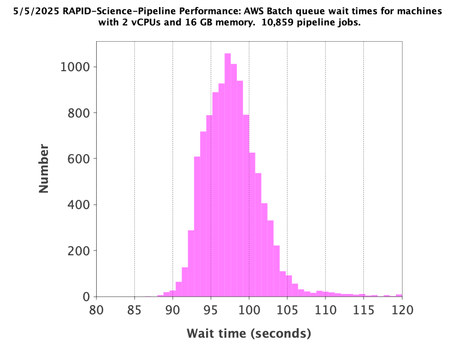

Here is a histogram of the science-pipeline job execution times, measured from pipeline start to pipeline finish on an AWS Batch machine:

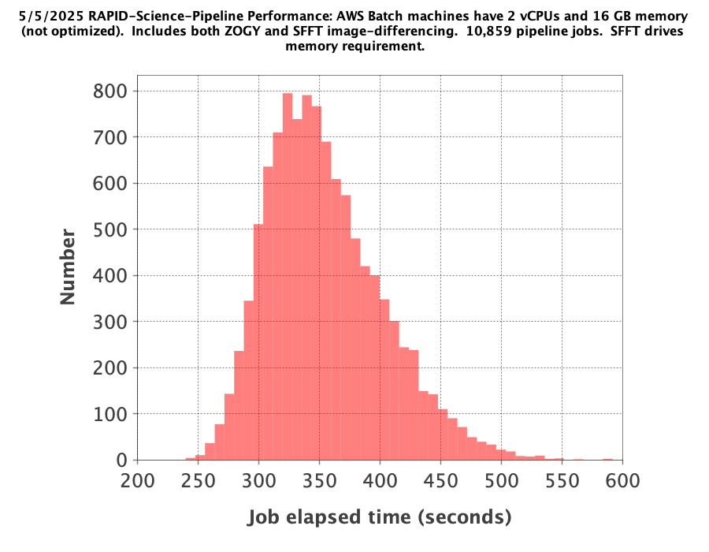

The mode of the histogram indicates the job elapsed times are approximately 3 minutes shorter than
those from the 4/28/2025 test, which is expected since all reference images needed for this test
are already available and none had to be generated on the fly.

Other key timing benchmarks for this test, which were done on an 8-core job-launcher machine (``t3.2xlarge`` EC2 instance)
with 8-core multiprocessing:

===================================================================    ==========================
Task                                                                   Elapsed time in seconds
===================================================================    ==========================
Launch science pipelines                                               6,029
Register Jobs, Diffimages, RefImages records for science pipelines     2,067
Launch post-processing pipelines                                       5,967
Register Jobs records for post-processing pipelines                      343
===================================================================    ==========================

This test utilized a fraction of the reference images that were previously generated in the standard test.
The numbers of reference images per filter ID that were actually used in this test are listed as follows:

.. code-block::

    rapidopsdb=> select a.fid,count(*)
                 from RefImages a, RefImMeta b
                 where a.rfid = b.rfid
                 and status > 0
                 and vbest > 0
                 and nframes >= 10
                 and cov5percent >= 60
                 group by a.fid
                 order by a.fid;

     fid | count
    -----+-------
       1 |   196
       2 |   189
       3 |     5
       4 |     7
    (4 rows)

5/6/2025
************************************

Test to process 4,858 exposure-SCAs, all in the observation date/time ranges given below, making
reference images on the fly as needed.
The observation date/time range is relatively early in the available range of the OpenUniverse simulated images.
This test includes filters that are not well covered by the 4/28/2025 test.
AWS Batch machines for science-pipeline jobs have 2 vCPUs and 16 GB memory.

.. code-block::

    export STARTDATETIME="2028-09-08 08:30:00"
    export ENDDATETIME="2028-09-12 00:00:00"

    python3.11 /code/pipeline/awsBatchSubmitJobs_launchSciencePipelinesForDateTimeRange.py >& awsBatchSubmitJobs_launchSciencePipelinesForDateTimeRange_20250506.out &

.. code-block::

    rapidopsdb=> select ppid,exitcode,count(*) from jobs where ppid=15 and cast(launched as date) = '20250506' group by ppid, exitcode order by ppid, exitcode;
     ppid | exitcode | count
    ------+----------+-------
       15 |        0 |  4701
       15 |        4 |     3
       15 |       33 |   154
    (3 rows)

=======================================================    ==========================
Pipeline condition at termination                           Exitcode
=======================================================    ==========================
Normal                                                         0
SFFT failed due to singular matrix                             4
Reference image not available and could not be made           33
=======================================================    ==========================

Pipeline exit codes in the 0-31 range are considered normal, in the 32-63 range a warning, and 64 or greater an error.
Even though SFFT might have failed, a difference image is still generated by ZOGY.

This test generated 3,884 new reference images, for 5 different filters and a variety of fields.  The number of fields
for each of the filter IDs included is listed as follows:

.. code-block::

    rapidopsdb=> select fid,count(*) from refimages where vbest>0 and created >= '20250506' group by fid order by fid;
     fid | count
    -----+-------
       3 |   765
       4 |   780
       5 |   821
       6 |   821
       7 |   808
    (5 rows)

These reference images, plus those generated by the standard test on 4/28/2025, give the following total numbers
of reference images broken down by filter ID:

.. code-block::

    rapidopsdb=> select fid,count(*) from refimages where vbest>0 group by fid order by fid;
    (7 rows)
     fid | count
    -----+-------
       1 |   806
       2 |   812
       3 |   813
       4 |   810
       5 |   821
       6 |   821
       7 |   808
    (7 rows)

Here is a histogram of the AWS Batch queue wait times for an available AWS Batch machine on which to run a pipeline job:

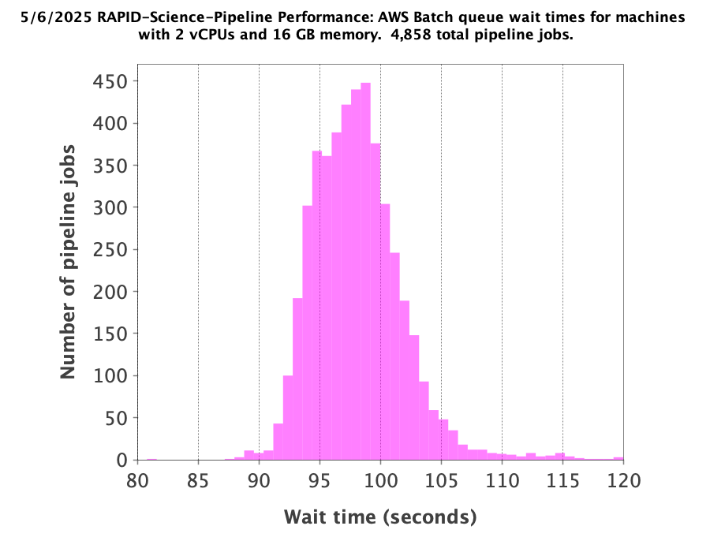

Here is a histogram of the job execution times, measured from pipeline start to pipeline finish on an AWS Batch machine:

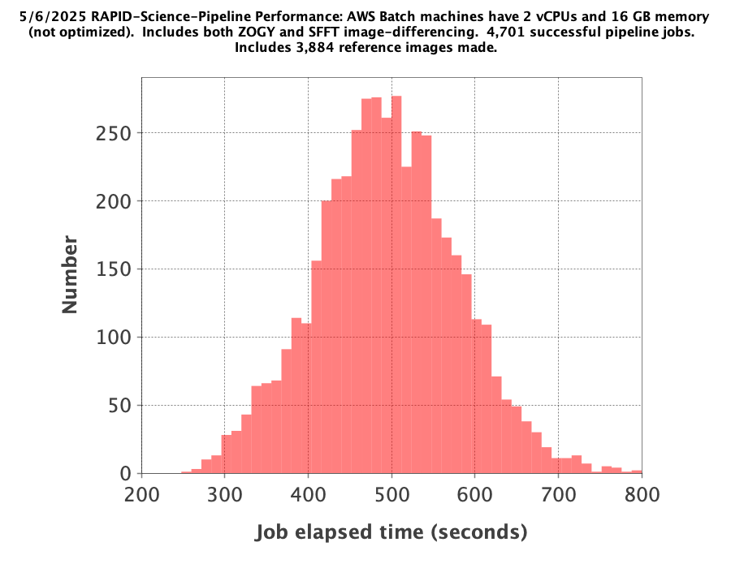

Here is a 2-D histogram of the job execution times versus number of input frames in making reference images on the fly in this test:

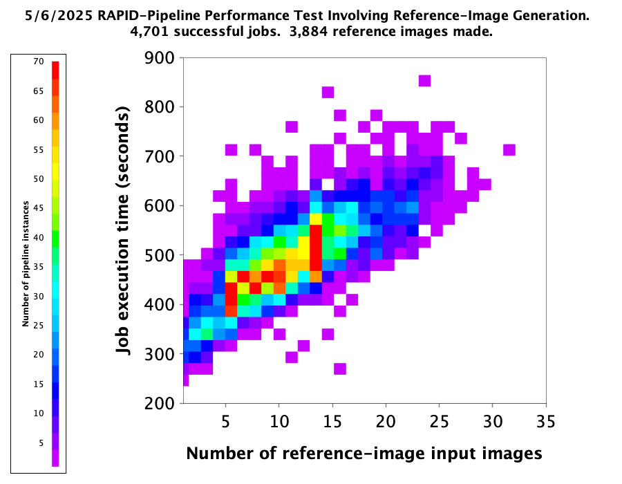

Here is a histogram of ``nframes`` for all reference images made in this test:

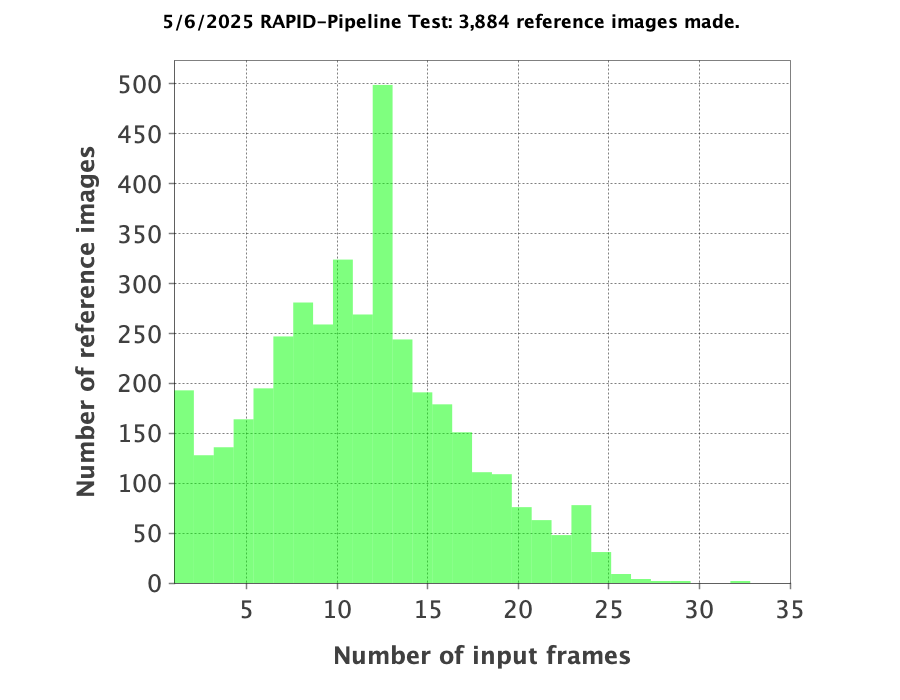

Here is a histogram of ``cov5percent`` for all reference images made in this test:

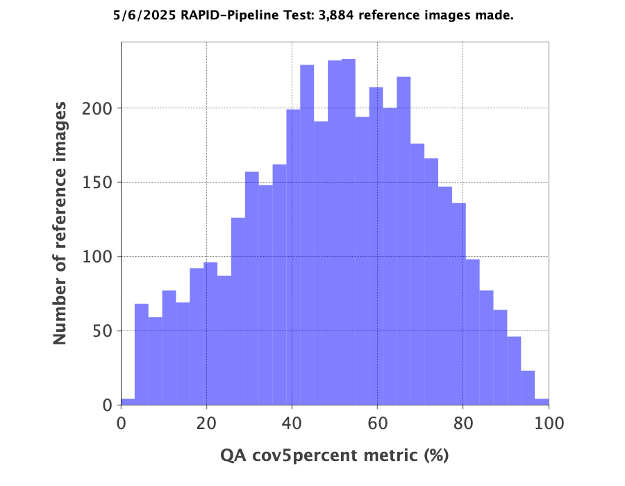

5/8/2025
************************************

Test to process 3,020 exposure-SCAs, all in the observation date/time ranges given below, making
reference images on the fly as needed.
The observation date/time range is relatively early in the available range of the OpenUniverse simulated images.
This test exercised the new Virtual Pipeline Operator (VPO) running in single-processing-date mode.
AWS Batch machines for science-pipeline jobs have 2 vCPUs and 16 GB memory.

.. code-block::

    export STARTDATETIME="2028-09-12 00:00:00"
    export ENDDATETIME="2028-09-15 00:00:00"

    python3.11 /code/pipeline/virtualPipelineOperator.py 20250508 >& virtualPipelineOperator_20250508.out &

Here is a summary of the pipeline exit codes after the test:

.. code-block::

    rapidopsdb=> select ppid,exitcode,count(*) from jobs where cast(launched as date) = '20250508' group by ppid, exitcode order by ppid, exitcode;
     ppid | exitcode | count
    ------+----------+-------
       15 |        0 |  2924
       15 |       33 |    96
       17 |        0 |  2924
    (3 rows)

=======================================================    ==========================
Pipeline condition at termination                           Exitcode
=======================================================    ==========================
Normal                                                         0
SFFT failed due to singular matrix                             4
Reference image not available and could not be made           33
=======================================================    ==========================

Pipeline exit codes in the 0-31 range are considered normal, in the 32-63 range a warning, and 64 or greater an error.
Even though SFFT might have failed, a difference image is still generated by ZOGY.

This test generated 1,500 new reference images, for 4 different filters and a variety of fields.  The number of fields
for each of the filter IDs included is listed as follows:

.. code-block::

    rapidopsdb=> select fid,count(*) from refimages where vbest>0 and created >= '20250508' group by fid order by fid;

     fid | count
    -----+-------
       1 |   483
       2 |   495
       3 |    27
       4 |   495
    (4 rows)

These reference images, plus those generated by previous tests, give the following total numbers
of reference images broken down by filter ID:

.. code-block::

    rapidopsdb=> select fid,count(*) from refimages where vbest>0 group by fid order by fid;

    fid | count
    -----+-------
       1 |  1289
       2 |  1307
       3 |   840
       4 |  1305
       5 |   821
       6 |   821
       7 |   808
    (7 rows)

5/10/2025
************************************

Test to process 13,850 exposure-SCA images, all in the observation date/time ranges given below, making
reference images on the fly as needed.
The observation date/time range is relatively early in the available range of the OpenUniverse simulated images.
This test exercised, for the second time, the new Virtual Pipeline Operator (VPO) running in single-processing-date mode,
only this test processed the largest number of images to date in a single run.  Input images from filter IDs 1-7 in approximately
equal numbers were processed by this test.
AWS Batch machines for science-pipeline jobs have 2 vCPUs and 16 GB memory.

.. code-block::

    export STARTDATETIME="2028-09-15 00:00:00"
    export ENDDATETIME="2028-09-25 00:00:00"

    python3.11 /code/pipeline/virtualPipelineOperator.py 20250510 >& virtualPipelineOperator_20250510.out &

Here is a summary of the pipeline exit codes after the test (which are not unexpected):

.. code-block::

    rapidopsdb=> select ppid,exitcode,count(*) from jobs where cast(launched as date) = '20250510' group by ppid, exitcode order by ppid, exitcode;
     ppid | exitcode | count
    ------+----------+-------
       15 |        0 | 13506
       15 |        4 |    15
       15 |       33 |   329
       17 |        0 | 13521
    (4 rows)

=======================================================    ==========================
Pipeline condition at termination                           Exitcode
=======================================================    ==========================
Normal                                                         0
SFFT failed due to singular matrix                             4
Reference image not available and could not be made           33
=======================================================    ==========================

Pipeline exit codes in the 0-31 range are considered normal, in the 32-63 range a warning, and 64 or greater an error.
Even though SFFT might have failed, a difference image is still generated by ZOGY.

This test generated 4,876 new reference images, for all the aforementioned seven filters and a variety of fields.  The number of fields
for each of the filter IDs included is listed as follows:

.. code-block::

    rapidopsdb=> select fid,count(*) from refimages where vbest>0 and created >= '20250510' group by fid order by fid;

     fid | count
    -----+-------
       1 |   533
       2 |   523
       3 |   816
       4 |   523
       5 |   825
       6 |   825
       7 |   831
    (7 rows)

These reference images, plus those generated by previous tests, give the following total numbers
of reference images broken down by filter ID:

.. code-block::

    rapidopsdb=> select fid,count(*) from refimages where vbest>0 group by fid order by fid;

     fid | count
    -----+-------
       1 |  1822
       2 |  1830
       3 |  1656
       4 |  1828
       5 |  1646
       6 |  1646
       7 |  1639
    (7 rows)

Other key timing benchmarks for this test, which were done on an 8-core job-launcher machine (``t3.2xlarge`` EC2 instance)
with 8-core multiprocessing:

===================================================================    ==========================
Task                                                                   Elapsed time in seconds
===================================================================    ==========================
Launch science pipelines                                               7,747
Register Jobs, Diffimages, RefImages records for science pipelines     2,545
Launch post-processing pipelines                                       7,667
Register Jobs records for post-processing pipelines                    420
===================================================================    ==========================

5/14/2025
************************************

Same as 4/28/2025 standard test, except that SFFT was run with the ``--crossconv`` flag.  No new reference images
were made, as they already exist.  The resulting SFFT difference image, ``sfftdiffimage_cconv_masked.fits``, and the
SFFT decorrelated difference image, ``sfftdiffimage_dconv_masked.fits``, are copied to the
S3 product bucket, along with the other products.

6/12/2025
************************************

Test to process 3,545 exposure-SCAs, all in the observation date/time ranges given below,
making reference images on the fly as needed.
The reference images are special in that their input frames are selected from the observation window
63,400 < MJD < 99,9999, which is later than the observation range of the test.
The test covers only those field/filter combinations in which reference images can be made that have 6 input frames or more,
which resulted in 79 reference images.
The observation date/time range of the science images processed in this test is relatively early
in the available range of the OpenUniverse simulated images, but spans more than a year.
This test covers all seven filters included in the OpenUniverse dataset.
A special pipeline-launch script is utilized.

For efficiency, the test is processed in two stages.
In the first stage, only one representative science image per field/filter combination
is processed to initially make the needed reference image for the other science images
with the same field and filter.
In the second stage, all other science images are processed (i.e., except the representative science images).
The representative science image is the first in a time-ordered, SCA-ordered list for a given field and filter
that is returned from a database query.

Only ZOGY difference-image products were made in this test.

.. code-block::

    export DBNAME=specialdb
    export STARTDATETIME="2028-09-07 00:00:00"
    export ENDDATETIME="2029-09-20 00:00:00"
    export STARTREFIMMJDOBS=63400
    export ENDREFIMMJDOBS=99999
    export MINREFIMNFRAMES=6
    export SPECIALRUNFLAG=True
    export LAUNCHSCIENCEPIPELINESCODE=/code/pipeline/launchSciencePipelinesForDateTimeRangeWithRefImageWindow.py
    export DRYRUN=False
    export MAKEREFIMAGESFLAG=True
    python3.11 /code/pipeline/virtualPipelineOperator.py 20250612 >& virtualPipelineOperator_20250612.out &
    export MAKEREFIMAGESFLAG=False
    python3.11 /code/pipeline/virtualPipelineOperator.py 20250612 >& virtualPipelineOperator_20250612_2.out &

.. code-block::

    db=> select ppid,exitcode,count(*) from jobs where cast(launched as date) = '20250612' group by ppid, exitcode order by ppid, exitcode;
     ppid | exitcode | count
    ------+----------+-------
       15 |        0 |  3545
       17 |        0 |  3545
    (2 rows)

6/13/2025
************************************

Test to process 2,783 exposure-SCAs, all in the observation date/time ranges given below,
which spans the observing year after that of the 20250612 test,
utilizing the same reference images made for the 20250612 test.

Improvements and additional automation made to the VPO simplify the required run-time parameters, listed below.

.. code-block::

    export DBNAME=specialdb
    export STARTDATETIME="2029-09-20 00:00:00"
    export ENDDATETIME="2030-09-20 00:00:00"
    export STARTREFIMMJDOBS=63400
    export ENDREFIMMJDOBS=99999
    export MINREFIMNFRAMES=6

    python3.11 /code/pipeline/virtualPipelineOperator.py 20250613 >& virtualPipelineOperator_20250613.out &

6/17/2025
************************************

Test to process 547 exposure-SCAs, all in the observation date/time ranges given below (spanning 21 days),
making reference images on the fly as needed (in order to test the VPO's special logic
for making reference images).

The observation date/time range of the science images processed in this test covers the earliest
range of the OpenUniverse simulated images, all filters, not covered in the two previous tests.

For efficiency, the test is processed in two stages.
In the first stage, only one representative science image per field/filter combination
is processed to initially make the needed reference image for the other science images
with the same field and filter.
In the second stage, all other science images are processed (i.e., except the representative science images).
The representative science image is the first in a time-ordered, SCA-ordered list for a given field and filter
that is returned from a database query.

Only ZOGY difference-image products were made in this test.

.. code-block::

    export DBNAME=specialdb
    export STARTDATETIME="2028-08-17 00:00:00"
    export ENDDATETIME="2028-09-07 00:00:00"
    export STARTREFIMMJDOBS=63400
    export ENDREFIMMJDOBS=99999
    export MINREFIMNFRAMES=6

    python3.11 /code/pipeline/virtualPipelineOperator.py 20250617 >& virtualPipelineOperator_20250617.out &

.. code-block::

    specialdb=> select ppid,exitcode,count(*) from jobs where cast(launched as date) = '20250617' group by ppid, exitcode order by ppid, exitcode;
     ppid | exitcode | count
    ------+----------+-------
       15 |        0 |   547
       17 |        0 |   547
    (2 rows)

6/20/2025
************************************

Same as the combined 6/12/2025, 6/13/2025, and 6/17/2025 tests, except that, in addition to the ZOGY
difference-image products, the SFFT difference-image products were also made.
Note that SFFT was run with the ``--crossconv`` flag.
No new reference images were made, as they already exist.
The resulting SFFT difference image, ``sfftdiffimage_cconv_masked.fits``, and the
SFFT decorrelated difference image, ``sfftdiffimage_dconv_masked.fits``, are copied to the
S3 product bucket, along with the other products.

Naive image-differencing was also done (simple science minus reference image), and the product is ``naive_diffimage_masked.fits``.

.. code-block::

    export DBNAME=specialdb
    export STARTDATETIME="2028-08-17 00:00:00"
    export ENDDATETIME="2030-09-20 00:00:00"
    export STARTREFIMMJDOBS=63400
    export ENDREFIMMJDOBS=99999
    export MINREFIMNFRAMES=6

    python3.11 /code/pipeline/virtualPipelineOperator.py 20250620 >& virtualPipelineOperator_20250620.out &

.. code-block::

    specialdb=> select ppid,exitcode,count(*) from jobs where cast(launched as date) = '20250620' group by ppid, exitcode order by ppid, exitcode;
     ppid | exitcode | count
    ------+----------+-------
       15 |        0 |  6875
       17 |        0 |  6875
    (2 rows)

7/10/2025
************************************

A repeat of the 6/20/2025 test, but with new PhotUtils PSF-fit star-finder catalog from ZOGY difference image (noniterative),
stored in a separate file called ``diffimage_masked_psfcat_finder.txt``.

8/23/2025
************************************

Similar to the 7/10/2025 test, with the following exceptions:

* Made correction to uncertainty-image formula.
* New PSF-fit catalog for SFFT difference image.
* Fake-source injection was turned on.
* Changed [FAKE_SOURCES] num_injections = 100, mag_min = 21.0, mag_max = 28.0.
* Changed [PSFCAT_DIFFIMAGE] fwhm = 2.0.
* Changed [SEXTRACTOR_DIFFIMAGE] FILTER_THRESH = 3.0, DEBLEND_NTHRESH = 32, WEIGHT_TYPE = "NONE,MAP_RMS", FILTER = "N" (last two parameters are overrided in code for ZOGY and SFFT SExtractor catalogs).
* Fed ZOGY dxrmsfin = 0.0, dyrmsfin = 0.0 for comparison with SFFT.

Covers 6,875 science images.  All science images in the 8/23 run had 100 fake sources injected per science image.
This is in addition to the fake sources that are already included in the OpenUniverse simulation set.

New reference images were made with corrected uncertainties (79 total).
The reference images are special in that their input frames are selected
from the observation window 63,400 < MJD < 99,9999, which is later than the observation range of the test.
The test covers only those field/filter combinations in which reference images can be made that have 6 input frames or more,
which resulted in 79 reference images.

Note that SFFT was run with the ``--crossconv`` flag, as was done for the 6/20/25 and 7/10/25 tests,
but in those previous tests, the convolved and deconvolved SFFT difference images had their roles
mistakenly swapped (in terms of being fed to SExtractor downstream).
The resulting SFFT deconvolved difference image, ``sfftdiffimage_dconv_masked.fits``, and the
SFFT convolved difference image, ``sfftdiffimage_cconv_masked.fits``, are copied to the
S3 product bucket, along with the other products.

Naive image-differencing was also done (simple science minus reference image), and the product is ``naive_diffimage_masked.fits``.
A new capability is computing an SExtractor catalog for the naive difference image, which is called ``naive_diffimage_masked.txt``.

.. code-block::

    export DBNAME=fakesourcesdb
    export STARTDATETIME="2028-08-17 00:00:00"
    export ENDDATETIME="2030-09-20 00:00:00"
    export STARTREFIMMJDOBS=63400
    export ENDREFIMMJDOBS=99999
    export MINREFIMNFRAMES=6

    python3.11 /code/pipeline/virtualPipelineOperator.py 20250823 >& virtualPipelineOperator_20250823.out &

.. code-block::

    fakesourcesdb=> select ppid,exitcode,count(*) from jobs where cast(launched as date) = '20250823' group by ppid, exitcode order by ppid, exitcode;
     ppid | exitcode | count
    ------+----------+-------
       15 |        0 |  6875
       17 |        0 |  6875
    (2 rows)

The VPO clocked 3.24 hours to run the entire test (all 6,875 science images).
As shown in the table below for a particular pipeline instance, executing SFFT,
executing AWAICGEN for reference-image generation, and injecting fake sources
are the dominant factors affecting pipeline performance.

==============================================================  =====================
Pipeline step                                                   Execution time (sec)
==============================================================  =====================
Downloading science image                                       0.865
Downloading or generating reference image  (9 input frames)     129.247
Injecting fake sources                                          51.104
Generating science-image catalog                                3.029
Swarping images                                                 8.826
Running bkgest on science image                                 13.459
Running gainmatchscienceandreferenceimages                      5.845
Replacing nans, applying image offsets, etc.                    0.101
Running ZOGY                                                    39.043
Masking ZOGY difference image                                   0.579
Running sextractor on ZOGY difference image                     3.901
Generating psf-fit catalog on ZOGY difference image             15.247
Uploading main products to s3 bucket                            4.429
Running SFFT                                                    291.798
Uploading SFFT difference image to s3 bucket                    5.317
Running sextractor on SFFT difference image                     1.442
Uploading SFFT-diffimage sextractor catalog to s3 bucket        0.109
Generating psf-fit catalog on SFFT difference image             12.091
Uploading SFFT-diffimage psf-fit catalogs to s3 bucket          0.800
Computing naive image difference                                1.211
Running sextractor on naive difference image                    4.671
Uploading products at pipeline end                              0.033
Total time to run one instance of science pipeline              593.158
==============================================================  =====================

Typically only 1-4 science images in an exposure were processed in the 5,538 exposures covered by this test.
Here is a breakdown of the number of science images processed per filter in this test:

.. code-block::

    fakesourcesdb=> select fid,count(*) from diffimages where vbest>0 and status>0 and created >= '2025-08-23' group by fid;
     fid | count
    -----+-------
       7 |   770
       1 |   770
       5 |  1142
       4 |  1140
       2 |  1142
       6 |  1141
       3 |   770
    (7 rows)

9/27/2025
************************************

Similar to the 8/23/2025 test, with the following bug fixes and additions:

    * Modified to not limit the precision of (ra, dec) in PSF-fit catalogs.
    * Added code to generate naive-difference-image PSF-fit catalogs.
    * Added code to generate SExtractor catalogs and PSF-fit catalogs for negative difference images (ZOGY, SFFT, naive).
    * Modified to feed sca_gain * exptime_sciimage as gain to method pipeline.differenceImageSubs.compute_diffimage_uncertainty.
    * Fixed bug: x and y subpixels offsets were swapped (adversely affected inputs to ZOGY, SFFT, and naive image-differencing).
    * Added new method normalize_image to normalize science-image PSFs (required by ZOGY).

The above additions cause more product files to be generated
(namely, separate catalog files for negative difference images, with suffix "_negative" embedded in the filename).

Covers 6,875 science images.  All science images in the 9/27 run had 100 fake sources injected per science image.
This is in addition to the fake sources that are already included in the OpenUniverse simulation set.

New reference images were made with corrected uncertainties (79 total).
The reference images are special in that their input frames are selected
from the observation window 63,400 < MJD < 99,9999, which is later than the observation range of the test.
The test covers only those field/filter combinations in which reference images can be made that have 6 input frames or more,
which resulted in 79 reference images.

Note that SFFT was run with the ``--crossconv`` flag, as was done for the 8/23/25 test,
but in those previous tests, the convolved and deconvolved SFFT difference images had their roles
mistakenly swapped (in terms of being fed to SExtractor downstream).
The resulting SFFT deconvolved difference image, ``sfftdiffimage_dconv_masked.fits``, and the
SFFT convolved difference image, ``sfftdiffimage_cconv_masked.fits``, are copied to the
S3 product bucket, along with the other products.

Naive image-differencing was also done (simple science minus reference image), and the product is ``naive_diffimage_masked.fits``.
A new capability is computing an SExtractor catalog for the naive difference image, which is called ``naive_diffimage_masked.txt``.

.. code-block::

    export DBNAME=fakesourcesdb
    export STARTDATETIME="2028-08-17 00:00:00"
    export ENDDATETIME="2030-09-20 00:00:00"
    export STARTREFIMMJDOBS=63400
    export ENDREFIMMJDOBS=99999
    export MINREFIMNFRAMES=6

    python3.11 /code/pipeline/virtualPipelineOperator.py 20250927 >& virtualPipelineOperator_20250927.out &

.. code-block::

    fakesourcesdb=> select ppid,exitcode,count(*) from jobs where cast(launched as date) = '20250927' group by ppid, exitcode order by ppid, exitcode;
     ppid | exitcode | count
    ------+----------+-------
       15 |        0 |  6875
       17 |        0 |  6875
    (2 rows)

The VPO clocked 3.55 hours to run the entire test (all 6,875 science images).
As shown in the table below for a particular pipeline instance, executing SFFT,
executing AWAICGEN for reference-image generation, and injecting fake sources
are the dominant factors affecting pipeline performance.

==============================================================  =====================
Pipeline step                                                   Execution time (sec)
==============================================================  =====================
Downloading science image                                             0.910
Downloading or generating reference image                           128.579
Injecting fake sources                                               57.766
Generating science-image catalog                                      2.757
Swarping images                                                       9.153
Running bkgest on science image                                      14.381
Running gainMatchScienceAndReferenceImages                            6.114
Replacing NaNs, applying image offsets, etc.                          0.105
Running ZOGY                                                         39.384
Masking ZOGY difference image                                         0.951
Running SExtractor on positive ZOGY difference image                  3.823
Running SExtractor on negative ZOGY difference image                  1.599
Generating PSF-fit catalog on positive ZOGY difference image         15.176
Generating PSF-fit catalog on negative ZOGY difference image          9.631
Uploading main products to S3 bucket                                  7.981
Running SFFT                                                        295.983
Uploading SFFT difference image to S3 bucket                          7.481
Running SExtractor on positive SFFT difference images                 1.424
Running SExtractor on negative SFFT difference images                 1.448
Uploading SFFT-diffimage SExtractor catalogs to S3 bucket             0.196
Generating PSF-fit catalog on positive SFFT difference image         12.655
Generating PSF-fit catalog on negative SFFT difference image         11.014
Uploading SFFT-diffimage PSF-fit catalogs to S3 bucket                1.626
Computing naive difference images                                     2.212
Running SExtractor on positive naive difference image                 4.273
Running SExtractor on negative naive difference image                 1.662
Uploading SExtractor catalogs for naive difference images             0.941
Running and uploading PSF-fit catalogs for naive difference images   26.879
Uploading products at pipeline end                                    0.037
Total time to run one instance of science pipeline                  666.143
==============================================================  =====================

Typically only 1-4 science images in an exposure were processed in the 5,538 exposures covered by this test.
Here is a breakdown of the number of science images processed per filter in this test:

.. code-block::

    fakesourcesdb=> select fid,count(*) from diffimages where vbest>0 and status>0 and created >= '2025-09-27' group by fid;
     fid | count
    -----+-------
       7 |   770
       1 |   770
       5 |  1142
       4 |  1140
       2 |  1142
       6 |  1141
       3 |   770
    (7 rows)
