Testing with OpenUniverse Simulated Data
####################################################

Overview
************************************

OpenUniverse simulated data approximate the High Latitude Time Domain Survey
(HLTDS), covering sparse extragalactic fields. It is the only HLTDS simulation set RAPID has processed;
RimTimSim and SOC both simulate GBTDS.

The tests described below are organized by processing date.

Dataset coverage
====================================

The observation range is::

    rapidopsdb=> select min(dateobs),max(dateobs) from l2files;
               min           |          max
    -------------------------+------------------------
     2028-08-17 00:30:48.096 | 2032-11-27 01:23:22.56
    (1 row)

The last exposure containing injected transients has ``DATE-OBS = 2030-08-15 01:23:31.2``.
The dataset has a gap in ``MJD-OBS`` from 62,728 to 63,550 days. A later
"post-survey" set contains 1,155 transient-free exposures, starting with
``DATE-OBS = 2032-11-14 00:30:48.096``. Their distribution by filter is::

    select fid,count(*)
    from exposures
    where dateobs>='2032-11-14'
    group by fid
    order by fid;

     fid | count
    -----+-------
       1 |   165
       2 |   165
       3 |   165
       4 |   165
       5 |   165
       6 |   165
       7 |   165
    (7 rows)

Each exposure includes all 18 SCAs. The dataset covers 7 filters; fid=8
(W146) is not included.

Filter IDs and Roman Space Telescope filter names in the database:

.. code-block::

    rapidopsdb=> select * from filters order by fid;
     fid | filter
    -----+--------
       1 | F184
       2 | H158
       3 | J129
       4 | K213
       5 | R062
       6 | Y106
       7 | Z087
       8 | W146
    (8 rows)

The 2-D histogram shows OpenUniverse exposure-SCA image counts by sky position
for the F184 filter:

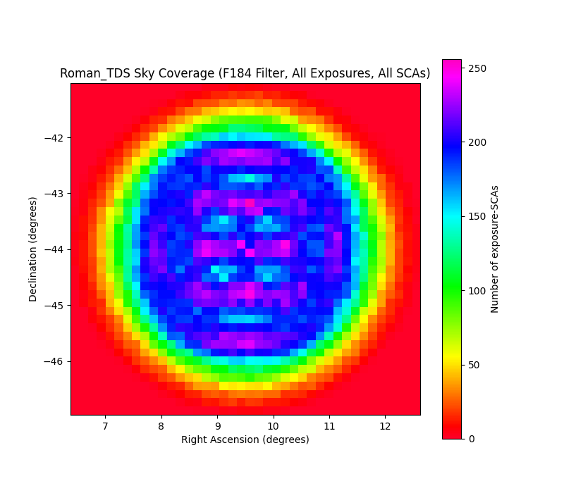

Uniform coverage across filters makes this figure representative of any available filter.

Successful-test summary
====================================

=========================  =============  =======================  ===================  ===================  ============================================================================================
Test                       No. of images  No. of ref. images made  Start obs. datetime  End obs. datetime    Description
=========================  =============  =======================  ===================  ===================  ============================================================================================
4/28/2025 "standard test"         2,069              1,696         2028-09-07 00:00:00  2028-09-08 08:30:00  All images in obs. range
4/30/2025                         5,222              None          2029-03-15 00:00:00  2029-07-15 00:00:00  Only fields with superior ref. images
5/5/2025                         10,859              None          2029-07-15 00:00:00  2030-03-15 00:00:00  Only fields with superior ref. images
5/6/2025                          4,858              3,995         2028-09-08 08:30:00  2028-09-12 00:00:00  All images in obs. range
5/8/2025                          3,020              1,500         2028-09-12 00:00:00  2028-09-15 00:00:00  All images in obs. range
5/10/2025                        13,850              4,876         2028-09-15 00:00:00  2028-09-25 00:00:00  All images in obs. range
5/14/2025                         2,069              None          2028-09-07 00:00:00  2028-09-08 08:30:00  Repeat standard test with SFFT ``--crossconv`` flag.  Use existing ref. images.
6/12/2025                         3,545                 79         2028-09-07 00:00:00  2029-09-20 00:00:00  Only ZOGY difference-image products were made
6/13/2025                         2,783              None          2029-09-20 00:00:00  2030-09-20 00:00:00  Only ZOGY difference-image products were made
6/17/2025                           547              None          2028-08-17 00:00:00  2028-09-07 00:00:00  Only ZOGY difference-image products were made
6/20/2025                         6,875              None          2028-08-17 00:00:00  2030-09-20 00:00:00  Both ZOGY and SFFT difference-image products were made.  Ran SFFT with ``--crossconv`` flag.
7/10/2025                         6,875              None          2028-08-17 00:00:00  2030-09-20 00:00:00  Like the 6/20/2025 test with new PhotUtils PSF-fit star-finder catalog in separate file.
8/23/2025                         6,875                79          2028-08-17 00:00:00  2030-09-20 00:00:00  Similar to the 7/10/2025 test, with several exceptions (see below for details).
=========================  =============  =======================  ===================  ===================  ============================================================================================

Superior reference images have ``nframes >= 10`` and ``cov5percent >= 60%``:
at least 10 frames stacked somewhere in the field, with varying overlap, and
60% or more of the reference-image pixels covered by at least 5 frames.

Performance query
====================================

The Perl script ``elapsed.pl`` queries the operations database for
science-pipeline performance results::

    use strict;
    my $starthourorigin;

    my $procdate = '20250430';

    print"count,nframes,startedhours,elapsedseconds\n";

    my $q;
    $q="select nframes,extract(day from started) * 24.0 + extract(hour from started) + ".
       "extract(minute from started)/60.0 + extract(second from started)/3600.0 ".
       "as startedhours, extract(hour from elapsed)*3600 + ".
       "extract(minute from elapsed)*60 + extract(second from elapsed) as elapsedseconds ".
       "from jobs a, diffimages b, diffimmeta c, refimmeta d ".
       "where a.rid=b.rid and a.ppid=15 and b.pid=c.pid and b.vbest>0 and b.rfid=d.rfid ".
       "and exitcode=0 and cast(launched as date) ='".$procdate."' order by started; ";

    my @op=`psql -h $DBSERVER -d rapidopsdb -p 5432 -U rapidporuss -c \"$q\"`;
    my $i=0;
    shift @op;
    shift @op;
    foreach my $op (@op) {
        if ($op =~ /row/) { last; }
        chomp $op;
        $op =~ s/^\s+|\s+$//g;
        my (@f) = split(/\s*\|\s*/, $op);
        my $nframes = $f[0];
        my $startedhours = $f[1];
        my $elapsedtimeseconds = $f[2];
        if ($i==0) {
            $starthourorigin = $startedhours;
        }
        $startedhours = $startedhours - $starthourorigin;
        $i++;
        print"$i,$nframes,$startedhours,$elapsedtimeseconds\n";
    }

4/28/2025
************************************

The "standard test" processes 2,069 exposure-SCAs with all reference images
cleared from the database (``status=0`` for ``vbest>0``), forcing the science
pipeline to generate reference images on the fly. AWS Batch science-pipeline
machines have 2 vCPUs and 16 GB memory.

.. code-block::

    export STARTDATETIME="2028-09-07 00:00:00"
    export ENDDATETIME="2028-09-08 08:30:00"
    python3.11 /code/pipeline/awsBatchSubmitJobs_launchSciencePipelinesForDateTimeRange.py >& awsBatchSubmitJobs_launchSciencePipelinesForDateTimeRange.out &

Two jobs had empty reference images in difference-image regions, so ``SFFT``
did not produce results, and 33 jobs had no reference images.

.. code-block::

    rapidopsdb=> select exitcode,count(*) from jobs where ppid=15 and cast(launched as date) = '20250428' group by exitcode order by exitcode;
     exitcode | count
    ----------+-------
            0 |  1987
            4 |     2
           33 |    80
    (3 rows)

Histogram of AWS Batch queue wait times for an available pipeline-job machine:

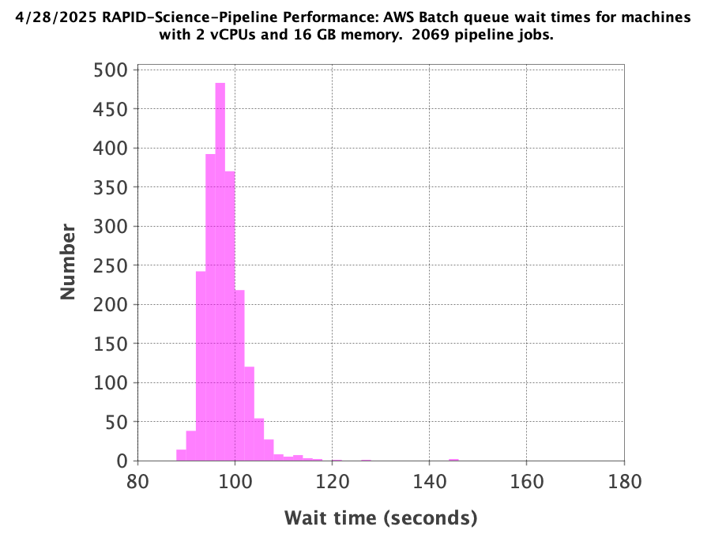

Histogram of job execution times, measured from pipeline start to finish on
an AWS Batch machine:

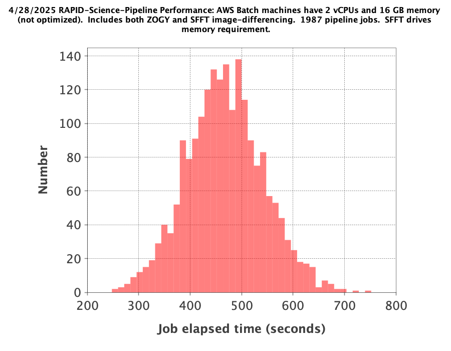

These times include reference-image generation, which would be unnecessary if
reference images already existed for the standard test's input fields.

The standard test generated 1,696 reference images across 4 filters and a
variety of fields. Field counts by filter ID:

.. code-block::

    rapidopsdb=> select fid,count(*) from refimages where vbest>0 group by fid order by fid;
     fid | count
    -----+-------
       1 |   806
       2 |   812
       3 |    48
       4 |    30
    (4 rows)

Filter IDs and names for the entire OpenUniverse simulated dataset, of which
the standard test covers a tiny subset:

.. code-block::

    rapidopsdb=> select * from filters order by fid;
     fid | filter
    -----+--------
       1 | F184
       2 | H158
       3 | J129
       4 | K213
       5 | R062
       6 | Y106
       7 | Z087
       8 | W146
    (8 rows)

4/29/2025
************************************

This test selected 5222 exposure-SCAs acquired 6 months after the standard-test
data. It reused a subset of the 4/28/2025 reference images, selecting only
fields with ``nframes >= 10`` and ``cov5percent >= 60%``.
AWS Batch machines for science-pipeline jobs have 2 vCPUs and 16 GB memory.

.. code-block::

    export STARTDATETIME="2029-03-15 00:00:00"
    export ENDDATETIME="2029-07-15 00:00:00"
    export NFRAMES=10
    export COV5PERCENT=60
    python3.11 /code/pipeline/awsBatchSubmitJobs_launchSciencePipelinesForDateTimeRangeAndSuperiorRefImages.py >& awsBatchSubmitJobs_launchSciencePipelinesForDateTimeRangeAndSuperiorRefImages.out &

The AWS Batch error ``Timeout waiting for network interface provisioning to complete``
caused 115 jobs to fail. The job definition needs retry attempts.

.. code-block::

    rapidopsdb=> select exitcode,count(*) from jobs where ppid=15 and cast(launched as date) = '20250429' group by exitcode order by exitcode;
    exitcode | count
    ---------+-------
           0 |  5107
             |   115
    (2 rows)

4/30/2025
************************************

This rerun of the 4/29/2025 test selected 5,222 exposure-SCAs acquired 6 months
after the standard-test data. It reused a subset of the 4/28/2025 reference
images, selecting only fields with ``nframes >= 10`` and ``cov5percent >= 60%``.
AWS Batch machines for science-pipeline jobs have 2 vCPUs and 16 GB memory.

.. code-block::

    export STARTDATETIME="2029-03-15 00:00:00"
    export ENDDATETIME="2029-07-15 00:00:00"
    export NFRAMES=10
    export COV5PERCENT=60
    python3.11 /code/pipeline/awsBatchSubmitJobs_launchSciencePipelinesForDateTimeRangeAndSuperiorRefImages.py >& awsBatchSubmitJobs_launchSciencePipelinesForDateTimeRangeAndSuperiorRefImages.out &

All jobs succeeded after the AWS Batch science-pipeline job definition was
configured to allow 3 attempts per job:

.. code-block::

    rapidopsdb=> select exitcode,count(*) from jobs where ppid=15 and cast(launched as date) = '20250430' group by exitcode order by exitcode;
     exitcode | count
    ----------+-------
            0 |  5222
    (1 row)

Histogram of AWS Batch queue wait times for an available pipeline-job machine:

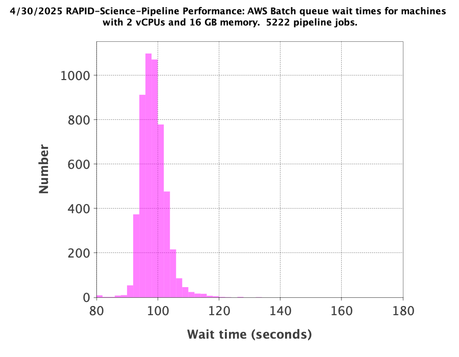

Histogram of job execution times, measured from pipeline start to finish on
an AWS Batch machine:

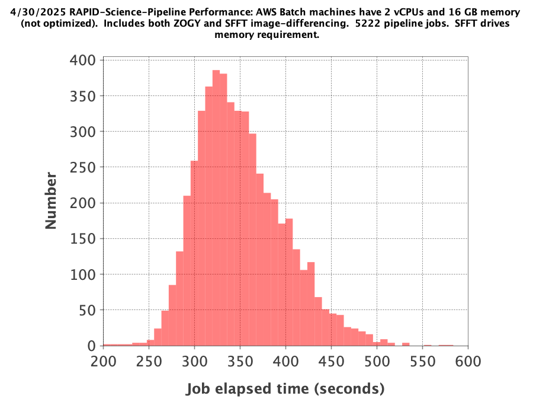

The histogram mode shows job times approximately 3 minutes shorter than in
the 4/28/2025 test, as expected: all required reference images already existed.

This test reused a subset of the standard-test reference images. Counts used
per filter ID:

.. code-block::

    rapidopsdb=> select a.fid,count(*) from refimages a, refimmeta b where a.rfid = b.rfid and vbest>0 and nframes >= 10 and cov5percent >= 60 group by a.fid order by a.fid;
     fid | count
    -----+-------
       1 |   196
       2 |   189
       3 |     5
       4 |     7
    (4 rows)

5/5/2025
************************************

This test selected 10,859 exposure-SCAs acquired many months after the
standard-test data. It reused a subset of the 4/28/2025 reference images,
selecting only fields with ``nframes >= 10`` and ``cov5percent >= 60%``.
AWS Batch machines for science-pipeline jobs have 2 vCPUs and 16 GB memory.

.. code-block::

    export STARTDATETIME="2029-07-15 00:00:00"
    export ENDDATETIME="2030-03-15 00:00:00"
    export NFRAMES=10
    export COV5PERCENT=60
    python3.11 /code/pipeline/awsBatchSubmitJobs_launchSciencePipelinesForDateTimeRangeAndSuperiorRefImages.py >& awsBatchSubmitJobs_launchSciencePipelinesForDateTimeRangeAndSuperiorRefImages.out &

The RAPID operations database metadata select the exposure-SCAs as follows:

.. code-block::

    rapidopsdb=> select count(*)
                 from L2Files a, RefImages b, RefImMeta c
                 where a.field = b.field
                 and b.rfid = c.rfid
                 and a.fid = b.fid
                 and b.status > 0
                 and b.vbest > 0
                 and cov5percent >= 60
                 and nframes >= 10
                 and a.dateobs > '2029-07-15 00:00:00'
                 and a.dateobs < '2030-03-15 00:00:00';

     count
    -------
     10859
    (1 row)

All science-pipeline and post-processing jobs succeeded:

.. code-block::

    rapidopsdb=> select ppid,exitcode,count(*) from jobs where cast(launched as date) = '20250505' group by ppid, exitcode order by ppid, exitcode;
     ppid | exitcode | count
    ------+----------+-------
       15 |        0 | 10859
       17 |        0 | 10859
    (2 rows)

The expected number of difference images was generated:

.. code-block::

    rapidopsdb=> select count(*) from diffimages where created >= '20250505' and vbest>0;
     count
    -------
     10859
    (1 row)

Histogram of AWS Batch queue wait times for an available science-pipeline machine:

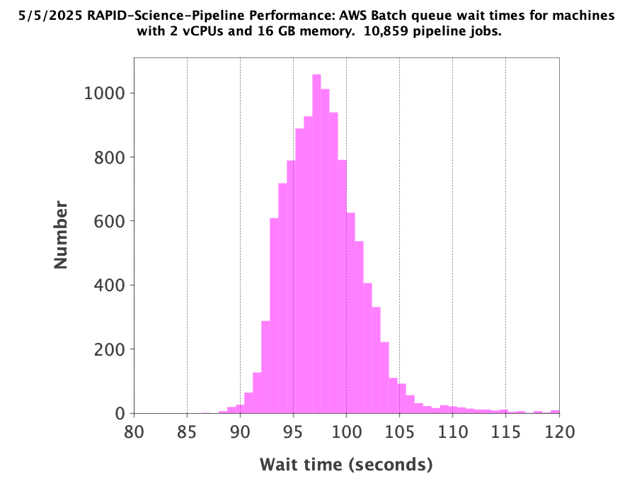

Histogram of science-pipeline execution times, measured from start to finish
on an AWS Batch machine:

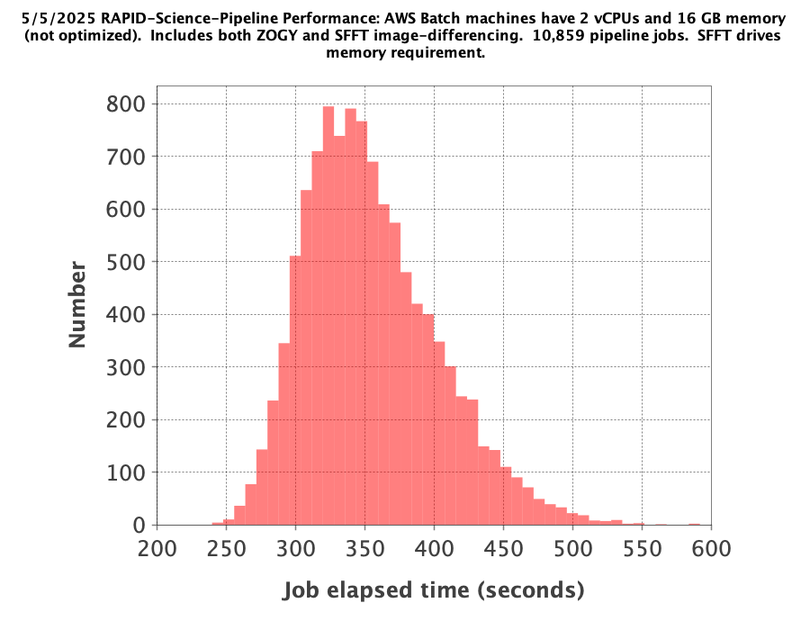

The histogram mode shows job times approximately 3 minutes shorter than in
the 4/28/2025 test, as expected: all required reference images already existed.

Timing benchmarks on an 8-core job-launcher machine (``t3.2xlarge`` EC2
instance), using 8-core multiprocessing:

===================================================================    ==========================
Task                                                                   Elapsed time in seconds
===================================================================    ==========================
Launch science pipelines                                               6,029
Register Jobs, Diffimages, RefImages records for science pipelines     2,067
Launch post-processing pipelines                                       5,967
Register Jobs records for post-processing pipelines                      343
===================================================================    ==========================

This test reused a subset of the standard-test reference images. Counts used
per filter ID:

.. code-block::

    rapidopsdb=> select a.fid,count(*)
                 from RefImages a, RefImMeta b
                 where a.rfid = b.rfid
                 and status > 0
                 and vbest > 0
                 and nframes >= 10
                 and cov5percent >= 60
                 group by a.fid
                 order by a.fid;

     fid | count
    -----+-------
       1 |   196
       2 |   189
       3 |     5
       4 |     7
    (4 rows)

5/6/2025
************************************

This test processed all 4,858 exposure-SCAs in the observation range below,
generating reference images on the fly as needed. The range is early in the
OpenUniverse dataset and includes filters poorly covered by the 4/28/2025 test.
AWS Batch machines for science-pipeline jobs have 2 vCPUs and 16 GB memory.

.. code-block::

    export STARTDATETIME="2028-09-08 08:30:00"
    export ENDDATETIME="2028-09-12 00:00:00"

    python3.11 /code/pipeline/awsBatchSubmitJobs_launchSciencePipelinesForDateTimeRange.py >& awsBatchSubmitJobs_launchSciencePipelinesForDateTimeRange_20250506.out &

.. code-block::

    rapidopsdb=> select ppid,exitcode,count(*) from jobs where ppid=15 and cast(launched as date) = '20250506' group by ppid, exitcode order by ppid, exitcode;
     ppid | exitcode | count
    ------+----------+-------
       15 |        0 |  4701
       15 |        4 |     3
       15 |       33 |   154
    (3 rows)

=======================================================    ==========================
Pipeline condition at termination                           Exitcode
=======================================================    ==========================
Normal                                                         0
SFFT failed due to singular matrix                             4
Reference image not available and could not be made           33
=======================================================    ==========================

Pipeline exit codes in the 0-31 range are considered normal, in the 32-63 range a warning, and 64 or greater an error.
Even though SFFT might have failed, a difference image is still generated by ZOGY.

The test generated 3,884 reference images across 5 filters and a variety of
fields. Field counts by filter ID:

.. code-block::

    rapidopsdb=> select fid,count(*) from refimages where vbest>0 and created >= '20250506' group by fid order by fid;
     fid | count
    -----+-------
       3 |   765
       4 |   780
       5 |   821
       6 |   821
       7 |   808
    (5 rows)

Cumulative reference-image counts, including the 4/28/2025 standard test, by
filter ID:

.. code-block::

    rapidopsdb=> select fid,count(*) from refimages where vbest>0 group by fid order by fid;
    (7 rows)
     fid | count
    -----+-------
       1 |   806
       2 |   812
       3 |   813
       4 |   810
       5 |   821
       6 |   821
       7 |   808
    (7 rows)

Histogram of AWS Batch queue wait times for an available pipeline-job machine:

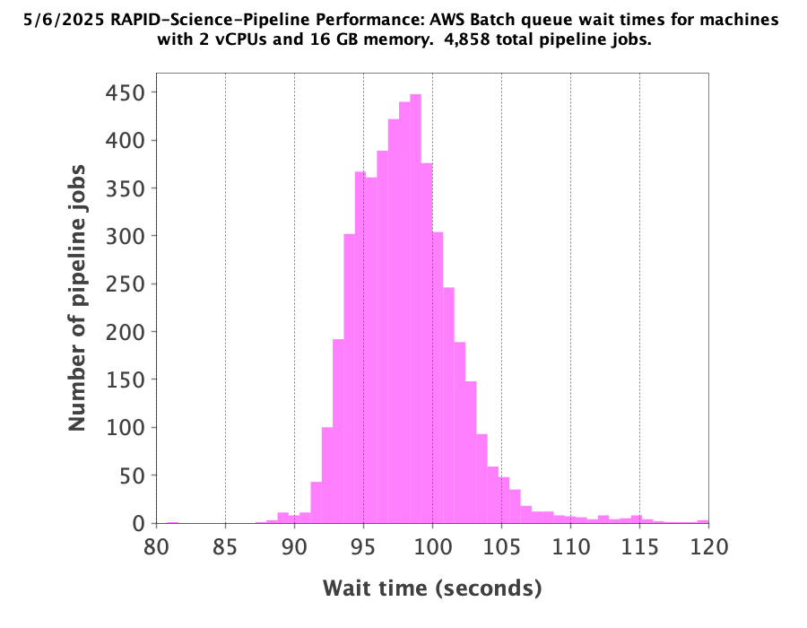

Histogram of job execution times, measured from pipeline start to finish on
an AWS Batch machine:

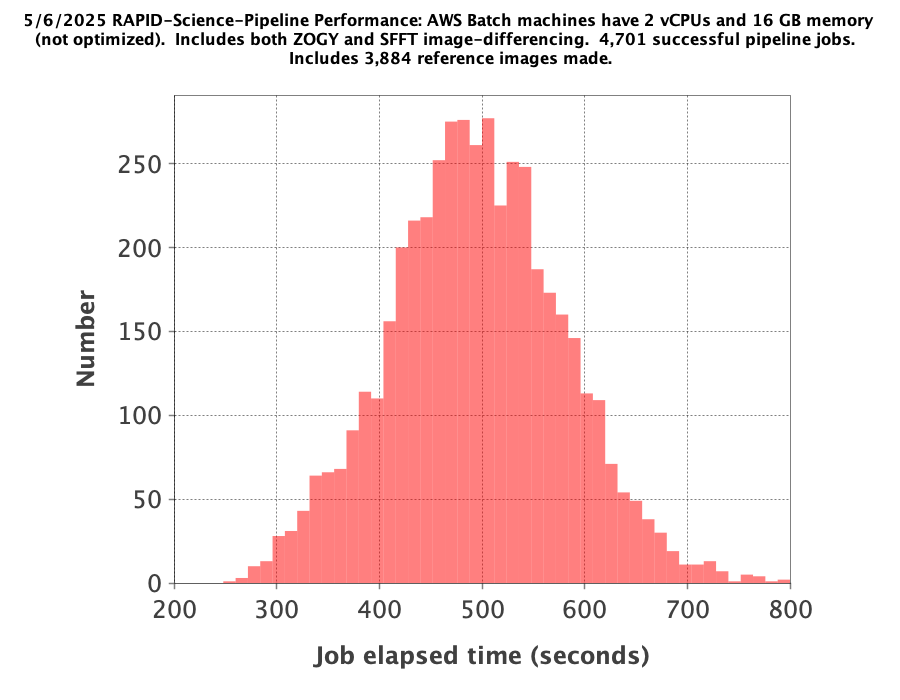

Job execution times versus input-frame counts for on-the-fly reference-image
generation in this test (2-D histogram):

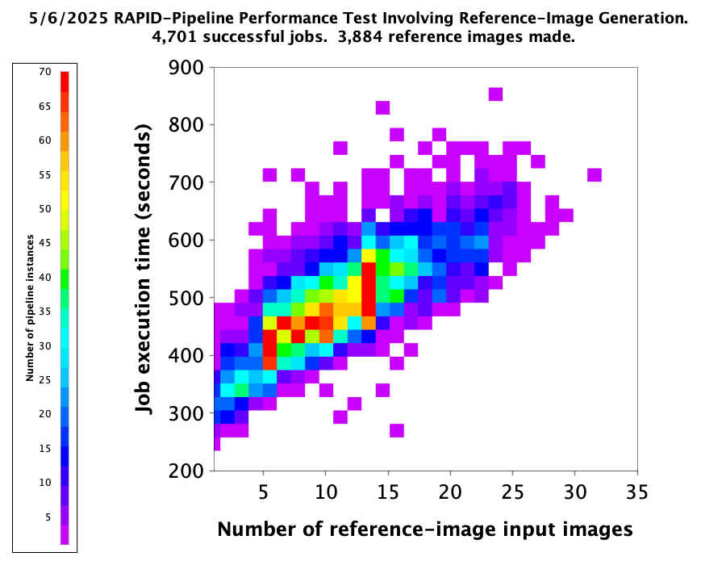

Histogram of ``nframes`` for all reference images made in this test:

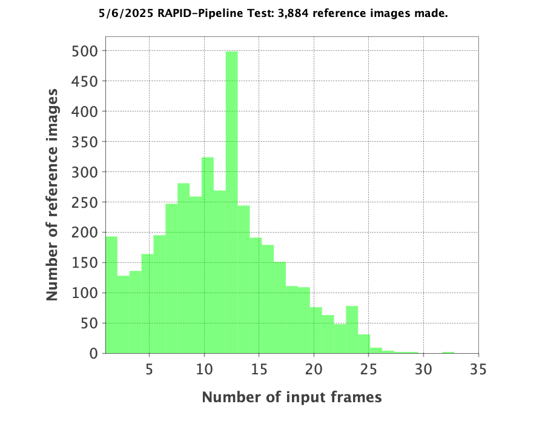

Histogram of ``cov5percent`` for all reference images made in this test:

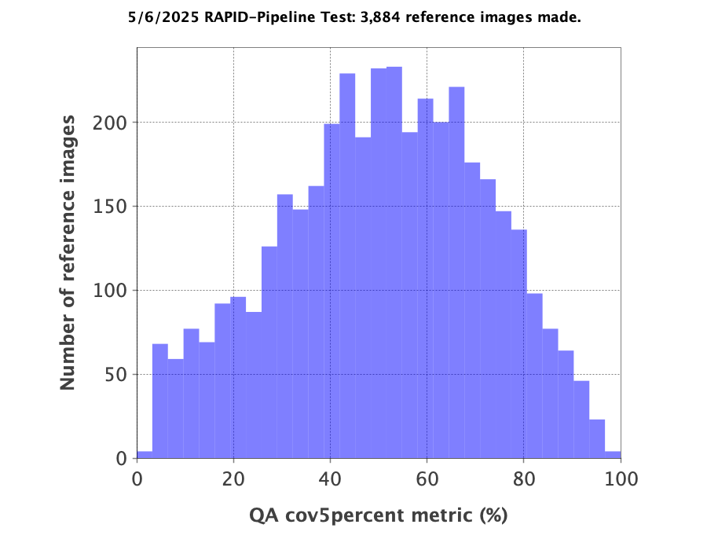

5/8/2025
************************************

This test processed all 3,020 exposure-SCAs in the observation range below,
generating reference images on the fly as needed. The range is early in the
OpenUniverse dataset. The new Virtual Pipeline Operator (VPO) ran in
single-processing-date mode.
AWS Batch machines for science-pipeline jobs have 2 vCPUs and 16 GB memory.

.. code-block::

    export STARTDATETIME="2028-09-12 00:00:00"
    export ENDDATETIME="2028-09-15 00:00:00"

    python3.11 /code/pipeline/virtualPipelineOperator.py 20250508 >& virtualPipelineOperator_20250508.out &

Pipeline exit codes:

.. code-block::

    rapidopsdb=> select ppid,exitcode,count(*) from jobs where cast(launched as date) = '20250508' group by ppid, exitcode order by ppid, exitcode;
     ppid | exitcode | count
    ------+----------+-------
       15 |        0 |  2924
       15 |       33 |    96
       17 |        0 |  2924
    (3 rows)

=======================================================    ==========================
Pipeline condition at termination                           Exitcode
=======================================================    ==========================
Normal                                                         0
SFFT failed due to singular matrix                             4
Reference image not available and could not be made           33
=======================================================    ==========================

Pipeline exit codes in the 0-31 range are considered normal, in the 32-63 range a warning, and 64 or greater an error.
Even though SFFT might have failed, a difference image is still generated by ZOGY.

The test generated 1,500 reference images across 4 filters and a variety of
fields. Field counts by filter ID:

.. code-block::

    rapidopsdb=> select fid,count(*) from refimages where vbest>0 and created >= '20250508' group by fid order by fid;

     fid | count
    -----+-------
       1 |   483
       2 |   495
       3 |    27
       4 |   495
    (4 rows)

Cumulative reference-image counts, including previous tests, by filter ID:

.. code-block::

    rapidopsdb=> select fid,count(*) from refimages where vbest>0 group by fid order by fid;

    fid | count
    -----+-------
       1 |  1289
       2 |  1307
       3 |   840
       4 |  1305
       5 |   821
       6 |   821
       7 |   808
    (7 rows)

5/10/2025
************************************

This test processed all 13,850 exposure-SCA images in the observation range
below, generating reference images on the fly as needed. The range is early
in the OpenUniverse dataset, with approximately equal image counts for filter
IDs 1-7. This was the second test of the new Virtual Pipeline Operator (VPO)
in single-processing-date mode and the largest single run to date.
AWS Batch machines for science-pipeline jobs have 2 vCPUs and 16 GB memory.

.. code-block::

    export STARTDATETIME="2028-09-15 00:00:00"
    export ENDDATETIME="2028-09-25 00:00:00"

    python3.11 /code/pipeline/virtualPipelineOperator.py 20250510 >& virtualPipelineOperator_20250510.out &

Pipeline exit codes, as expected:

.. code-block::

    rapidopsdb=> select ppid,exitcode,count(*) from jobs where cast(launched as date) = '20250510' group by ppid, exitcode order by ppid, exitcode;
     ppid | exitcode | count
    ------+----------+-------
       15 |        0 | 13506
       15 |        4 |    15
       15 |       33 |   329
       17 |        0 | 13521
    (4 rows)

=======================================================    ==========================
Pipeline condition at termination                           Exitcode
=======================================================    ==========================
Normal                                                         0
SFFT failed due to singular matrix                             4
Reference image not available and could not be made           33
=======================================================    ==========================

Pipeline exit codes in the 0-31 range are considered normal, in the 32-63 range a warning, and 64 or greater an error.
Even though SFFT might have failed, a difference image is still generated by ZOGY.

The test generated 4,876 reference images across all seven filters and a
variety of fields. Field counts by filter ID:

.. code-block::

    rapidopsdb=> select fid,count(*) from refimages where vbest>0 and created >= '20250510' group by fid order by fid;

     fid | count
    -----+-------
       1 |   533
       2 |   523
       3 |   816
       4 |   523
       5 |   825
       6 |   825
       7 |   831
    (7 rows)

Cumulative reference-image counts, including previous tests, by filter ID:

.. code-block::

    rapidopsdb=> select fid,count(*) from refimages where vbest>0 group by fid order by fid;

     fid | count
    -----+-------
       1 |  1822
       2 |  1830
       3 |  1656
       4 |  1828
       5 |  1646
       6 |  1646
       7 |  1639
    (7 rows)

Timing benchmarks on an 8-core job-launcher machine (``t3.2xlarge`` EC2
instance), using 8-core multiprocessing:

===================================================================    ==========================
Task                                                                   Elapsed time in seconds
===================================================================    ==========================
Launch science pipelines                                               7,747
Register Jobs, Diffimages, RefImages records for science pipelines     2,545
Launch post-processing pipelines                                       7,667
Register Jobs records for post-processing pipelines                    420
===================================================================    ==========================

5/14/2025
************************************

Same as 4/28/2025 standard test, except that SFFT was run with the ``--crossconv`` flag.  No new reference images
were made, as they already exist.  The resulting SFFT difference image, ``sfftdiffimage_cconv_masked.fits``, and the
SFFT decorrelated difference image, ``sfftdiffimage_dconv_masked.fits``, are copied to the
S3 product bucket, along with the other products.

6/12/2025
************************************

A special pipeline-launch script processed all 3,545 exposure-SCAs in the
observation range below, generating reference images on the fly as needed.
The science images span more than a year early in the OpenUniverse dataset
and cover all seven filters. Reference inputs come from the later window
63,400 < MJD < 99,9999. Only field/filter combinations with at least 6
reference input frames qualify, yielding 79 reference images.

Processing has two stages for efficiency: first, process one representative
science image per field/filter combination to generate the reference image;
then process all remaining science images using it. The representative is the
first image returned by a database query ordered by time and SCA for that
field and filter.

Only ZOGY difference-image products were made in this test.

.. code-block::

    export DBNAME=specialdb
    export STARTDATETIME="2028-09-07 00:00:00"
    export ENDDATETIME="2029-09-20 00:00:00"
    export STARTREFIMMJDOBS=63400
    export ENDREFIMMJDOBS=99999
    export MINREFIMNFRAMES=6
    export SPECIALRUNFLAG=True
    export LAUNCHSCIENCEPIPELINESCODE=/code/pipeline/launchSciencePipelinesForDateTimeRangeWithRefImageWindow.py
    export DRYRUN=False
    export MAKEREFIMAGESFLAG=True
    python3.11 /code/pipeline/virtualPipelineOperator.py 20250612 >& virtualPipelineOperator_20250612.out &
    export MAKEREFIMAGESFLAG=False
    python3.11 /code/pipeline/virtualPipelineOperator.py 20250612 >& virtualPipelineOperator_20250612_2.out &

.. code-block::

    db=> select ppid,exitcode,count(*) from jobs where cast(launched as date) = '20250612' group by ppid, exitcode order by ppid, exitcode;
     ppid | exitcode | count
    ------+----------+-------
       15 |        0 |  3545
       17 |        0 |  3545
    (2 rows)

6/13/2025
************************************

This test processed all 2,783 exposure-SCAs in the observation range below,
covering the observing year after the 20250612 test and reusing its reference
images.

VPO improvements and automation simplify the required run-time parameters:

.. code-block::

    export DBNAME=specialdb
    export STARTDATETIME="2029-09-20 00:00:00"
    export ENDDATETIME="2030-09-20 00:00:00"
    export STARTREFIMMJDOBS=63400
    export ENDREFIMMJDOBS=99999
    export MINREFIMNFRAMES=6

    python3.11 /code/pipeline/virtualPipelineOperator.py 20250613 >& virtualPipelineOperator_20250613.out &

6/17/2025
************************************

This test processed all 547 exposure-SCAs in the 21 days below, covering the
earliest OpenUniverse observations in all filters, which the two previous
tests had not covered. It generated reference images on the fly as needed to
test the VPO's special reference-image logic.

Processing has two stages for efficiency: first, process one representative
science image per field/filter combination to generate the reference image;
then process all remaining science images using it. The representative is the
first image returned by a database query ordered by time and SCA for that
field and filter.

Only ZOGY difference-image products were made in this test.

.. code-block::

    export DBNAME=specialdb
    export STARTDATETIME="2028-08-17 00:00:00"
    export ENDDATETIME="2028-09-07 00:00:00"
    export STARTREFIMMJDOBS=63400
    export ENDREFIMMJDOBS=99999
    export MINREFIMNFRAMES=6

    python3.11 /code/pipeline/virtualPipelineOperator.py 20250617 >& virtualPipelineOperator_20250617.out &

.. code-block::

    specialdb=> select ppid,exitcode,count(*) from jobs where cast(launched as date) = '20250617' group by ppid, exitcode order by ppid, exitcode;
     ppid | exitcode | count
    ------+----------+-------
       15 |        0 |   547
       17 |        0 |   547
    (2 rows)

6/20/2025
************************************

Same as the combined 6/12/2025, 6/13/2025, and 6/17/2025 tests, except that, in addition to the ZOGY
difference-image products, the SFFT difference-image products were also made.
Note that SFFT was run with the ``--crossconv`` flag.
No new reference images were made, as they already exist.
The resulting SFFT difference image, ``sfftdiffimage_cconv_masked.fits``, and the
SFFT decorrelated difference image, ``sfftdiffimage_dconv_masked.fits``, are copied to the
S3 product bucket, along with the other products.

Naive differencing (science minus reference image) produced ``naive_diffimage_masked.fits``.

.. code-block::

    export DBNAME=specialdb
    export STARTDATETIME="2028-08-17 00:00:00"
    export ENDDATETIME="2030-09-20 00:00:00"
    export STARTREFIMMJDOBS=63400
    export ENDREFIMMJDOBS=99999
    export MINREFIMNFRAMES=6

    python3.11 /code/pipeline/virtualPipelineOperator.py 20250620 >& virtualPipelineOperator_20250620.out &

.. code-block::

    specialdb=> select ppid,exitcode,count(*) from jobs where cast(launched as date) = '20250620' group by ppid, exitcode order by ppid, exitcode;
     ppid | exitcode | count
    ------+----------+-------
       15 |        0 |  6875
       17 |        0 |  6875
    (2 rows)

7/10/2025
************************************

A repeat of the 6/20/2025 test, but with new PhotUtils PSF-fit star-finder catalog from ZOGY difference image (noniterative),
stored in a separate file called ``diffimage_masked_psfcat_finder.txt``.

8/23/2025
************************************

Similar to the 7/10/2025 test, with the following exceptions:

* Made correction to uncertainty-image formula.
* New PSF-fit catalog for SFFT difference image.
* Fake-source injection was turned on.
* Changed [FAKE_SOURCES] num_injections = 100, mag_min = 21.0, mag_max = 28.0.
* Changed [PSFCAT_DIFFIMAGE] fwhm = 2.0.
* Changed [SEXTRACTOR_DIFFIMAGE] FILTER_THRESH = 3.0, DEBLEND_NTHRESH = 32, WEIGHT_TYPE = "NONE,MAP_RMS", FILTER = "N" (last two parameters are overrided in code for ZOGY and SFFT SExtractor catalogs).
* Fed ZOGY dxrmsfin = 0.0, dyrmsfin = 0.0 for comparison with SFFT.

Covers 6,875 science images.  All science images in the 8/23 run had 100 fake sources injected per science image.
This is in addition to the fake sources that are already included in the OpenUniverse simulation set.

New reference images were made with corrected uncertainties (79 total).
The reference images are special in that their input frames are selected
from the observation window 63,400 < MJD < 99,9999, which is later than the observation range of the test.
The test covers only those field/filter combinations in which reference images can be made that have 6 input frames or more,
which resulted in 79 reference images.

Note that SFFT was run with the ``--crossconv`` flag, as was done for the 6/20/25 and 7/10/25 tests,
but in those previous tests, the convolved and deconvolved SFFT difference images had their roles
mistakenly swapped (in terms of being fed to SExtractor downstream).
The resulting SFFT deconvolved difference image, ``sfftdiffimage_dconv_masked.fits``, and the
SFFT convolved difference image, ``sfftdiffimage_cconv_masked.fits``, are copied to the
S3 product bucket, along with the other products.

Naive differencing (science minus reference image) produced ``naive_diffimage_masked.fits``.
The new SExtractor catalog for the naive difference image is ``naive_diffimage_masked.txt``.

.. code-block::

    export DBNAME=fakesourcesdb
    export STARTDATETIME="2028-08-17 00:00:00"
    export ENDDATETIME="2030-09-20 00:00:00"
    export STARTREFIMMJDOBS=63400
    export ENDREFIMMJDOBS=99999
    export MINREFIMNFRAMES=6

    python3.11 /code/pipeline/virtualPipelineOperator.py 20250823 >& virtualPipelineOperator_20250823.out &

.. code-block::

    fakesourcesdb=> select ppid,exitcode,count(*) from jobs where cast(launched as date) = '20250823' group by ppid, exitcode order by ppid, exitcode;
     ppid | exitcode | count
    ------+----------+-------
       15 |        0 |  6875
       17 |        0 |  6875
    (2 rows)

The VPO clocked 3.24 hours to run the entire test (all 6,875 science images).
As shown in the table below for a particular pipeline instance, executing SFFT,
executing AWAICGEN for reference-image generation, and injecting fake sources
are the dominant factors affecting pipeline performance.

==============================================================  =====================
Pipeline step                                                   Execution time (sec)
==============================================================  =====================
Downloading science image                                       0.865
Downloading or generating reference image  (9 input frames)     129.247
Injecting fake sources                                          51.104
Generating science-image catalog                                3.029
Swarping images                                                 8.826
Running bkgest on science image                                 13.459
Running gainmatchscienceandreferenceimages                      5.845
Replacing nans, applying image offsets, etc.                    0.101
Running ZOGY                                                    39.043
Masking ZOGY difference image                                   0.579
Running sextractor on ZOGY difference image                     3.901
Generating psf-fit catalog on ZOGY difference image             15.247
Uploading main products to s3 bucket                            4.429
Running SFFT                                                    291.798
Uploading SFFT difference image to s3 bucket                    5.317
Running sextractor on SFFT difference image                     1.442
Uploading SFFT-diffimage sextractor catalog to s3 bucket        0.109
Generating psf-fit catalog on SFFT difference image             12.091
Uploading SFFT-diffimage psf-fit catalogs to s3 bucket          0.800
Computing naive image difference                                1.211
Running sextractor on naive difference image                    4.671
Uploading products at pipeline end                              0.033
Total time to run one instance of science pipeline              593.158
==============================================================  =====================

The test covered 5,538 exposures, typically processing only 1-4 science images
per exposure. Science-image counts by filter:

.. code-block::

    fakesourcesdb=> select fid,count(*) from diffimages where vbest>0 and status>0 and created >= '2025-08-23' group by fid;
     fid | count
    -----+-------
       7 |   770
       1 |   770
       5 |  1142
       4 |  1140
       2 |  1142
       6 |  1141
       3 |   770
    (7 rows)

9/27/2025
************************************

Similar to the 8/23/2025 test, with the following bug fixes and additions:

    * Modified to not limit the precision of (ra, dec) in PSF-fit catalogs.
    * Added code to generate naive-difference-image PSF-fit catalogs.
    * Added code to generate SExtractor catalogs and PSF-fit catalogs for negative difference images (ZOGY, SFFT, naive).
    * Modified to feed sca_gain * exptime_sciimage as gain to method compute_diffimage_uncertainty.
    * Fixed bug: x and y subpixels offsets were swapped (adversely affected inputs to ZOGY, SFFT, and naive image-differencing).
    * Added new method normalize_image to normalize science-image PSFs (required by ZOGY).

These additions generate separate catalogs for negative difference images,
with the suffix "_negative" embedded in each filename.

Covers 6,875 science images.  All science images in the 9/27 run had 100 fake sources injected per science image.
This is in addition to the fake sources that are already included in the OpenUniverse simulation set.

New reference images were made with corrected uncertainties (79 total).
The reference images are special in that their input frames are selected
from the observation window 63,400 < MJD < 99,9999, which is later than the observation range of the test.
The test covers only those field/filter combinations in which reference images can be made that have 6 input frames or more,
which resulted in 79 reference images.

Note that SFFT was run with the ``--crossconv`` flag, as was done for the 8/23/25 test,
but in those previous tests, the convolved and deconvolved SFFT difference images had their roles
mistakenly swapped (in terms of being fed to SExtractor downstream).
The resulting SFFT deconvolved difference image, ``sfftdiffimage_dconv_masked.fits``, and the
SFFT convolved difference image, ``sfftdiffimage_cconv_masked.fits``, are copied to the
S3 product bucket, along with the other products.

Naive differencing (science minus reference image) produced ``naive_diffimage_masked.fits``.
The new SExtractor catalog for the naive difference image is ``naive_diffimage_masked.txt``.

.. code-block::

    export DBNAME=fakesourcesdb
    export STARTDATETIME="2028-08-17 00:00:00"
    export ENDDATETIME="2030-09-20 00:00:00"
    export STARTREFIMMJDOBS=63400
    export ENDREFIMMJDOBS=99999
    export MINREFIMNFRAMES=6

    python3.11 /code/pipeline/virtualPipelineOperator.py 20250927 >& virtualPipelineOperator_20250927.out &

.. code-block::

    fakesourcesdb=> select ppid,exitcode,count(*) from jobs where cast(launched as date) = '20250927' group by ppid, exitcode order by ppid, exitcode;
     ppid | exitcode | count
    ------+----------+-------
       15 |        0 |  6875
       17 |        0 |  6875
    (2 rows)

The VPO clocked 3.55 hours to run the entire test (all 6,875 science images),
with parallel processing (up to 10,000 machines with 1 machine per science image).
As shown in the table below for a particular pipeline instance, executing SFFT,
executing AWAICGEN for reference-image generation, and injecting fake sources
are the dominant factors affecting pipeline performance.

==============================================================  =====================
Pipeline step                                                   Execution time (sec)
==============================================================  =====================
Downloading science image                                             0.910
Downloading or generating reference image                           128.579
Injecting fake sources                                               57.766
Generating science-image catalog                                      2.757
Swarping images                                                       9.153
Running bkgest on science image                                      14.381
Running gainMatchScienceAndReferenceImages                            6.114
Replacing NaNs, applying image offsets, etc.                          0.105
Running ZOGY                                                         39.384
Masking ZOGY difference image                                         0.951
Running SExtractor on positive ZOGY difference image                  3.823
Running SExtractor on negative ZOGY difference image                  1.599
Generating PSF-fit catalog on positive ZOGY difference image         15.176
Generating PSF-fit catalog on negative ZOGY difference image          9.631
Uploading main products to S3 bucket                                  7.981
Running SFFT                                                        295.983
Uploading SFFT difference image to S3 bucket                          7.481
Running SExtractor on positive SFFT difference images                 1.424
Running SExtractor on negative SFFT difference images                 1.448
Uploading SFFT-diffimage SExtractor catalogs to S3 bucket             0.196
Generating PSF-fit catalog on positive SFFT difference image         12.655
Generating PSF-fit catalog on negative SFFT difference image         11.014
Uploading SFFT-diffimage PSF-fit catalogs to S3 bucket                1.626
Computing naive difference images                                     2.212
Running SExtractor on positive naive difference image                 4.273
Running SExtractor on negative naive difference image                 1.662
Uploading SExtractor catalogs for naive difference images             0.941
Running/uploading PSF-fit catalogs for naive difference images       26.879
Uploading products at pipeline end                                    0.037
Total time to run one instance of science pipeline                  666.143
==============================================================  =====================

The test covered 5,538 exposures, typically processing only 1-4 science images
per exposure. Science-image counts by filter:

.. code-block::

    fakesourcesdb=> select fid,count(*) from diffimages where vbest>0 and status>0 and created >= '2025-09-27' group by fid;
     fid | count
    -----+-------
       7 |   770
       1 |   770
       5 |  1142
       4 |  1140
       2 |  1142
       6 |  1141
       3 |   770
    (7 rows)

Loading Python photutils PSF-fit catalogs from positive and negative ZOGY
difference images into Sources child PostgreSQL tables took 14.7 minutes
with 8 parallel processes and added 13,767,979 Sources records.

Cross-matching the sources, resulting in records loaded into the Merges_<field> and
AstroObjects_<fields> database tables, for all fields of the sources, was done.
The elapsed time to cross-match all sources was 3.5 hours with 8 parallel processes.
This includes cross-matching across field boundaries for sources near field edges.
A match radius of 0.1 arcsec (a Roman WFI pixel) was used.
The PostgreSQL database received 3,269,268 AstroObjects records and
58,913,016 Merges records (lightcurve data points). Of these, 15,449 merges
crossed field boundaries because the match radius can extend beyond a field,
increasing the merge count by 0.02623%.

After cross-matching, a separate process updates the lightcurve statistics
in AstroObjects_<fields>, then explicitly vacuums and analyzes the tables.
This took 11 minutes.

2/27/2026
************************************

Similar to the 9/27/2025 test, but with the following bug fixes and additions:

===============   ===============================================================================================================================================================================================================================
Date              Software modification
===============   ===============================================================================================================================================================================================================================
10/10/2025        Added source matching within/without field boundaries to populate Sources, Merges, and AstroObjects database tables.
10/11/2025        Added methods to compute statistics for AstroObjects database tables.
10/29/2025        Set ``min_separation = 1.0`` pixel for PhotUtils catalog generation.
11/19/2025        Upgraded to SExtractor 2.28.2.
11/25/2025        Modified ``awaicgen`` for execution on Mac laptop (compiler is more strict than Linux).
12/4/2025         Explicitly cast data and uncertainty images as ndarrays when passed to PhotUtils methods (not sure whether this actually caused any problems).
12/8/2025         Fixed call to ``romanisim.psf.make_one_psf`` method after interface changed.
12/17/2025        New SFFT python module that works on rimtimsim images.
12/22/2025        Adjusted ``awaicgen_num_threads = 2`` to match the number of VCPUs in the AWS Batch machines used by the RAPID pipeline.
1/14/2026         Modified science pipeline to output catalogs in parquet format.
1/24/2026         Added methods to delete not-best records in Sources and Merges database tables.
1/30/2026         Developed code to generate sources and lightcurves HATS catalogs.
1/31/2026         Various miscellaneous improvements such as modifications to run RAPID science pipeline on Mac laptop.
2/3/2026          Created forced-photometry backend and added ``cforcepsfaper`` C module.
2/4/2026          Reduced-chi2 in PhotUtils catalogs and Sources database table.
2/11/2026         Scaled reference-image inputs so that reference image has fixed zero point = 17 mag.
2/12/2026         Modified to generate PhotUtils catalog for reference image.
===============   ===============================================================================================================================================================================================================================

These additions generate more product files, including reference-image
PhotUtils catalogs in different formats.

Covers 6,875 science images.  All science images in this run had 100 fake sources injected per science image.
This is in addition to the fake sources that are already included in the OpenUniverse simulation set.

New reference images were made (79 total), and more useful keywords were included in the FITS header.
The reference images are special in that their input frames are selected
from the observation window 63,400 < MJD < 99,9999, which is later than the observation range of the science images
that are processed in the test.
The test covers only those field/filter combinations in which reference images can be made that have 6 input frames or more
(which resulted in the aforementioned 79 reference images).

ZOGY image-difference products were generated, as well as SFFT and naive difference-image products.
Note that SFFT was run with the ``--crossconv`` flag, as was done for the 9/27/25 test.
The resulting SFFT deconvolved difference image, ``sfftdiffimage_dconv_masked.fits``, and the
SFFT convolved difference image, ``sfftdiffimage_cconv_masked.fits``, are copied to the
S3 product bucket, along with the other products.
Naive differencing (science minus reference image) produced ``naive_diffimage_masked.fits``.
All three methods produced SExtractor and PhotUtils catalogs.

.. code-block::

    export DBNAME=fakesourcesdb
    export STARTDATETIME="2028-08-17 00:00:00"
    export ENDDATETIME="2030-09-20 00:00:00"
    export STARTREFIMMJDOBS=63400
    export ENDREFIMMJDOBS=99999
    export MINREFIMNFRAMES=6

    python3.11 /code/pipeline/virtualPipelineOperator.py 20260227 >& virtualPipelineOperator_20260227.out &

.. code-block::

    fakesourcesdb=> select ppid,exitcode,count(*) from jobs where cast(launched as date) = '20260227' group by ppid, exitcode order by ppid, exitcode;
     ppid | exitcode | count
    ------+----------+-------
       15 |        0 |  6875
       17 |        0 |  6875
    (2 rows)

The VPO generated difference-image products for all 6,875 science images in
2.46 hours, excluding Sources-table loading and subsequent steps. AWS Batch
parallelism, up to 10,000 machines with 1 machine per science image,
facilitated this speed.
As shown in the table below for a particular pipeline instance, executing SFFT,
executing AWAICGEN for reference-image generation (depends on the number of input images),
applying sub-pixel offsets to the reference image,
injecting fake sources, and generating PhotUtils catalogs are the dominant factors
affecting pipeline performance.

=================================================================  =====================
Pipeline step                                                      Execution time (sec)
=================================================================  =====================
Downloading science image                                             0.587
Uloading science image to product S3 bucket                           0.400
Downloading or generating reference image                           333.833
Uploading reference image to S3 product bucket                        5.383
Injecting fake sources                                               54.371
Generating science-image catalog                                      3.094
Swarping images                                                       8.807
Uploading intermediate FITS files to product S3 bucket                3.519
Running bkgest on science image                                       8.738
Running gainMatchScienceAndReferenceImages                            6.169
Replacing NaNs, applying image offsets, etc.                         91.259
Running ZOGY                                                         40.064
Masking ZOGY difference image                                         0.894
Running SExtractor on positive ZOGY difference image                  4.232
Running SExtractor on negative ZOGY difference image                  1.663
Generating PSF-fit catalog on positive ZOGY difference image         23.256
Generating PSF-fit catalog on negative ZOGY difference image         12.590
Uploading main products to S3 bucket                                  6.134
Running SFFT                                                        154.794
Uploading SFFT difference image to S3 product bucket                  6.349
Running SExtractor on positive SFFT difference images                 1.776
Running SExtractor on negative SFFT difference images                 1.729
Uploading SFFT-diffimage SExtractor catalogs to S3 product bucket     0.157
Generating PSF-fit catalog on positive SFFT difference image         15.669
Generating PSF-fit catalog on negative SFFT difference image         14.473
Uploading SFFT-diffimage PSF-fit catalogs to S3 product bucket        2.348
Computing naive difference images                                     0.799
Uploading naive difference images to S3 product bucket                1.326
Running SExtractor on positive naive difference image                 4.351
Running SExtractor on negative naive difference image                 1.700
Uploading SExtractor catalogs for naive difference images             0.581
Generating PSF-fit catalog on positive naive difference image        23.735
Generating PSF-fit catalog on negative naive difference image        12.546
Uploading PSF-fit catalogs for naive difference images                1.730
Uploading products at pipeline end to S3 product bucket               0.036
Total time to run one instance of science pipeline                  849.093
=================================================================  =====================

The test covered 5,538 exposures, typically processing only 1-4 science images
per exposure. Science-image counts by filter:

.. code-block::

    fakesourcesdb=> select fid,count(*) from diffimages where vbest>0 and status>0 and created >= '2026-02-27' group by fid;
     fid | count
    -----+-------
       7 |   770
       1 |   770
       5 |  1142
       4 |  1140
       2 |  1142
       6 |  1141
       3 |   770
    (7 rows)

Loading Python photutils PSF-fit catalogs from positive and negative ZOGY
difference images into Sources child PostgreSQL tables took 17.0 minutes
with 8 parallel processes and added 13,722,343 Sources records.

Cross-matching sources with astronomical objects (AstroObjects) across all
fields of the sources populated Merges_<field> and AstroObjects_<fields>.
This took 3.39 hours with 8 parallel processes, including matches across
field boundaries for sources near field edges.
A match radius of 0.1 arcsec (a Roman WFI pixel) was used.
The PostgreSQL database received 3,488,741 AstroObjects records and
66,449,889 Merges records (lightcurve data points). Of these, 16,307 merges
crossed field boundaries because the match radius can extend beyond a field,
increasing the merge count by 0.02454%.

After cross-matching, a separate process updates lightcurve statistics in
AstroObjects_<fields> and deletes records without associated sources in
Merges_<field>. It creates a new Q3C index on (meanra, meandec) for every
AstroObjects_<fields> table, then sets the tables to logged, clusters and
analyzes them, and explicitly vacuums them at the end.
For this test, all of this took 15.44 minutes with 8 parallel processes.

It took 10.4 hours to delete non-best Merges_<fields> records with 8 parallel processes,
which also included vacuuming and analyzing all Merges_<fields> database tables.
The likely cause of the long run time was repeated cross-matching of the same
input during testing/debugging, which created many redundant records.

It took 33 minutes to delete all not-best records in sources_20250927_* database tables
with 8 parallel processes.

3/25/2026
************************************

This test was similar to the 2/27/2026 test, with upgraded fake-source injection:
variable sources have fixed sky positions, enabling lightcurves from repeated
extractions. Variable sources are also injected into the science images used
to build reference images.

Most ZOGY difference-image products now have the filename prefix "zogy_".

Each of the 6,875 science images received 100 injected fake variable sources,
in addition to those already in the OpenUniverse simulation set.

New reference images were made (79 total).
The reference images are special in that their input frames are selected
from the observation window 63,400 < MJD < 99,9999, which is later than the observation
range of the science images that are processed in the test.
The test covers only those field/filter combinations in which reference images can be made
that have 6 input frames or more (which resulted in the aforementioned 79 reference images).
The reference images are associated with 21 distinct fields, and for each of these
fields there are reference images for three or more WFI bandpasses, as shown in the
following query results:

.. code-block::

    fakesourcesdb=> select field, count(*) from refimages where vbest>0 group by field order by field;
      field  | count
    ---------+-------
     5257274 |     3
     5261331 |     4
     5261333 |     4
     5285570 |     3
     5293565 |     3
     5297552 |     4
     5297554 |     4
     5297558 |     4
     5321341 |     4
     5325281 |     4
     5325283 |     4
     5333116 |     4
     5352605 |     4
     5356461 |     3
     5356467 |     3
     5356469 |     3
     5356473 |     7
     5356477 |     3
     5356479 |     4
     5364185 |     3
     5364186 |     4
    (21 rows)

Reference-image counts by input-frame count and quality-assurance metric cov5percent:

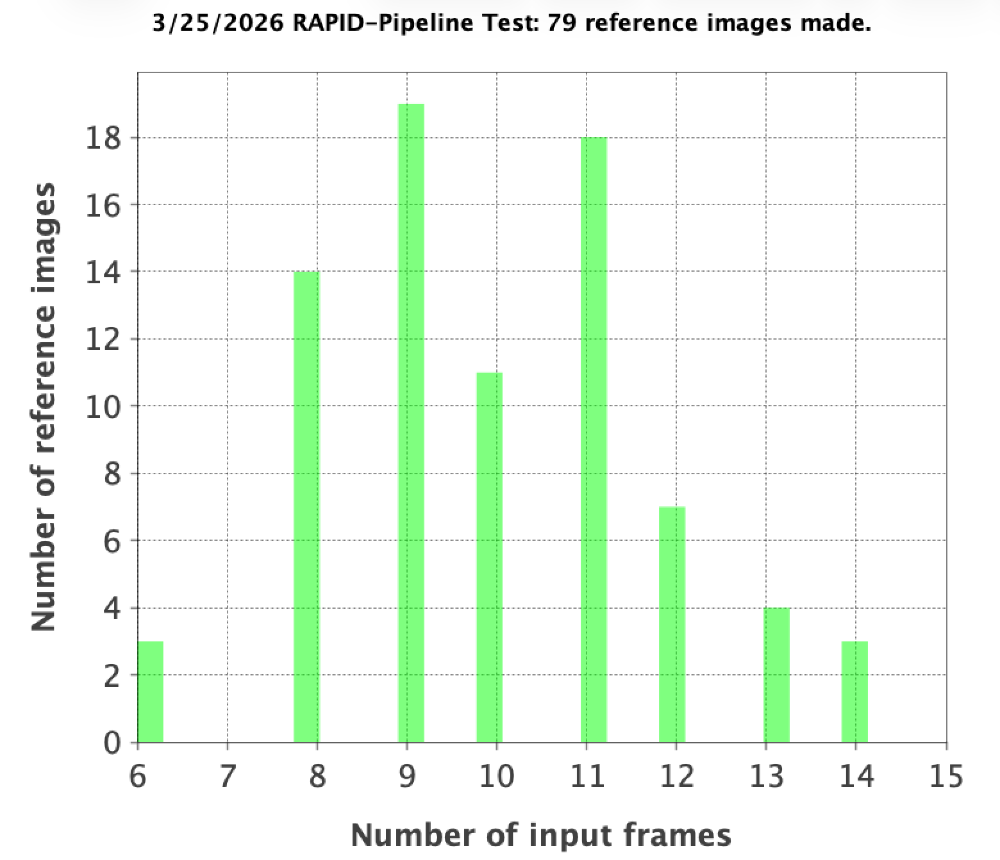

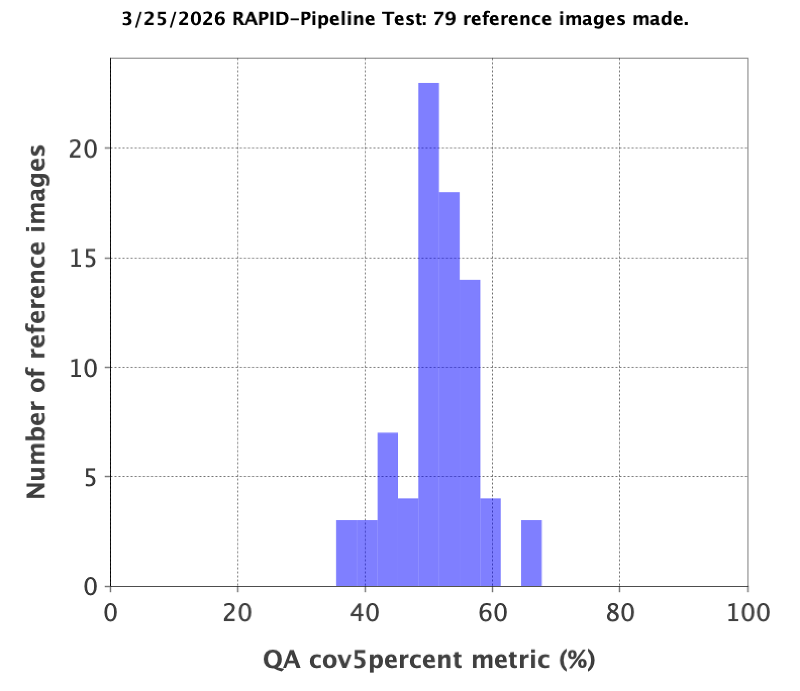

The quality-assurance metric cov5percent (FITS-header keyword COV5PERC)
is an absolute measure of a RAPID reference image's aggregate areal-depth coverage
at a reference depth of 5, corresponding to a coadd depth of at least 5 input
images. From the reference-image coverage map, it sums pixel coverage capped
at 5 and expresses the result as a percentage of 5 times the total pixel count.

ZOGY image-difference products were generated, as well as SFFT and naive difference-image products.
Note that SFFT was run with the ``--crossconv`` flag, as was done for the 2/27/26 test.
The resulting SFFT deconvolved difference image, ``sfftdiffimage_dconv_masked.fits``, and the
SFFT convolved difference image, ``sfftdiffimage_cconv_masked.fits``, are copied to the
S3 product bucket, along with the other products.
Naive differencing (science minus reference image) produced ``naive_diffimage_masked.fits``.
All three methods produced SExtractor and PhotUtils catalogs.

.. code-block::

    export DBNAME=fakesourcesdb
    export STARTDATETIME="2028-08-17 00:00:00"
    export ENDDATETIME="2030-09-20 00:00:00"
    export STARTREFIMMJDOBS=63400
    export ENDREFIMMJDOBS=99999
    export MINREFIMNFRAMES=6

    python3.11 /code/pipeline/virtualPipelineOperator.py 20260325 >& virtualPipelineOperator_20260325.out &

.. code-block::

    fakesourcesdb=> select ppid,exitcode,count(*) from jobs where cast(launched as date) = '20260325' group by ppid, exitcode order by ppid, exitcode;
     ppid | exitcode | count
    ------+----------+-------
       15 |        0 |  6875
       17 |        0 |  6875
    (2 rows)

This 2-D histogram plots elapsed time against start time for RAPID science
pipelines running in parallel under AWS Batch, with up to 10,000 machines
permitted in the job queue:

* Upper left: the 79 instances that generated all required reference images.
  Injecting fake variable sources into reference inputs made these runs
  significantly longer than in previous tests.
* Middle: the remaining science-image instances, reusing reference images
  from the first 79 instances.
* Lower right: post-processing instances, also parallel under AWS Batch.
  These finalize products, including FITS-header updates and file checksums.

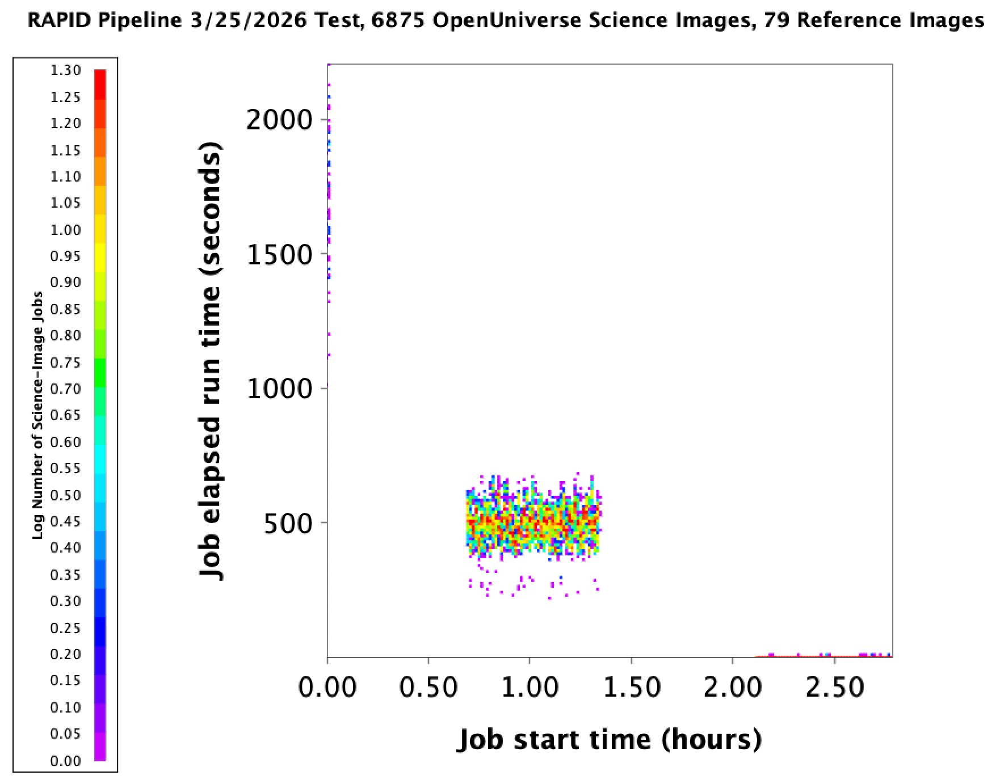

The VPO generated difference-image products for all 6,875 science images in
2.8 hours, excluding Sources-table loading and subsequent steps. AWS Batch
parallelism, up to 10,000 machines with 1 machine per science image,
facilitated this speed.  The average AWS-Batch queue wait time was 141 s (stddev=13.7 s);
queue wait times vary from day to day, and can range from minutes to hours depending
on machine availability.

As shown in the table below for the longest running pipeline instance (jid = 90894),
executing AWAICGEN for reference-image generation
(depends on the number of input images; NFRAMES=14 for this case),
executing SFFT, injecting fake sources  (both science image and reference-image inputs),
and generating PhotUtils catalogs are the dominant factors
affecting pipeline performance.

=================================================================  =====================
Pipeline step                                                      Execution time (sec)
=================================================================  =====================
Downloading science image                                                 0.590
Uploading science image to product S3 bucket                              0.372
Downloading or generating reference image                              1687.838
Uploading reference image to S3 product bucket                            2.898
Injecting fake sources                                                  108.987
Generating science-image catalog                                          3.412
Swarping images                                                           8.767
Uploading intermediate FITS files to product S3 bucket                    3.249
Running bkgest on science image                                           8.381
Running gainMatchScienceAndReferenceImages                                6.792
Replacing NaNs, applying image offsets, etc.                              0.096
Running ZOGY                                                             39.313
masking ZOGY difference image                                             0.877
Running SExtractor on positive ZOGY difference image                      4.813
Running SExtractor on negative ZOGY difference image                      2.538
Generating PSF-fit catalog on positive ZOGY difference image             36.232
Generating PSF-fit catalog on negative ZOGY difference image             19.169
Uploading main products to S3 bucket                                      5.300
Running SFFT                                                            142.225
Uploading SFFT difference image to S3 product bucket                      6.107
Running SExtractor on positive SFFT difference images                     2.906
Running SExtractor on negative SFFT difference images                     2.332
Uploading SFFT-diffimage SExtractor catalogs to S3 product bucket         0.177
Generating PSF-fit catalog on positive SFFT difference image             27.088
Generating PSF-fit catalog on negative SFFT difference image             21.861
Uploading SFFT-diffimage PSF-fit catalogs to S3 product bucket            1.236
Computing naive difference images                                         0.710
Uploading naive difference images to S3 product bucket                    0.881
Running SExtractor on positive naive difference image                     4.245
Running SExtractor on negative naive difference image                     1.702
Uploading SExtractor catalogs for naive difference images                 0.844
Generating PSF-fit catalog on positive naive difference image            36.271
Generating PSF-fit catalog on negative naive difference image            19.198
Uploading PSF-fit catalogs for naive difference images to                 1.192
Uploading products at pipeline end to S3 product bucket                   0.036
Total time to run one instance of science pipeline                     2208.632
=================================================================  =====================

The test covered 5,538 exposures, typically processing only 1-4 science images
per exposure. Science-image counts by filter:

.. code-block::

    fakesourcesdb=> select fid,count(*) from diffimages where vbest>0 and status>0 and created >= '2026-03-25' group by fid;
     fid | count
    -----+-------
       7 |   770
       1 |   770
       5 |  1142
       4 |  1140
       2 |  1142
       6 |  1141
       3 |   770
    (7 rows)

Loading Python photutils PSF-fit catalogs from positive and negative ZOGY
difference images into Sources child PostgreSQL tables took 16.9 minutes
with 8 parallel processes and added 14,327,713 Sources records.

Cross-matching sources with astronomical objects (AstroObjects) across all
262 fields of the sources populated Merges_<field> and AstroObjects_<fields>.
This took 3.392 hours with 8 parallel processes, including matches across
field boundaries for sources near field edges.
A match radius of 0.1 arcsec (a Roman WFI pixel) was used.
The PostgreSQL database received 3,623,747 AstroObjects records and
69,111,195 Merges records (lightcurve data points). Of these, 17,760 merges
crossed field boundaries because the match radius can extend beyond a field,
increasing the merge count by 0.02570%.

After cross-matching, a separate process updates lightcurve statistics in
AstroObjects_<fields> and deletes records without associated sources in
Merges_<field>. It creates a new Q3C index on (meanra, meandec) for every
AstroObjects_<fields> table, then sets the tables to logged, clusters and
analyzes them, and explicitly vacuums them at the end.
For this test, all of this took 30.34 minutes with 8 parallel processes.

It took 2.40 hours to delete non-best Merges_<fields> records with 8 parallel processes,
which also included vacuuming and analyzing all Merges_<fields> database tables.
The likely cause of the long run time was repeated cross-matching of the same
input during testing/debugging, which created many redundant records.

It took 28.50 minutes to delete all not-best records in sources_20260227_* database tables
with 8 parallel processes.

5/13/2026
************************************

This test was similar to the 3/25/2026 test, with the improvements below. Database
loading used SFFT-difference-image PSF-fit catalogs instead of ZOGY catalogs,
unlike the 3/25/2026 test. Other major changes were upgrades to
``crossMatchSources.py`` and a reduced match radius of 0.00001528 degrees
(half a Roman WFI pixel).

===============   ===============================================================================================================================================================================================================================
Date              Software modification
===============   ===============================================================================================================================================================================================================================
4/7/2026          Modified SFFT code to output a difference-image PSF
4/9/2026          Changes to how the uncertainty images are calculated (for science image and refimage inputs).
4/13/2026         Replaces hard-wired value 1750.0 with ``saturation_value_rate_sciimage`` for processing rimtimsims.
4/16/2026         Modified crossMatchSources.py to only cross-match sources with ``flags = 0``.
4/17/2026         Modified crossMatchSources.py to cross-match using AstroObjects ``(meanra,meandec)`` instead of ``(ra0,dec0)``.
4/17/2026         Modified crossMatchSources.py to update AstroObjects ``(meanra,meandec)`` record for each lightcurve data point added.
4/20/2026         Modified to cross-match all sources in one observation at a time for all SCAs in ascending time order.
4/20/2026         Modified to load into RAPID operations database the SFFT-difference-image PhotUtils catalogs, instead of ZOGY.
4/21/2026         Modified to replace NaNs, if any, in SFFT difference image with zeros.
4/21/2026         Modified to replace NaNs, if any, in difference-image uncertainty images with ``std_dif_img``.
4/21/2026         Increased ``[SCI_IMAGE] saturation_level`` from 100000 to 1100000 for rimtimsims.
4/22/2026         Modified SFFT command for rimtimsims to use the brute-force masking options (``--bsmaskvalue 20000.0 --bsmaskradius 30.0``).
4/22/2026         In the latest version of PhotUtils, output column name ``npixfit`` has been changed to ``n_pixels_fit``, and output column name ``npix`` has been changed to ``n_pixels``.
4/23/2026         Modified to use ``filename_sfftdiffpsf`` for SFFT-difference-image PSF-fit catalog generation, instead of ``filename_refimage_psf`` as before.
4/24/2026         Changed ``[SOURCE_MATCHING] match_radius`` to 0.00001528 degrees (half a Roman WFI pixel).  Reran cross-matching for the 4/23/2026 test.
4/28/2026         Modified SFFT code to refactor bright star masking in ``bkg_mask`` to use binary_dilation.
4/28/2026         Modified SFFT code to replace the slow per-pixel distance loop with ``scipy.ndimage.binary_dilation`` and a precomputed circular footprint.
4/28/2026         Modified SFFT code so that when a SExtractor catalog is provided, a second pass after catalog masking to catch any remaining bright pixels above ``bsmask_value``.
4/29/2026         Modified SFFT code to fix logic path issues, and set ``sat_value`` and ``bsmask_value`` defaults to 1e6 to disable masking unless explicitly set.
5/12/2026         Modified to scale the reference-image uncertainty map by the gain-matching scale factor (prior to this, gain-matching was only applied to the reference image).
5/12/2026         Moved the block of code that uploads intermediate products to just before ZOGY execution (this facilitates running ZOGY offline from S3-bucket downloaded inputs).
===============   ===============================================================================================================================================================================================================================

As in the 3/25/2026 test, fake variable sources have fixed sky positions
and are injected into science images used to build reference images as well.
Repeated extractions can therefore produce lightcurves.

Each of the 6,875 science images received 100 injected fake variable sources,
in addition to those already in the OpenUniverse simulation set.

New reference images were made (79 total).  More details about the reference images are given
in the 3/25/2026 description above.

ZOGY image-difference products were generated, as well as SFFT and naive difference-image products.
Note that SFFT was run with the ``--crossconv`` flag, as was done for the 3/25/2026 test.
The resulting SFFT deconvolved difference image, ``sfftdiffimage_dconv_masked.fits``, and the
SFFT convolved difference image, ``sfftdiffimage_cconv_masked.fits``, are copied to the
S3 product bucket, along with the other products.
Naive differencing (science minus reference image) produced ``naive_diffimage_masked.fits``.
All three methods produced SExtractor and PhotUtils catalogs.

.. code-block::

    export DBNAME=fakesourcesdb
    export STARTDATETIME="2028-08-17 00:00:00"
    export ENDDATETIME="2030-09-20 00:00:00"
    export STARTREFIMMJDOBS=63400
    export ENDREFIMMJDOBS=99999
    export MINREFIMNFRAMES=6

    python3.11 /code/pipeline/virtualPipelineOperator.py 20260513 >& virtualPipelineOperator_20260513.out &

.. code-block::

    fakesourcesdb=> select ppid,exitcode,count(*) from jobs where cast(launched as date) = '20260513' group by ppid, exitcode order by ppid, exitcode;
     ppid | exitcode | count
    ------+----------+-------
       15 |        0 |  6875
       17 |        0 |  6875
    (2 rows)

The VPO generated difference-image products for all 6,875 science images in
2.48 hours, excluding Sources-table loading and subsequent steps. AWS Batch
parallelism, up to 10,000 machines with 1 machine per science image,
facilitated this speed.  A detailed breakdown of the pipeline steps can be found
above in the description of the 3/25/2026 test.

The test covered 5,538 exposures, typically processing only 1-4 science images
per exposure. Science-image counts by filter:

.. code-block::

    fakesourcesdb=> select fid,count(*) from diffimages where vbest>0 and status>0 and created >= '2026-03-25' group by fid;
     fid | count
    -----+-------
       7 |   770
       1 |   770
       5 |  1142
       4 |  1140
       2 |  1142
       6 |  1141
       3 |   770
    (7 rows)

The PSF-fit catalogs made by the Python photutils package from the SFFT difference images,
both positive and negative, were loaded into Sources child PostgreSQL database tables
(unlike the 3/25/2026 test, in which the PSF-fit catalogs from the ZOGY difference images were loaded).
The elapsed time to load all sources into the database was 17.9 minutes with 8 parallel processes.
There were 14,239,446 Sources records loaded into the PostgreSQL database.

Cross-matching sources with astronomical objects (AstroObjects) across all
196 fields of the sources populated Merges_<field> and AstroObjects_<fields>.
This took 4.084 hours with 8 parallel processes, including matches across
field boundaries for sources near field edges.
A match radius of 0.055 arcseconds was used (half a Roman WFI pixel).
The PostgreSQL database received 6,277,546 AstroObjects records and
39,396,561 Merges records (lightcurve data points). Of these, 9,945 merges
crossed field boundaries because the match radius can extend beyond a field,
increasing the merge count by 0.02524%.

After cross-matching, a separate process updates lightcurve statistics in
AstroObjects_<fields> and deletes records without associated sources in
Merges_<field>. It creates a new Q3C index on (meanra, meandec) for every
AstroObjects_<fields> table, then sets the tables to logged, clusters and
analyzes them, and explicitly vacuums them at the end.
For this test, all of this took 20.99 minutes with 8 parallel processes.

It took 1.26 hours to delete non-best Merges_<fields> records with 8 parallel processes,
which also included vacuuming and analyzing all Merges_<fields> database tables.

It took 32.87 minutes to delete all not-best records in sources_20260325_* database tables
with 8 parallel processes.

5/20/2026
************************************

This test was similar to the 5/13/2026 test, with the change below to improve ZOGY
difference images and downstream products:

===============   ===============================================================================================================================================================================================================================
Date              Software modification
===============   ===============================================================================================================================================================================================================================
5/19/2026         Modified to feed ZOGY scaled std_ref_img by scalefacref (gain-matching correction).
===============   ===============================================================================================================================================================================================================================

As in the 5/13/2026 test, fake variable sources have fixed sky positions
and are injected into science images used to build reference images as well.
Repeated extractions can therefore produce lightcurves.

Each of the 6,875 science images received 100 injected fake variable sources,
in addition to those already in the OpenUniverse simulation set.

New reference images were made (79 total).  More details about the reference images are given
in the 3/25/2026 description above.

ZOGY image-difference products were generated, as well as SFFT and naive difference-image products.
Note that SFFT was run with the ``--crossconv`` flag, as was done for the 5/13/2026 test.
The resulting SFFT deconvolved difference image, ``sfftdiffimage_dconv_masked.fits``, and the
SFFT convolved difference image, ``sfftdiffimage_cconv_masked.fits``, are copied to the
S3 product bucket, along with the other products.
Naive differencing (science minus reference image) produced ``naive_diffimage_masked.fits``.
All three methods produced SExtractor and PhotUtils catalogs.

.. code-block::

    export DBNAME=fakesourcesdb
    export STARTDATETIME="2028-08-17 00:00:00"
    export ENDDATETIME="2030-09-20 00:00:00"
    export STARTREFIMMJDOBS=63400
    export ENDREFIMMJDOBS=99999
    export MINREFIMNFRAMES=6

    python3.11 /code/pipeline/virtualPipelineOperator.py 20260513 >& virtualPipelineOperator_20260513.out &

.. code-block::

    fakesourcesdb=> select ppid,exitcode,count(*) from jobs where cast(launched as date) = '20260520' group by ppid, exitcode order by ppid, exitcode;
     ppid | exitcode | count
    ------+----------+-------
       15 |        0 |  6875
       17 |        0 |  6875
    (2 rows)

The VPO generated difference-image products for all 6,875 science images in
2.47 hours, excluding Sources-table loading and subsequent steps. AWS Batch
parallelism, up to 10,000 machines with 1 machine per science image,
facilitated this speed.  A detailed breakdown of the pipeline steps can be found
above in the description of the 3/25/2026 test.

The test covered 5,538 exposures, typically processing only 1-4 science images
per exposure. Science-image counts by filter:

.. code-block::

    fakesourcesdb=> select fid,count(*) from diffimages where vbest>0 and status>0 and created >= '2026-03-25' group by fid;
     fid | count
    -----+-------
       7 |   770
       1 |   770
       5 |  1142
       4 |  1140
       2 |  1142
       6 |  1141
       3 |   770
    (7 rows)

Loading Python photutils PSF-fit catalogs from positive and negative SFFT
difference images into Sources child PostgreSQL tables took 17.6 minutes
with 8 parallel processes and added 14,239,540 Sources records.

Cross-matching sources with astronomical objects (AstroObjects) across all
196 fields of the sources populated Merges_<field> and AstroObjects_<fields>.
This took 1.47 hours with 8 parallel processes, including matches across
field boundaries for sources near field edges.
A match radius of 0.055 arcseconds was used (half a Roman WFI pixel).
The PostgreSQL database received 5,216,999 AstroObjects records and
15,970,855 Merges records (lightcurve data points). Of these, 3,350 merges
crossed field boundaries because the match radius can extend beyond a field,
increasing the merge count by 0.02098%.

All AstroObjects_<field> and Merges_<field> tables were dropped before this
test. Differences in AstroObjects and Merges counts from the 5/13/2026 test
are attributed to insufficient database cleanup: redundant records from
multiple, not necessarily documented tests. This needs further development.

After cross-matching, a separate process updates lightcurve statistics in
AstroObjects_<fields> and deletes records without associated sources in
Merges_<field>. It creates a new Q3C index on (meanra, meandec) for every
AstroObjects_<fields> table, then sets the tables to logged, clusters and
analyzes them, and explicitly vacuums them at the end.
For this test, all of this took 15.46 minutes with 8 parallel processes.
