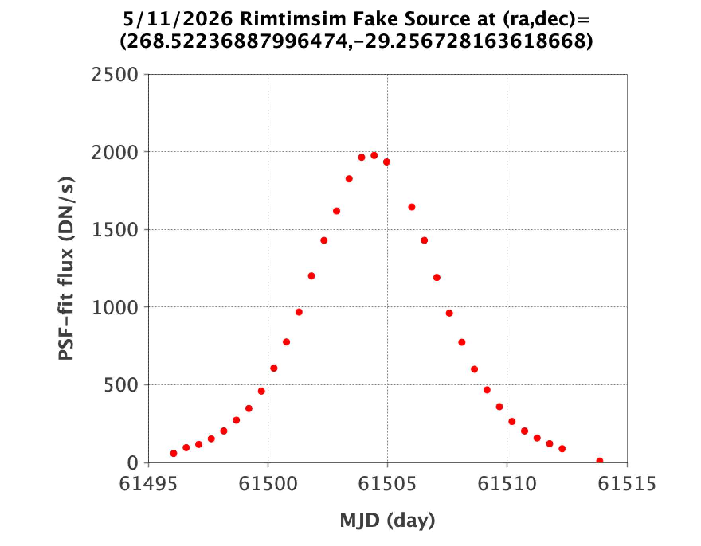

Testing with RimTimSim Simulated Data
####################################################

Overview
************************************

Robby Wilson's RimTimSim data simulate dense stellar fields in the Galactic
Bulge Time Domain Survey (GBTDS), the same survey as the SOC simulation set.
RimTimSim contains 263 images from a single detector, unlike the SOC sims,
which cover all 18. The images have small dithers and small image-angle
variations.

The tests described below are organized by processing date.

Observation range::

    rimtimsimdb=> select min(dateobs),max(dateobs) from l2files;
               min           |          max
    -------------------------+------------------------
     2027-02-14 06:02:26.719 | 2027-04-24 21:17:51.141
    (1 row)

The dataset covers one field::

    rimtimsimdb=> select distinct field from l2files;
      field
    ---------
     4682737
    (1 row)

It includes one SCA and two filters::

    rimtimsimdb=> select sca,fid,count(*) from l2files group by sca,fid order by sca,fid;
     sca | fid | count
    -----+-----+-------
       2 |   4 |   131
       2 |   7 |   132
    (2 rows)

Filter IDs and Roman Space Telescope filter names in the database:

.. code-block::

    rimtimsimdb=> select * from filters order by fid;
     fid | filter
    -----+--------
       1 | F184
       2 | H158
       3 | J129
       4 | K213
       5 | R062
       6 | Y106
       7 | Z087
       8 | W146
    (8 rows)

A new set of rimtimsimbs, delivered on 6/22/26 with a greater variety of
injected transients, has been loaded into the RAPID operations database
rimtimsims3db.

5/30/2025
************************************

This test included the following pipeline-software improvements:

* Feed ZOGY astrometric uncertainties computed from gain-matching instead of
  the fixed value 0.01 pixels.
* Shift the gain-matched reference image fed to ZOGY by the subpixel x and y
  offsets computed from gain-matching.
* Transpose the science-image PSF before feeding it to ZOGY, as required by
  a feature of the RimTimSim dataset.

Only ZOGY difference-image products were made. NaNs in the RimTimSim dataset
introduced a new requirement: remove NaNs from ZOGY inputs before execution,
then restore them in the outputs.

The day before this test, one image per filter (jids 1 and 3) was processed
to make the two reference images for the single field. This avoided redundant
reference-image generation when processing the remaining images in parallel.
For jid=1, PSF-fit catalog generation took 488 seconds (nsources=27420), and
reference-image generation took 426 seconds (nframes=23). Together they
accounted for most of the 1038-second total run time.

Processing started after the earliest observations to reserve earlier frames
for reference images::

    export STARTDATETIME="2027-02-27 00:00:00"
    export ENDDATETIME="2027-04-25 00:00:00"

Exposure-SCA images processed per available filter (fid = 4 and 7 only):

.. code-block::

    rimtimsimdb=> select fid,count(*) from l2files where dateobs >= '20270227' group by fid order by fid;
      fid | count
     -----+-------
        4 |    108
        7 |    107
    (2 rows)

Exposure-SCA images reserved for reference-image construction:

.. code-block::

    rimtimsimdb=> select fid,count(*) from l2files where dateobs < '20270227' group by fid order by fid;
      fid | count
     -----+-------
        4 |    23
        7 |    25
    (2 rows)

The 215 jobs executed on 5/30/2025 used the two reference images generated
the previous day. Their elapsed run times ranged from 387 to 849 seconds.

Reference-image metadata for fid = 4 and 7:

.. code-block::

    rimtimsimdb=> select * from refimages where vbest>0;
     rfid |  field  |  hp6  |   hp9   | fid | ppid | version | vbest |                                 filename                                 | status |             checksum             |          created           | svid | avid | archivestatus | infobits
    ------+---------+-------+---------+-----+------+---------+-------+--------------------------------------------------------------------------+--------+----------------------------------+----------------------------+------+------+---------------+----------
      219 | 4682737 | 28823 | 1844720 |   4 |   15 |     110 |     1 | s3://rapid-product-files/20250529/jid1/awaicgen_output_mosaic_image.fits |      1 | 8c234333894d25bb4a4a1305d143d618 | 2025-05-29 07:58:33.624864 |    1 |      |             0 |        0
      220 | 4682737 | 28823 | 1844720 |   7 |   15 |     109 |     1 | s3://rapid-product-files/20250529/jid3/awaicgen_output_mosaic_image.fits |      1 | 5bba26bc6ac244c5ebc8d9ab3cb0dccc | 2025-05-29 07:58:35.057414 |    1 |      |             0 |        0
    (2 rows)

.. code-block::

    rimtimsimdb=> select * from refimmeta where rfid in (select rfid from refimages where vbest>0);
     rfid |  field  |  hp6  |   hp9   | fid | nframes |     mjdobsmin     |     mjdobsmax     | npixsat | npixnan  |   clmean   |  clstddev   | clnoutliers |  gmedian   |  datascale  |    gmin    |   gmax    | cov5percent | medncov |  medpixunc  | fwhmmedpix | fwhmminpix | fwhmmaxpix | nsexcatsources
    ------+---------+-------+---------+-----+---------+-------------------+-------------------+---------+----------+------------+-------------+-------------+------------+-------------+------------+-----------+-------------+---------+-------------+------------+------------+------------+----------------
      219 | 4682737 | 28823 | 1844720 |   4 |      23 | 61450.51327337697 | 61462.55675993627 |       0 | 33052859 |   0.273195 | 0.107858755 |     1496560 |  0.2515229 |  0.13983491 | 0.09267347 | 315.44882 |    32.51499 |       0 |  0.03142484 |       3.44 |      -0.02 |      209.4 |          61980
      220 | 4682737 | 28823 | 1844720 |   7 |      25 | 61450.25169813307 | 61462.81866137544 |       0 | 33043712 | 0.13141742 |  0.08563688 |     1585559 | 0.10927002 | 0.115269825 | 0.01366262 | 307.28656 |    32.52147 |       0 | 0.019715047 |       2.46 |      -1.21 |     180.55 |         104036
    (2 rows)

Both reference images have a ``cov5percent`` QA metric of about 32.5 percent.
The difference-image footprint is nevertheless almost 100 percent because
the entire dataset has small dithers and small image-angle variations.

4/10/2026
************************************

A new set of 131 rimtimsims FITS images covers SCA number 2, bandpass filter
K213, and a single sky footprint/orientation associated with field number
4682737, with dithers of no more than a few pixels. The images already
contained fake-source injections, so the RAPID pipeline injected no
additional fake sources.

SFFT was run without the ``--crossconv`` flag.

Virtual Pipeline Operator (VPO) invocation:

.. code-block::

    export DBNAME=rimtimsims2db
    export STARTDATETIME="2027-02-19 17:00:00"
    export ENDDATETIME="2027-04-24 23:00:00"
    export STARTREFIMMJDOBS=61450
    export ENDREFIMMJDOBS=61455.3
    export MINREFIMNFRAMES=6

    python3.11 /code/pipeline/virtualPipelineOperator.py 20260410 >& virtualPipelineOperator_20260410.out &

The ``STARTDATETIME`` and ``ENDDATETIME`` date/times exclude the first 10 images,
which are reserved for reference-image generation.

The database query shows normal completion of parallel file-product
generation via AWS Batch:

.. code-block::

    rimtimsims2db=> select ppid,exitcode,count(*) from jobs where cast(launched as date) = '20260410' group by ppid, exitcode order by ppid, exitcode;

     ppid | exitcode | count
    ------+----------+-------
       15 |        0 |   121
       17 |        0 |   121
    (2 rows)

The VPO took 1.8 hours for the following stages:

=================================================================  =====================
Pipeline stage                                                      Execution time (sec)
=================================================================  =====================
Generate file products and upload to S3 bucket                         5190.2
Load all sources into PostgreSQL database                                34.2
Cross-match all Sources and AstroObjects database records               877.1
Compute statistics for AstroObjects database records                    305.6
Delete not-best Merges database records (there were none)                 2.6
Total elapsed time to execute VPO on above stages                      6409.7
=================================================================  =====================

For the longest-running pipeline instance (jid = 91915), the dominant costs
were AWAICGEN reference-image generation, SFFT execution with both science
and reference-image inputs, and PhotUtils catalog generation. AWAICGEN run
time depends on the number of input images (NFRAMES=10 here).

The positive naive-difference-image PSF-fit catalog took an anomalously long
19.4 minutes to generate.

=================================================================  =====================
Pipeline step                                                      Execution time (sec)
=================================================================  =====================
Downloading science image                                             0.643
Uploading science image to product S3 bucket                          0.450
Downloading or generating reference image                           625.096
Uploading reference image to S3 product bucket                        2.158
Generating science-image catalog                                     23.402
Swarping images                                                       8.927
Uploading intermediate FITS files to product S3 bucket                2.653
Running bkgest on science image                                       7.801
Running gainMatchScienceAndReferenceImages                           30.194
Replacing NaNs, applying image offsets, etc.                          0.573
Running ZOGY                                                         39.462
Masking ZOGY difference image                                         0.952
Running SExtractor on positive ZOGY difference image                  4.315
Running SExtractor on negative ZOGY difference image                 21.474
Generating PSF-fit catalog on positive ZOGY difference image         82.193
Generating PSF-fit catalog on negative ZOGY difference image          6.587
Uploading main products to S3 bucket                                  5.502
Running SFFT                                                        149.377
Uploading SFFT difference image to S3 product bucket                  4.796
Running SExtractor on positive SFFT difference images                43.833
Running SExtractor on negative SFFT difference images                26.593
Uploading SFFT-diffimage SExtractor catalogs to S3 product bucket     1.241
Generating PSF-fit catalog on positive SFFT difference image         25.353
Generating PSF-fit catalog on negative SFFT difference image         12.718
Uploading SFFT-diffimage PSF-fit catalogs to S3 product bucket        0.131
Computing naive difference images                                     0.560
Uploading naive difference images to S3 product bucket                1.079
Running SExtractor on positive naive difference image                 4.027
Running SExtractor on negative naive difference image                18.012
Uploading SExtractor catalogs for naive difference images             0.892
Generating PSF-fit catalog on positive naive difference image      1164.406
Generating PSF-fit catalog on negative naive difference image       192.792
Uploading PSF-fit catalogs for naive difference images                1.837
Uploading products at pipeline end to S3 product bucket               0.037
Total elapsed time to run one instance of science pipeline         2510.065
=================================================================  =====================

Python photutils PSF-fit catalogs from positive and negative ZOGY difference
images were loaded into a Sources child PostgreSQL table
(tablename = sources_20260410_2). Loading 600,695 Sources records took
34.2 seconds with 8 parallel processes.

Cross-matching sources with astronomical objects (AstroObjects) across all
62 source fields took 877.1 seconds with 8 parallel processes. The match
radius was 0.1 arcsec (a Roman WFI pixel), including matches across field
boundaries for sources near field edges. The Merges_<field> and
AstroObjects_<fields> PostgreSQL tables received 600,695 AstroObjects records
and 601,071 Merges records (lightcurve data points). Cross-boundary matching
added 376 merges, an increase of 0.0626%.

A separate process after cross-matching updates lightcurve statistics in
AstroObjects_<fields> and deletes records with no associated sources in
Merges_<field>. It builds a new Q3C index on (meanra, meandec) for all
AstroObjects_<fields> tables, then sets them to logged, clusters and analyzes
them, and explicitly vacuums them at the end. This took 305.6 seconds with
8 parallel processes.

.. note::
    Only 7 overlapping fields were expected, but cross-matching covered 62.
    Plots of PhotUtils catalog extractions revealed a relatively small
    fraction of bogus off-image sky positions. The Python code
    crossMatchSources.py was therefore modified to select only sources
    with ``flags = 0``.

.. note::
    SFFT-difference-image PhotUtils catalog generation failed because of
    NaNs in the output SFFT difference image and its uncertainty image.
    Code changes were made to ameliorate this in the 4/23/2026 test below.

4/23/2026
************************************

Similar to the 4/10/2026 test, with the changes below. The new rimtimsims set
contains 131 FITS images for SCA number 2, bandpass filter K213, and a single
sky footprint/orientation associated with field number 4682737, with dithers
of no more than a few pixels. Fake sources were already injected, so the
RAPID pipeline added none.

SFFT ran without ``--crossconv``. Relative to the 4/10/2026 test, its command
used brute-force masking options ``--bsmaskvalue 20000.0 --bsmaskradius 30.0``
instead of relying on --satvalue.

SFFT PSF-fit catalogs used the SFFT difference-image PSF rather than the
reference-image PSF used in the 4/10/2026 test.

Virtual Pipeline Operator (VPO) invocation:

.. code-block::

    export DBNAME=rimtimsims2db
    export STARTDATETIME="2027-02-19 17:00:00"
    export ENDDATETIME="2027-04-24 23:00:00"
    export STARTREFIMMJDOBS=61450
    export ENDREFIMMJDOBS=61455.3
    export MINREFIMNFRAMES=6

    python3.11 /code/pipeline/virtualPipelineOperator.py 20260423 >& virtualPipelineOperator_20260423.out &

The ``STARTDATETIME`` and ``ENDDATETIME`` date/times exclude the first 10 images,
which are reserved for reference-image generation.

The database query shows normal completion of parallel file-product
generation via AWS Batch:

.. code-block::

    rimtimsims2db=> select ppid,exitcode,count(*) from jobs where cast(launched as date) = '20260423' group by ppid, exitcode order by ppid, exitcode;

     ppid | exitcode | count
    ------+----------+-------
       15 |        0 |   121
       17 |        0 |   121
    (2 rows)

The VPO took 4.6 hours for the following stages:

=================================================================  =====================
Pipeline stage                                                      Execution time (sec)
=================================================================  =====================
Generate final file products and upload to S3 bucket                   7182.2
Load all sources into PostgreSQL database                               455.8
Cross-match all Sources and AstroObjects database records              8604.1
Compute statistics for AstroObjects database records                    337.0
Delete not-best Merges database records (there were none)                 2.6
Total elapsed time to execute VPO on above stages                     16581.7
=================================================================  =====================

Reference-image generation made jid = 91915 the longest-running pipeline
instance. Its dominant costs were AWAICGEN reference-image generation,
SFFT execution with both science and reference-image inputs, and PhotUtils
catalog generation. AWAICGEN run time depends on the number of input images
(NFRAMES=10 here).

The positive naive-difference-image PSF-fit catalog took an anomalously long
18.3 minutes to generate.

=================================================================  =====================
Pipeline step                                                      Execution time (sec)
=================================================================  =====================
Downloading science image                                             0.798
Uploading science image to product S3 bucket                          0.665
Downloading or generating reference image                           612.479
Uploading reference image to S3 product bucket                        2.630
Generating science-image catalog                                     22.589
Swarping images                                                       8.615
Uploading intermediate FITS files to product S3 bucket                6.858
Running bkgest on science image                                       7.619
Running gainMatchScienceAndReferenceImages                           29.022
Replacing NaNs, applying image offsets, etc.                          0.621
Running ZOGY                                                         38.735
masking ZOGY difference image                                         1.014
Running SExtractor on positive ZOGY difference image                  6.058
Running SExtractor on negative ZOGY difference image                 24.090
Generating PSF-fit catalog on positive ZOGY difference image         77.726
Generating PSF-fit catalog on negative ZOGY difference image          5.564
Uploading main products to S3 bucket                                  9.137
Running SFFT                                                        109.835
Uploading SFFT difference image to S3 product bucket                  5.579
Running SExtractor on positive SFFT difference images                18.171
Running SExtractor on negative SFFT difference images                45.258
Uploading SFFT-diffimage SExtractor catalogs to S3 product bucket     1.888
Generating PSF-fit catalog on positive SFFT difference image        512.750
Generating PSF-fit catalog on negative SFFT difference image        670.221
Uploading SFFT-diffimage PSF-fit catalogs to S3 product bucket        2.099
Computing naive difference images                                     0.718
Uploading naive difference images to S3 product bucket                1.242
Running SExtractor on positive naive difference image                 4.001
Running SExtractor on negative naive difference image                20.822
Uploading SExtractor catalogs for naive difference images             1.212
Generating PSF-fit catalog on positive naive difference image      1100.839
Generating PSF-fit catalog on negative naive difference image       173.337
Uploading PSF-fit catalogs for naive difference images                1.876
Uploading products at pipeline end to S3 product bucket               0.029
Total elapsed time to run one instance of science pipeline         3524.095
=================================================================  =====================

Python photutils PSF-fit catalogs from positive and negative SFFT difference
images, rather than ZOGY as in the 4/10/2026 test, were loaded into a Sources
child PostgreSQL table (``tablename = sources_20260410_2``, since the new
rimtimsims contain only one SCA). Loading 9,597,393 Sources records, 16 times
as many as the 4/10/2026 test, took 455.8 seconds with 8 parallel processes.

Cross-matching sources with AstroObjects across all 7 fields overlapping the
rimtimsims took 8604.1 seconds with 8 parallel processes, including matches
across field boundaries near field edges. The ``match_radius = 0.00001528``
degrees (half a Roman WFI pixel) replaced the 4/10/2026 test's 0.1 arcsec
(approximately a Roman WFI pixel). The Merges_<field> and
AstroObjects_<fields> PostgreSQL tables received 826,503 AstroObjects records
and 11,779,174 Merges records (lightcurve data points). Cross-boundary
matching added 3153 merges, an increase of 0.0268%.

The separate post-cross-matching process described under 4/10/2026 updated
AstroObjects_<fields> lightcurve statistics, deleted records without sources
in Merges_<field>, rebuilt Q3C indexes on (meanra, meandec), set all
AstroObjects_<fields> tables to logged, clustered and analyzed them, and
explicitly vacuumed them at the end. It took 337.0 seconds with 8 parallel
processes.

5/11/2026
************************************

Similar to the 4/23/2026 test, but newer SFFT code gives deeper PhotUtils
detections. Minor mistakes were the use of ``sca_readout_noise = 8.5`` and
``saturation_level = 2500000`` instead of ``sca_readout_noise = 11.0`` and
``saturation_level = 1100000``. Use these products in place of those from
the 4/23/2026 test.

For one injected fake source peaking at approximately 18th magnitude, the
upgraded SFFT code recovered 6 deeper detections. Query its lightcurve from
SFFT-difference-image PhotUtils catalogs with:

.. code-block::

    select a.sid,mjdobs,pid,xfit,yfit,fluxfit,peak,field,
    q3c_dist(ra, dec,cast(268.52236887996474 as double precision), cast(-29.256728163618668 as double precision)) * 3600.0 as dist
    from sources a, merges_4682737 b where a.sid = b.sid and aid = 24673086 order by mjdobs;

Recovered lightcurve:

5/14/2026
************************************

Similar to the 5/11/2026 test, with the parameter mistakes fixed and two
pipeline improvements:

===============   ===============================================================================================================================================================================================================================
Date              Software modification
===============   ===============================================================================================================================================================================================================================
5/12/2026         Modified to scale the reference-image uncertainty map by the gain-matching scale factor (prior to this, gain-matching was only applied to the reference image).
5/12/2026         Moved the block of code that uploads intermediate products to just before ZOGY execution (this facilitates running ZOGY offline from S3-bucket downloaded inputs).
===============   ===============================================================================================================================================================================================================================

Scaling the reference-image uncertainty map by the gain-matching scale
factor improved the ZOGY difference images. Use these products in place of
those from the 5/11/2026 test.

Python photutils PSF-fit catalogs from positive and negative SFFT difference
images, rather than ZOGY as in the 4/10/2026 test, were loaded into a Sources
child PostgreSQL table (``tablename = sources_20260410_2``, since the new
rimtimsims contain only one SCA). Loading 6,067,135 Sources records took
291 seconds with 8 parallel processes. This count is 38% lower than the
4/23/2026 test because SFFT upgrades reduced false positives.

Cross-matching sources with AstroObjects across all 7 fields overlapping the
rimtimsims took 2.12 hours with 8 parallel processes, including matches across
field boundaries near field edges. The ``match_radius = 0.00001528`` degrees
was half a Roman WFI pixel. The Merges_<field> and AstroObjects_<fields>
PostgreSQL tables received 2,017,329 AstroObjects records and 8,774,607 Merges
records (lightcurve data points). Cross-boundary matching added 2083 merges,
an increase of 0.0237%.

The separate post-cross-matching process described under 4/10/2026 updated
AstroObjects_<fields> lightcurve statistics, deleted records without sources
in Merges_<field>, rebuilt Q3C indexes on (meanra, meandec), set all
AstroObjects_<fields> tables to logged, clustered and analyzed them, and
explicitly vacuumed them at the end. It took 1040 seconds with 8 parallel
processes.

Deleting non-best Merges_<fields> records, including vacuuming and analyzing
all Merges_<fields> tables, took 41.7 minutes with 8 parallel processes.

Deleting all not-best records in sources_20260325_* tables took
133.7 minutes with 8 parallel processes.

5/19/2026
************************************

Similar to the 5/14/2026 test, with the following change to improve ZOGY
difference images and downstream products:

===============   ===============================================================================================================================================================================================================================
Date              Software modification
===============   ===============================================================================================================================================================================================================================
5/19/2026         Modified to feed ZOGY scaled std_ref_img by scalefacref (gain-matching correction).
===============   ===============================================================================================================================================================================================================================

8/13/2026
************************************

This test processed all images in the new rimtimsims set delivered on
6/22/26, which has a greater variety of injected transients than earlier
rimtimsim versions and subpixel dithers. Its 263 images cover one SCA (2),
one field (4682737), and two filters (K213 and Z087)::

    rimtimsims3db=> select sca,a.fid,filter,count(*) from l2files a, filters b where a.fid = b.fid group by sca,a.fid,filter order by sca,a.fid;
     sca | fid | filter | count
    -----+-----+--------+-------
       2 |   4 | K213   |   131
       2 |   7 | Z087   |   132
    (2 rows)

The test included this input-preparation change and the recent pipeline
improvements on the :doc:`main page for testing </dev/tests>`:

===============   ===============================================================================================================================================================================================================================
Date              Software modification
===============   ===============================================================================================================================================================================================================================
8/12/2026         Modified ``sims/src/rimtimsim/convert_rimtimsim.py`` to recompute FITS-header ``CRVAL1,2`` at ``CRPIX1,2 = 2044.5`` (exact image center).
===============   ===============================================================================================================================================================================================================================

Test metadata are stored in the RAPID-operations database ``rimtimsims3db``.

Virtual Pipeline Operator (VPO) invocation:

.. code-block::

    export DBNAME=rimtimsims3db
    export STARTDATETIME="2027-02-14 06:00:00"
    export ENDDATETIME="2027-04-25 00:00:00"
    export STARTREFIMMJDOBS=0.0
    export ENDREFIMMJDOBS=999999.9

    python3.11 /code/pipeline/virtualPipelineOperator.py 20260813 >& virtualPipelineOperator_20260813.out &

The database query shows normal completion of parallel file-product
generation via AWS Batch, which can process thousands of images in parallel:

.. code-block::

    rimtimsims3db=> select ppid,exitcode,count(*) from jobs where cast(launched as date) = '20260813' group by ppid, exitcode order by ppid, exitcode;

     ppid | exitcode | count
    ------+----------+-------
       12 |        0 |     2
       15 |        0 |   263
       17 |        0 |   263
    (3 rows)

The ``ppid`` values (pipeline IDs) 12, 15, and 17 identify the RAPID
reference-image, science, and post-processing pipelines, respectively.

The VPO took 3.2 hours for the following stages:

====================================================================================  =====================
Pipeline stage                                                                        Execution time (sec)
====================================================================================  =====================
Generate final file products, register in database, and upload to S3 bucket                   10451.31
Load all sources into PostgreSQL database                                                       461.73
Cross-match all Sources and AstroObjects database records                                       227.41
Compute statistics for AstroObjectsMeta database records                                        271.54
Total elapsed time to execute VPO on above stages                                             11411.99
====================================================================================  =====================

Source loading, cross-matching, and lightcurve statistics used 8 parallel
processes on an 8-vCPU machine.

The VPO code is still evolving and not yet optimal; the first row's execution
time could be reduced significantly.

Pipeline processing ran in parallel under AWS Batch. The two RAPID
reference-image pipeline instances took ~14 minutes for ``K213`` and
~33 minutes for ``Z087``. Both stacked 25 input frames; reference-image
PhotUtils catalog generation accounted for the longer ``Z087`` run time.

RAPID science pipelines took ~1.3 hours per instance for ``K213`` and
~30 minutes for ``Z087``. PhotUtils catalog generation dominated the
longest-running science-pipeline instance (``jid=143944``), detailed below.

=================================================================  =====================
Pipeline step                                                      Execution time (sec)
=================================================================  =====================
Downloading science image                                                  0.808
Uploading science image to product S3 bucket                               0.401
Downloading or generating reference image                                  2.451
Generating science-image catalog                                          22.331
Swarping images                                                            8.781
Running bkgest on science image                                            3.864
Running gainMatchScienceAndReferenceImages                                26.195
Replacing NaNs, applying image offsets, etc.                               4.758
Uploading intermediate FITS files to product S3 bucket                     2.312
Running ZOGY                                                              39.775
Masking ZOGY difference image                                              1.113
Running SExtractor on positive ZOGY difference image                       4.835
Running SExtractor on negative ZOGY difference image                      22.344
Generating PSF-fit catalog on positive ZOGY difference image             889.471
Generating PSF-fit catalog on negative ZOGY difference image              96.523
Uploading main products to S3 bucket                                       5.033
Running SFFT                                                             161.709
Uploading SFFT difference image to S3 product bucket                       4.266
Running SExtractor on positive SFFT difference images                     45.064
Running SExtractor on negative SFFT difference images                     23.457
Uploading SFFT-diffimage SExtractor catalogs to S3 product bucket          1.06
Generating PSF-fit catalog on positive SFFT difference image            1551.529
Generating PSF-fit catalog on negative SFFT difference image             422.014
Uploading SFFT-diffimage PSF-fit catalogs to S3 product bucket             1.994
Computing naive difference images                                          0.681
Uploading naive difference images to S3 product bucket                     0.789
Running SExtractor on positive naive difference image                      4.14
Running SExtractor on negative naive difference image                     21.563
Uploading SExtractor catalogs for naive difference images                  0.729
Generating PSF-fit catalog on positive naive difference image           1305.434
Generating PSF-fit catalog on negative naive difference image            219.618
Uploading PSF-fit catalogs for naive difference images                     1.408
Uploading products at pipeline end to S3 product bucket                    0.032
Total elapsed time to run one instance of science pipeline              4896.480
=================================================================  =====================

Lightcurve extraction from PSF-fit SFFT-difference-image catalogs:

=========================================================================================  =====================
Item                                                                                        Number
=========================================================================================  =====================
Number of sources loaded into Sources_<obsdate>_<sca> database tables                         25,245,610
Number of merges inside AND outside field, loaded into Merges_<field> database tables         28,147,729
Number of merges outside field, loaded into Merges_<field> database tables                         8,981
Number of astroObjects loaded into AstroObjects_<field> database tables                        1,808,659
Number of records loaded into AstroObjectsMeta_<field> database tables                         1,808,659
Number of Sources_<obsdate>_<sca> database tables                                                     70
Number of AstroObjects_<field> database tables                                                         7
Number of Merges_<field> database tables                                                               7
Number of AstroObjectsMeta_<field> database tables                                                     7
=========================================================================================  =====================
