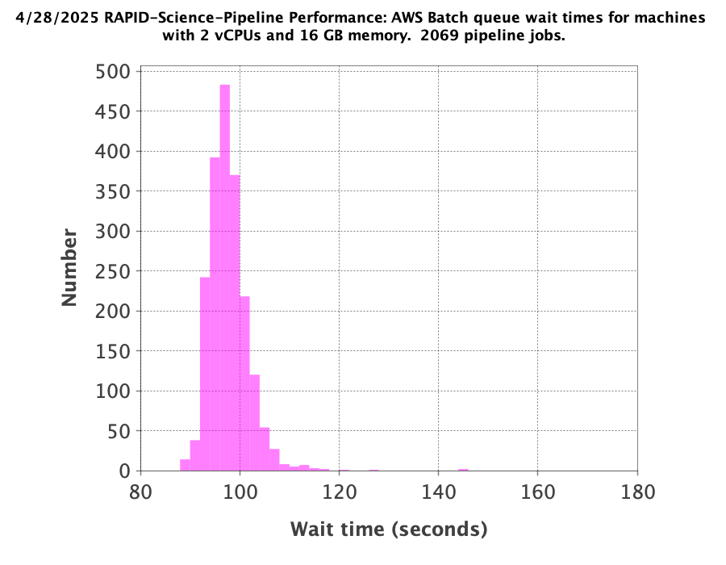

RAPID Pipeline Testing
####################################################

The tests described below are organized by processing date.

Here is Perl code (``elapsed.pl``) to query the operations database
for science-pipeline performance results::

    $procdate = '20250428';
    $starthourorigin = 680.59027777777777777777;

    print"count,nframes,startedhours,elapsedseconds\n";

    $q="select nframes,extract(day from started) * 24.0 + extract(hour from started) + ".
       "extract(minute from started)/60.0 + extract(second from started)/3600.0-".
       $starthourorigin." as startedhours, extract(hour from elapsed)*3600 + ".
       "extract(minute from elapsed)*60 + extract(second from elapsed) as elapsedseconds ".
       "from jobs a, diffimages b, diffimmeta c, refimmeta d ".
       "where a.rid=b.rid and a.ppid=15 and b.pid=c.pid and b.vbest>0 and b.rfid=d.rfid ".
       "and exitcode=0 and cast(launched as date) ='".$procdate."' order by started; ";

    @op=`psql -h 35.165.53.98 -d rapidopsdb -p 5432 -U rapidporuss -c \"$q\"`;
    $i=0;
    shift @op;
    shift @op;
    foreach my $op (@op) {
        if ($op =~ /row/) { last; }
        chomp $op;
        $op =~ s/^\s+|\s+$//g;
        my (@f) = split(/\s*\|\s*/, $op);
        $nframes = $f[0];
        $startedhours = $f[1];
        $elapsedtimeseconds = $f[2];
        $i++;
        print"$i,$nframes,$startedhours,$elapsedtimeseconds\n";
    }

4/28/2025
************************************

Standard large test run (2069 exposure-SCAs),
with all reference images cleared from database
(``status=0`` for ``vbest>0``).  AWS Batch machines for science-pipeline jobs
have 2 vCPUs and 16 GB memory.

.. code-block::

    export STARTDATETIME="2028-09-08 04:00:00"
    export ENDDATETIME="2028-09-08 08:30:00"
    python3.11 /code/pipeline/awsBatchSubmitJobs_launchSciencePipelinesForDateTimeRange.py >& awsBatchSubmitJobs_launchSciencePipelinesForDateTimeRange_jid_ge_2_le_90.out &

Two jobs had empty reference images in difference-image regions, so ``SFFT``
did not produce results, and 33 jobs had no reference images.

.. code-block::

    rapidopsdb=> select exitcode,count(*) from jobs where ppid=15 and cast(launched as date) = '20250428' group by exitcode order by exitcode;
     exitcode | count
    ----------+-------
            0 |  1987
            4 |     2
           33 |    80
    (3 rows)

Here is a histogram of the AWS Batch queue wait times for an available AWS Batch machine on which to run a pipeline job:

Here is a histogram of the job execution times, measured from pipeline start to pipeline finish on an AWS Batch machine:

.. image:: science_pipeline_execution_times20250428.png

4/29/2025
************************************

Standard large test run (5222 exposure-SCAs),
with all reference images cleared from database
(``status=0`` for ``vbest>0``).  AWS Batch machines for science-pipeline jobs
have 2 vCPUs and 16 GB memory.

.. code-block::

    export STARTDATETIME="2028-09-08 04:00:00"
    export ENDDATETIME="2028-09-08 08:30:00"
    python3.11 /code/pipeline/awsBatchSubmitJobs_launchSciencePipelinesForDateTimeRange.py >& awsBatchSubmitJobs_launchSciencePipelinesForDateTimeRange_jid_ge_2_le_90.out &

There were 115 jobs that failed due to the following AWS Batch error:
Timeout waiting for network interface provisioning to complete.  Need
to reconfigure the job definition to have retry attempts.

.. code-block::

    rapidopsdb=> select exitcode,count(*) from jobs where ppid=15 and cast(launched as date) = '20250429' group by exitcode order by exitcode;
    exitcode | count
   ----------+-------
           0 |  5107
             |   115
    (2 rows)
