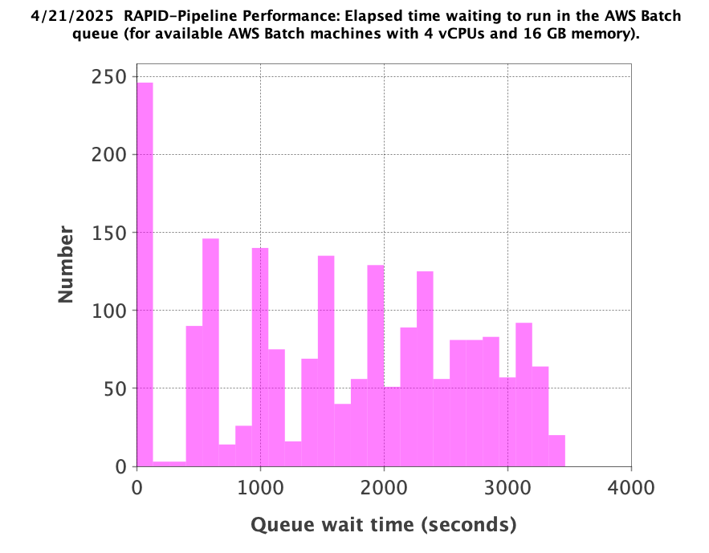
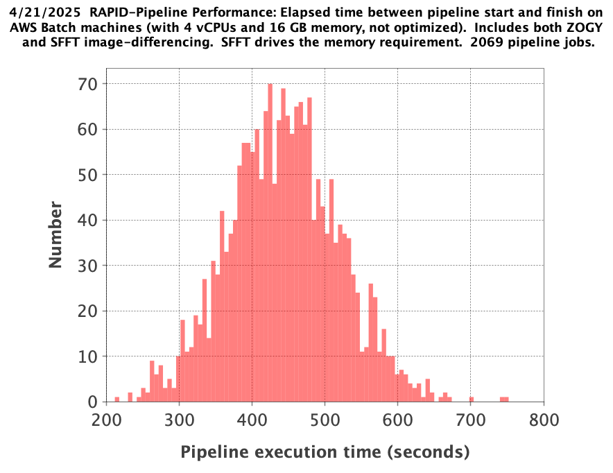

RAPID Pipeline Execution
####################################################

Overview
************************************

Run all four steps in order; each depends on the preceding steps:

1. Run science pipelines (``ppid = 15``).

2. Register pipeline metadata in operations database.

3. Run post-processing pipelines (``ppid = 17``).
   These rely on the operations database updated in step 2.

4. Register additional pipeline metadata in operations database.

Execute all steps in a Docker container on an EC2 instance with access to
the operations database. Automation scripts must use ``docker run``.

Launch scripts query the operations database and submit pipeline-instance
jobs to AWS Batch. Individual AWS Batch jobs do not interact with the
operations database.

Instructions
********************************************

This example launches RAPID science pipelines as AWS Batch jobs for an
observation-datetime range. It assumes processing on April 4, 2025
(``20250404``), with all AWS Batch jobs finishing under that processing
date. Observation dates are distinct from the processing date.

The Docker container rapid_science_pipeline:latest used under AWS Batch
contains a RAPID git clone in /code; no volume binding to an external RAPID
git repository is needed. The container name is arbitrary; this example
uses "russ-test-jobsubmit". Override the image's ENTRYPOINT with
``--entrypoint bash``; do not append ``bash`` to the command.

Log into the EC2 instance and perform Steps 1 through 4 as root
(``sudo su``). Steps 2 through 4 run inside a container with the same
environment as Step 1.

After launching jobs in Steps 1 and 3, manually monitor the AWS Batch
console until all jobs complete, then proceed to registration in Steps 2
and 4, respectively. Monitoring will be automated at a later stage of
development.

Step 1
=============

Launch RAPID science-pipeline jobs. STARTDATETIME and ENDDATETIME specify
the start and end observation datetimes of the data to process.

.. code-block::

   sudo su

   mkdir -p /home/ubuntu/work/test_20250404
   cd /home/ubuntu/work/test_20250404
   aws s3 cp s3://rapid-pipeline-files/roman_tessellation_nside512.db /home/ubuntu/work/test_20250404/roman_tessellation_nside512.db

   docker run -it --entrypoint bash --name russ-test-jobsubmit -v /home/ubuntu/work/test_20250404:/work public.ecr.aws/<ecr-public-alias>/rapid_science_pipeline:latest

   export DBPORT=5432
   export DBNAME=rapidopsdb
   export DBUSER=rapidporuss
   export DBSERVER=???
   export DBPASS="????"
   export AWS_DEFAULT_REGION=us-west-2
   export AWS_SECRET_ACCESS_KEY=????
   export AWS_ACCESS_KEY_ID=????
   export LD_LIBRARY_PATH=/code/c/lib
   export PATH=/code/c/bin:$PATH
   export export RAPID_SW=/code
   export export RAPID_WORK=/work
   export PYTHONPATH=/code
   export PYTHONUNBUFFERED=1
   export ROMANTESSELLATIONDBNAME=/work/roman_tessellation_nside512.db

   cd /work

   export STARTDATETIME="2028-09-07 00:00:00"
   export ENDDATETIME="2028-09-08 08:30:00"

   python3.11 /code/pipeline/awsBatchSubmitJobs_launchSciencePipelinesForDateTimeRange.py >& awsBatchSubmitJobs_launchSciencePipelinesForDateTimeRange.out &

RAPID products are organized in an S3 bucket according to the :doc:`processing date </prod/products>`.
The same processing date is a required input parameter in Step 2.

Step 2
============

Register science-pipeline metadata. The processing date selects the data
and is passed as a command-line argument to the Python script
``registerCompletedJobsInDB.py``.

.. code-block::

   cd /work

   python3.11 /code/pipeline/parallelRegisterCompletedJobsInDB.py 20250404 >& parallelRegisterCompletedJobsInDB_20250404.out &

Step 3
============

Launch RAPID post-processing-pipeline jobs under AWS Batch. JOBPROCDATE
selects the data by processing date, not observation date.

.. code-block::

   cd /work

   export JOBPROCDATE=20250404

   python3.11 /code/pipeline/awsBatchSubmitJobs_launchPostProcPipelinesForProcDate.py >& awsBatchSubmitJobs_launchPostProcPipelinesForProcDate_20250404.out &

Step 4
============

Register post-processing metadata. The processing date selects the data
and is passed as a command-line argument to the Python script
``registerCompletedJobsInDBAfterPostProc.py``.

.. code-block::

   cd /work

   python3.11 /code/pipeline/registerCompletedJobsInDBAfterPostProc.py 20250404 >& registerCompletedJobsInDBAfterPostProc_20250404.out &

Performance
********************************************

Each AWS Batch job requires a machine with 4 vCPUs, 16 GB of memory, and
20 GB of disk space. RAPID's AWS Batch configuration allows up to 1000
parallel jobs, a limit that can easily be increased. Actual concurrency
depends on machine availability, which varies with competing demand from
AWS customers outside the RAPID project.

Adding SFFT image differencing raised the science pipeline's memory
requirement from 8 GB to 16 GB and its execution time by about 3 minutes.

Step 1
============

Launching 2069 RAPID-science-pipeline jobs takes 1183 seconds with 8-core
multiprocessing on an 8-core job-launcher machine (``t3.2xlarge`` EC2
instance).

The 2069 jobs run in parallel under AWS Batch and average 480 seconds each
once started, excluding potentially significant queue waits. Execution
takes longer than the elapsed times reported last month because the
pipeline now computes difference images and catalogs for both ZOGY and
SFFT. There were 80 failed pipelines because no prior observations were
available to generate reference images.

Histogram of AWS Batch queue wait times for an available machine:

In theory, machines with 4 vCPUs and 16 GB of memory are scarcer than the
machines with one vCPU and 8 GB used in pipeline testing last month. This,
along with possible competing demand from AWS customers outside RAPID, may
explain the longer queue waits.

Histogram of job execution times, measured from pipeline start to finish
on an AWS Batch machine:

Step 2
============

Registering database records for 2069 RAPID-science-pipeline jobs takes
415 seconds with 8-core multiprocessing on an 8-core job-launcher machine.

Records are inserted and/or updated in the Jobs, DiffImages, DiffImMeta, RefImages, RefImCatalogs,
RefImMeta, and RefImImages database tables.

The development RAPID operations database runs on a ``t2.micro`` EC2
machine with one virtual core (1 vCPU).

Step 3
============

Launching 1989 RAPID-post-processing-pipeline jobs takes 1051 seconds with
8-core multiprocessing on an 8-core job-launcher machine.

The 1989 RAPID-post-processing-pipeline jobs take less than 60 seconds to run in parallel under AWS Batch.

Step 4
============

Registering database records for 1989 RAPID-post-processing-pipeline jobs
takes 476 seconds as a single process.

Records are updated in the Jobs, DiffImages, and RefImages database tables.
