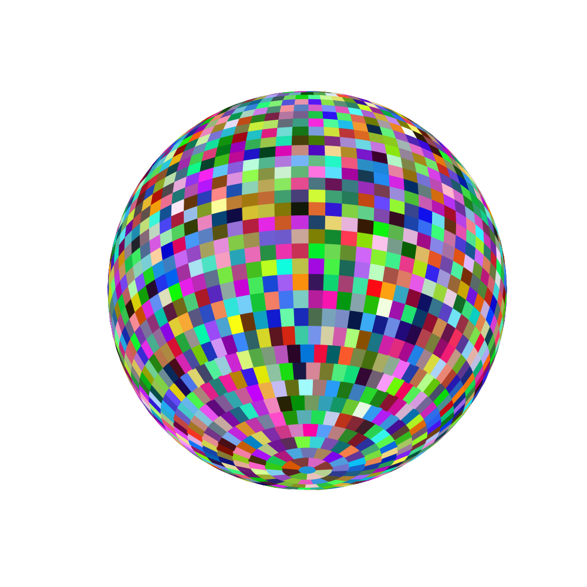
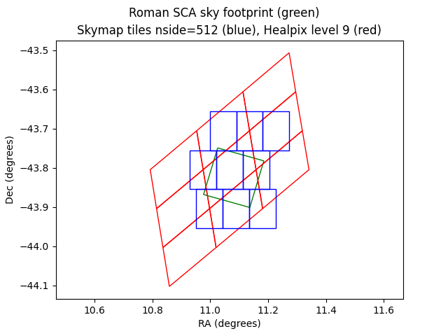
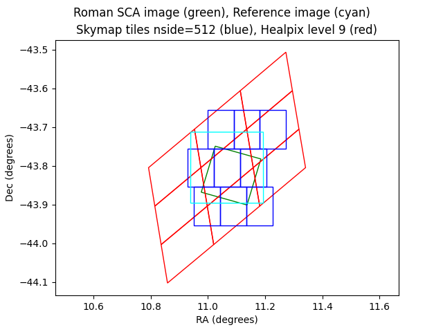
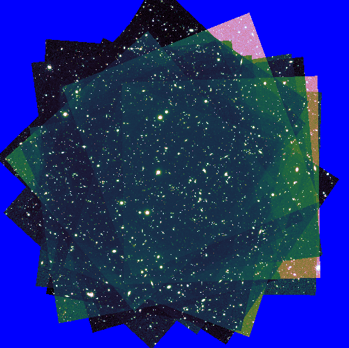
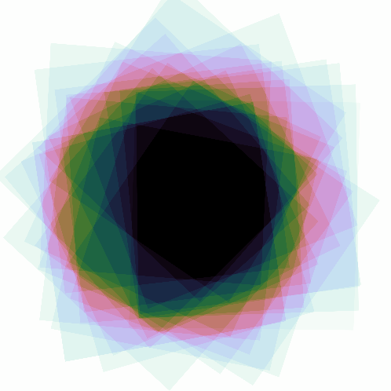
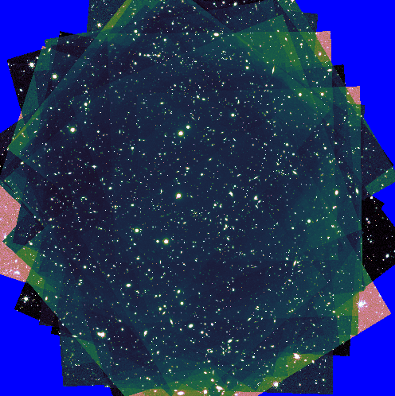
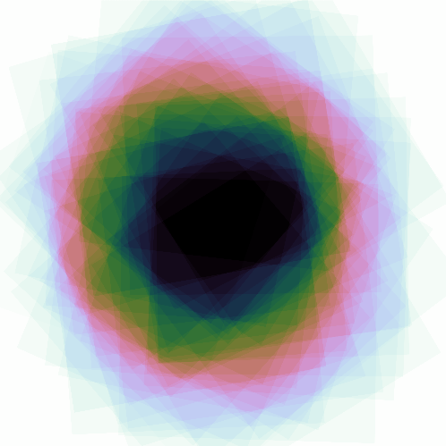

RAPID Pipeline Design
####################################################

Introduction
************************************
Below describes the current design of the RAPID pipeline and its rationale.

The pipeline will interact with the RAPID operations database, most likely in a
loosely coupled way, in order to keep the design flexible and control the number
of simultaneous connections.

.. note::
    The pipeline design described below is evolving and subject to change.

Computer Languages
************************************

The RAPID pipeline is written in Python, with some bash scripts, and system calls to OS commands and C executable binaries.
A few Perl scripts are used to prepare ad-hoc data for database ingestion, etc.

Sky Tiles
************************************

.. warning::
    This section explains the Roman tessellation scheme using large sky tiles, for illustration purposes only
    (large tiles are easier to list and plot).
    Much smaller tiles will be adopted for the RAPID pipeline, as discussed below in the section entitled Reference Images.

Please refer to the `SkyMap GitHub Repository <https://github.com/darioflute/skymap>`_ for the Roman-tessellation source code.
In one implementation of this gridding scheme (for illustrative purposes here), the parameter setting NSIDE=10
yields a sky that is divided into 2402 relatively large tiles, which are, in general,
approximately square and with similar area.
The tiles are basically aligned in rows within declination bins, with the most right-ascension
bins at the equator and progressively fewer as
the poles are approached (see table below).  There is one circular tile capping each pole.
For NSIDE=10, the tile size near the equator is approximately 3.8 degrees in declination height
and 4.5 degrees in right-ascension width.

Table: Number of right-ascension bins per declination bin for NSIDE=10.

==========   =====      ===========
center_dec   count      dec-bin num
==========   =====      ===========
-90.0        1          1
-85.32052    8          2
-80.63321    16         3
-75.93013    24         4
-71.203094   32         5
-66.443535   40         6
-61.642365   48         7
-56.789783   56         8
-51.875088   64         9
-46.886395   72         10
-41.810314   80         11
-36.869896   80         12
-32.230953   80         13
-27.81814    80         14
-23.578178   80         15
-19.47122    80         16
-15.46601    80         17
-11.536959   80         18
-7.662256    80         19
-3.8225536   80         20
0.0          80         21
3.8225536    80         22
7.662256     80         23
11.536959    80         24
15.46601     80         25
19.47122     80         26
23.578178    80         27
27.81814     80         28
32.230953    80         29
36.869896    80         30
41.810314    80         31
46.886395    72         32
51.875088    64         33
56.789783    56         34
61.642365    48         35
66.443535    40         36
71.203094    32         37
75.93013     24         38
80.63321     16         39
85.32052     8          40
90.0         1          41
==========   =====      ===========

These sky tiles are much larger than the Roman WFI focal plane (which is roughly 0.5 degrees by 1.2 degrees with gaps).

Here is a 3-D plot of the Roman tessellation for NSIDE=10:

As will be seen below, it will be necessary to adopt
a tile size that is suitable for Roman SCA images.

Reference Images
************************************

Reference images are needed for image differencing.  The maximum-tolerable number of pixels in a reference image
constrains the footprint of a reference image on the sky.
The reference images will be constructed for sky tiles given by the Roman tessellation scheme.

For the RAPID project, the Roman-tessellation parameter setting NSIDE=512 will be used,
and this will give tile sizes somewhat smaller than that of a Roman SCA image.
This results in 6,291,458 tiles covering the entire sky.
The tile size near the equator, for example, is 0.08789 degrees wide in ra and 0.0746 degrees high in dec.
This is roughly between 66% and 75% of the
width of an SCA, which is approximately 0.12 degrees.  The tile sizes vary over the sky; for example, the height of a dec bin ranges
from approximately 0.075 degrees to 0.1 degrees, and similarly for the widths of ra bins.  There are 2049 dec bins total, and 4096 ra
bins per dec bin near the equator.

The sky tiles of the Roman tessellation are indexed starting with one, and these indexes,
associated with different sky positions, such as the center of a reference image,
are stored in the field column of various tables in the RAPID operations database.
The maximum value of the field or sky-tile index is 6,291,458.

For comparison, here are the sky footprints of a simulated Roman SCA image (Roman_TDS_simple_model_F184_11474_2_lite.fits),
Skymap tiles for NSIDE=512, and Healpix pixels for level=9:

As can be seen in this example, the sky position of the center of the SCA image falls within the central skymap tile.

The reference images will be constructed to have sufficient buffer regions outside of the sky tile to which they are associated,
since a single Roman SCA image may overlap multiple tiles.
The buffer regions will account for arbitrary placement of individual frames relative to tile-center sky positions, and
also for arbitrary pointing roll angles.
Nominally the pixel scale for the reference images
will be the same as individual frames, but the size of reference images will be larger, having ~6Kx6K pixels instead of ~4Kx4K pixels.

Here is the sky footprint of the proposed 6Kx6K-pixel reference image, shown in cyan, for the example given above:

It is possible for the science image, represented in green, to be incompletely covered by the proposed reference image, especially
for cases where the science-image center is far from the tile center and rotated by some odd multiple of 45 degrees.  This
could be remedied by making the reference image bigger (which is done below),
but at a cost of more reference-image pixels to store and process.

Reference images will be constructed for different filters.  For a given filter, images from
different SCAs will be stacked to make reference images.

All reference images will have no rotation and north up.

There should be some minimum observation-time interval between a science image and reference image, so that
transients are actually detectable.

The following are a 7Kx7K-pixel reference image and its associated coverage map, resulting from the coaddition of 50 input images.
These were generated by ``awaicgen``, which is a C-code module from the WISE mission that was modified to be generic coadder.

Also below are a 7Kx7K-pixel reference image and its associated coverage map, resulting from the coaddition of 100 input images, made by ``awaicgen``.
(The image-display stretches are different for cases with 50 inputs versus 100 inputs.)

Image Differencing
************************************

For each image-differencing operation, image resampling is necessary.
``SWarp`` can be used to resample the reference image into the distorted grid of the science image.
In cases where the reference image consists of too few coadded inputs for undersampling to be resolved, it may be
necessary to instead use ``awaicgen`` to resample the science image into the undistorted grid of the reference image
(``awaicgen`` does not produce coadds mapped into distorted grids).

