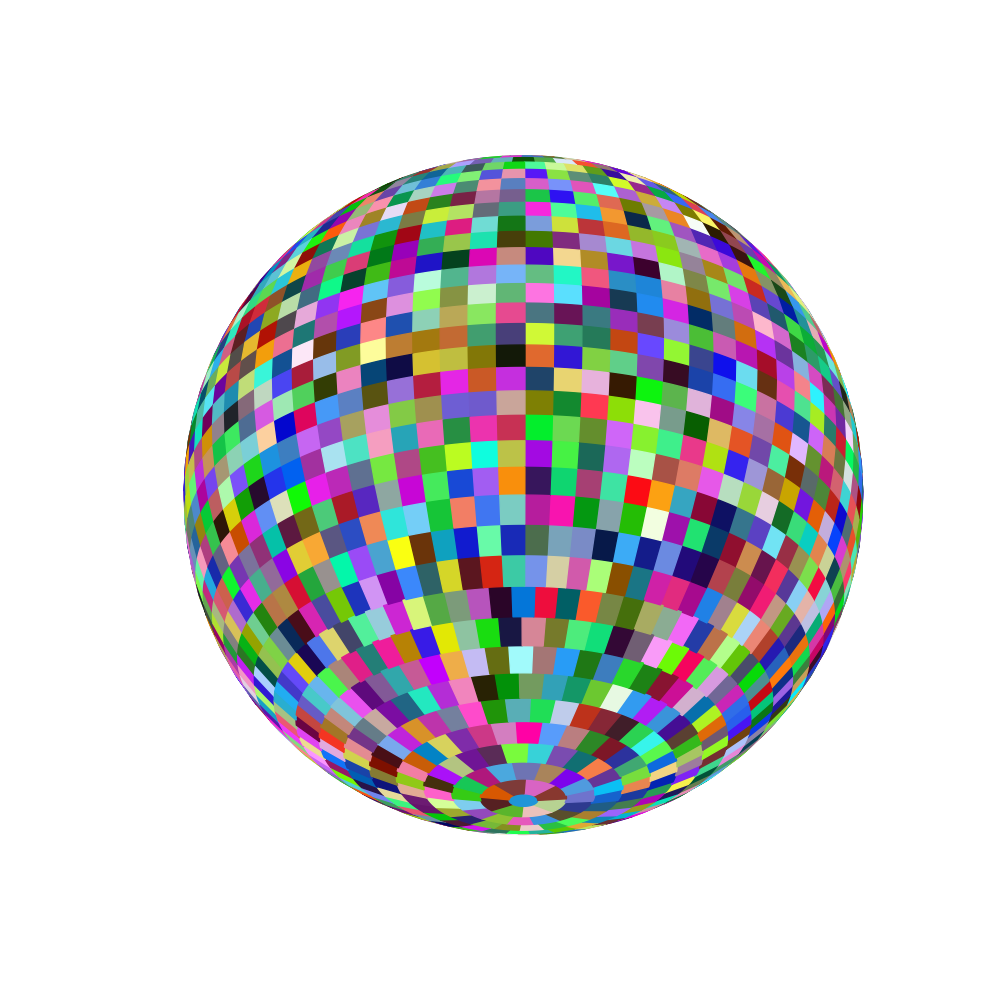
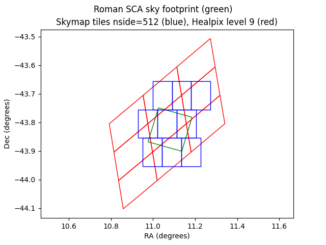
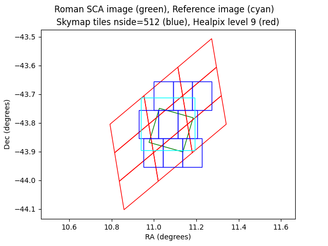
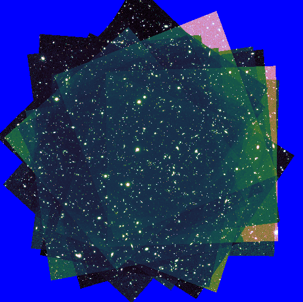
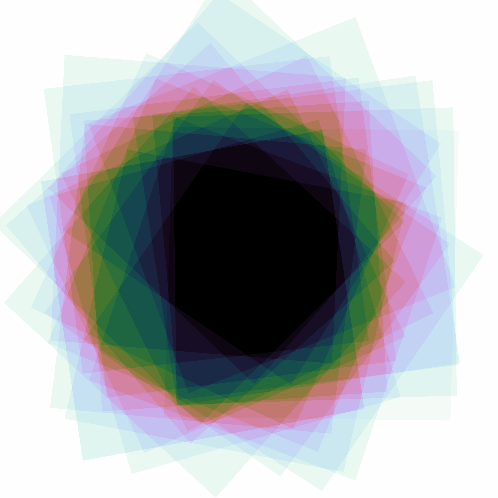
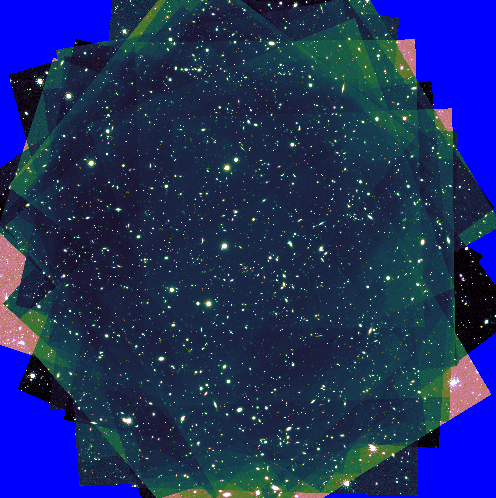
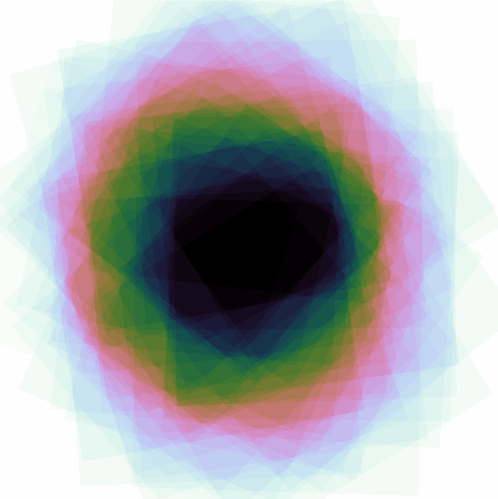
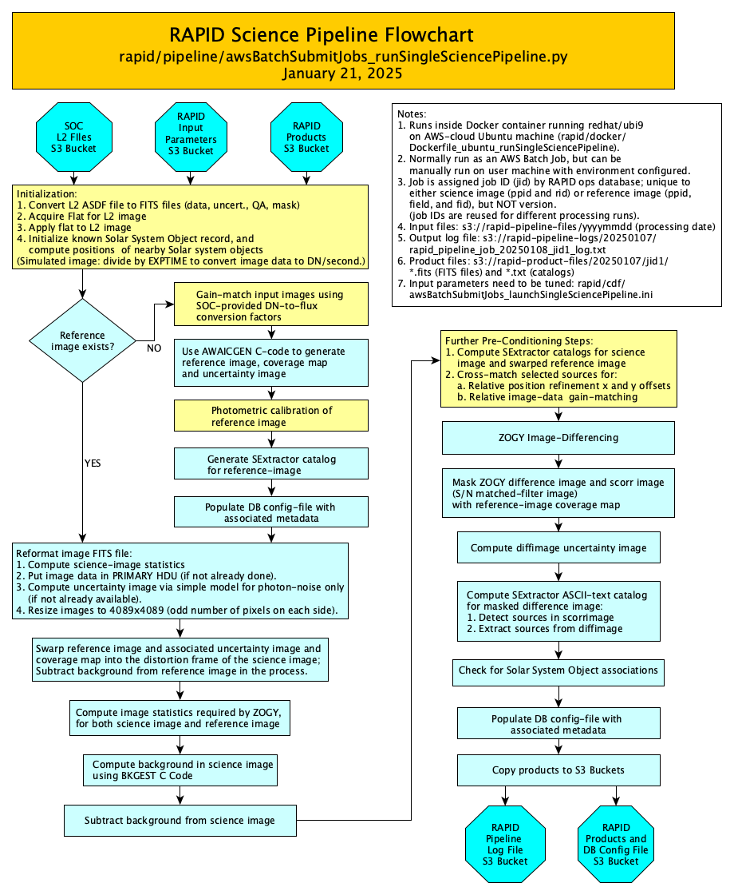

RAPID Pipeline Design
####################################################

Introduction
************************************

This page describes the current RAPID pipeline design and its rationale.

.. note::
    The pipeline design is evolving and subject to change.

The pipeline will interact with the RAPID operations database, most likely
through loose coupling to keep the design flexible and control simultaneous
connections.

Computer Languages
************************************

The RAPID pipeline uses Python, some bash scripts, and system calls to OS
commands and C executable binaries. A few Perl scripts prepare ad-hoc data
for database ingestion and other tasks.

The pipeline is coded in Python and C and runs inside the RAPID-pipeline
docker container, with all required software preinstalled.

Sky Tiles
************************************

.. warning::
    The large Roman-tessellation sky tiles shown here are for illustration
    only, because they are easier to list and plot. RAPID will adopt much
    smaller tiles, as discussed in Reference Images below.

The `SkyMap GitHub Repository <https://github.com/darioflute/skymap>`_
contains the Roman-tessellation source code. The illustrative setting
NSIDE=10 divides the sky into 2402 relatively large tiles, generally
approximately square and of similar area. Tiles form rows within
declination bins, with the most right-ascension bins at the equator and
progressively fewer toward the poles. One circular tile caps each pole.

For NSIDE=10, tiles near the equator are approximately 3.8 degrees high in
declination and 4.5 degrees wide in right ascension. These are much larger
than the Roman WFI focal plane, roughly 0.5 degrees by 1.2 degrees with gaps.
RAPID needs tiles suitable for Roman SCA images.

Table: Number of right-ascension bins per declination bin for NSIDE=10.

==========   =====      ===========
center_dec   count      dec-bin num
==========   =====      ===========
-90.0        1          1
-85.32052    8          2
-80.63321    16         3
-75.93013    24         4
-71.203094   32         5
-66.443535   40         6
-61.642365   48         7
-56.789783   56         8
-51.875088   64         9
-46.886395   72         10
-41.810314   80         11
-36.869896   80         12
-32.230953   80         13
-27.81814    80         14
-23.578178   80         15
-19.47122    80         16
-15.46601    80         17
-11.536959   80         18
-7.662256    80         19
-3.8225536   80         20
0.0          80         21
3.8225536    80         22
7.662256     80         23
11.536959    80         24
15.46601     80         25
19.47122     80         26
23.578178    80         27
27.81814     80         28
32.230953    80         29
36.869896    80         30
41.810314    80         31
46.886395    72         32
51.875088    64         33
56.789783    56         34
61.642365    48         35
66.443535    40         36
71.203094    32         37
75.93013     24         38
80.63321     16         39
85.32052     8          40
90.0         1          41
==========   =====      ===========

The Roman tessellation for NSIDE=10 in a 3-D plot:

Reference Images
************************************

Reference images are needed for image differencing. They will be built for
Roman-tessellation sky tiles, with their sky footprints constrained by the
maximum tolerable number of pixels.

Tile Geometry and Indexing
^^^^^^^^^^^^^^^^^^^^^^^^^^

RAPID will use NSIDE=512, giving 6,291,458 tiles over the entire sky,
somewhat smaller than a Roman SCA image. Near the equator, a tile is
0.08789 degrees wide in ra and 0.0746 degrees high in dec, roughly between
66% and 75% of the approximately 0.12-degree SCA width. Tile sizes vary
across the sky: dec-bin heights range from approximately 0.075 degrees to
0.1 degrees, as do ra-bin widths. There are 2049 dec bins, with 4096 ra
bins per dec bin near the equator.

Tile indexes start at one and have a maximum value of 6,291,458. Indexes
associated with sky positions, such as reference-image centers, are stored
in the field column of various RAPID operations database tables.

The following comparison shows the sky footprints of a simulated Roman SCA
image (Roman_TDS_simple_model_F184_11474_2_lite.fits), Skymap tiles for
NSIDE=512, and Healpix pixels for level=9. The SCA image center falls within
the central skymap tile.

Image Size and Orientation
^^^^^^^^^^^^^^^^^^^^^^^^^^

A single Roman SCA image may overlap multiple tiles. Reference images will
therefore extend beyond their associated tiles, with buffers for arbitrary
frame placement relative to tile centers and arbitrary pointing roll
angles. Nominally, reference images will have the same pixel scale as
individual frames but be larger: ~6Kx6K rather than ~4Kx4K pixels.

The proposed 6Kx6K-pixel reference image is shown in cyan for the example
above:

The science image, shown in green, may not be fully covered, especially
when its center is far from the tile center and it is rotated by an odd
multiple of 45 degrees. Enlarging the reference image, as done below,
can remedy this at the cost of more pixels to store and process.

All reference images will be north up, with no rotation.

Input Selection
^^^^^^^^^^^^^^^

Reference images will be constructed for different filters by stacking
images from different SCAs within each filter. Ideally, a minimum
observation-time interval should separate science and reference images
so that transients are detectable.

Two locations in the RAPID code base select L2 science images for
reference-image generation:

#. Python script ``pipeline/launchSciencePipelinesForDateTimeRangeWithRefImageWindow.py``
   queries the RAPID operations database for field/filter combinations
   with the minimum number of L2 science images needed to generate a
   reference image and process at least one L2 science image that is not
   among the reference inputs.
   Currently, before differencing a given L2 science image, the RAPID
   pipeline optionally generates a reference image depending on whether
   one already exists.

#. Method ``get_overlapping_l2files`` in
   ``database/modules/utils/rapid_db.py`` queries the RAPID operations
   database for all L2 science images in the input science image's filter
   that overlap its associated sky tile and were acquired before it.

Both locations have special logic for reference-image-generation strategies
of varying complexity across Open-Universe sims, rimtimsims, and SOC sims.

Coaddition Examples
^^^^^^^^^^^^^^^^^^^

The following 7Kx7K-pixel reference image and coverage map coadd 50 input
images. They were generated by ``awaicgen``, a WISE-mission C-code module
modified to be a generic coadder.

The next 7Kx7K-pixel reference image and coverage map coadd 100 input images,
also using ``awaicgen``. The display stretches differ between the 50-input
and 100-input examples.

Image Differencing
************************************

RAPID will use an implementation of ZOGY for image differencing. ZOGY
requires gain-matched inputs resampled to the same grid in pixel scale,
position, and orientation. The science image can have any sky rotation;
the reference image is north up (zero degrees rotation on the sky) and
centered on the closest predefined field, associated with the relevant
Roman tessellation index.

Resampling is therefore necessary. ``SWarp`` can resample the reference
image into the science image's distorted grid. If too few coadded inputs
leave the reference image undersampled, ``awaicgen`` may instead need to
resample the science image into the reference image's undistorted grid.
``awaicgen`` does not produce coadds mapped into distorted grids.

Point Spread Functions (PSFs)
^^^^^^^^^^^^^^^^^^^^^^^^^^^^^

ZOGY requires both the science-image PSF and the reference-image PSF.

Reference images average arbitrarily rotated inputs from different SCAs
within the same filter. The reference-image PSF should therefore be an
axially symmetric average of all 18 SCAs in that filter, with values
depending only on radius from the PSF center. It should be renormalized.

Radial averaging avoids the difficulty of deciding whether to flip a PSF:
does the reference-image WCS view the celestial sphere from inside or
outside, and what about the PSF? The smeared data are too featureless to
make correctness easy to judge. Averaging all pixels at the same radius
from the reference-image PSF center is a robust, reliable compromise when
ZOGY receives only one science-image PSF and only one reference image.

Segmenting the science and reference images would allow different,
appropriate PSFs for each segment, but would require more computing and
complicate RAPID. This is deferred until later, if implemented at all.

Averaged, symmetric PSFs may not suit every survey strategy, especially
Galactic Bulge campaigns with many sequenced images at the same orientation
and only small dithers. The simplest alternative is to average PSFs using
the same rotations and SCAs as the reference image. This remains a possible
RAPID upgrade if resources allow.

Science Pipeline Flowchart
**************************

The RAPID science pipeline flowchart:

