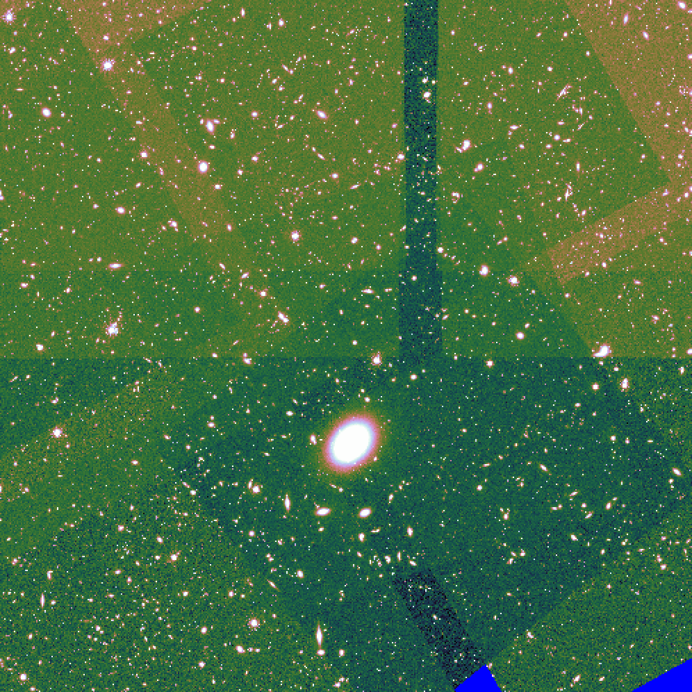
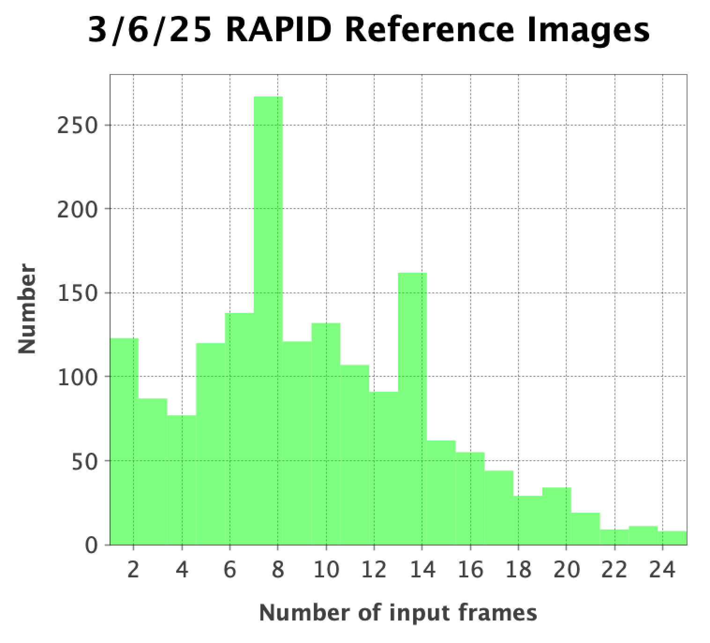
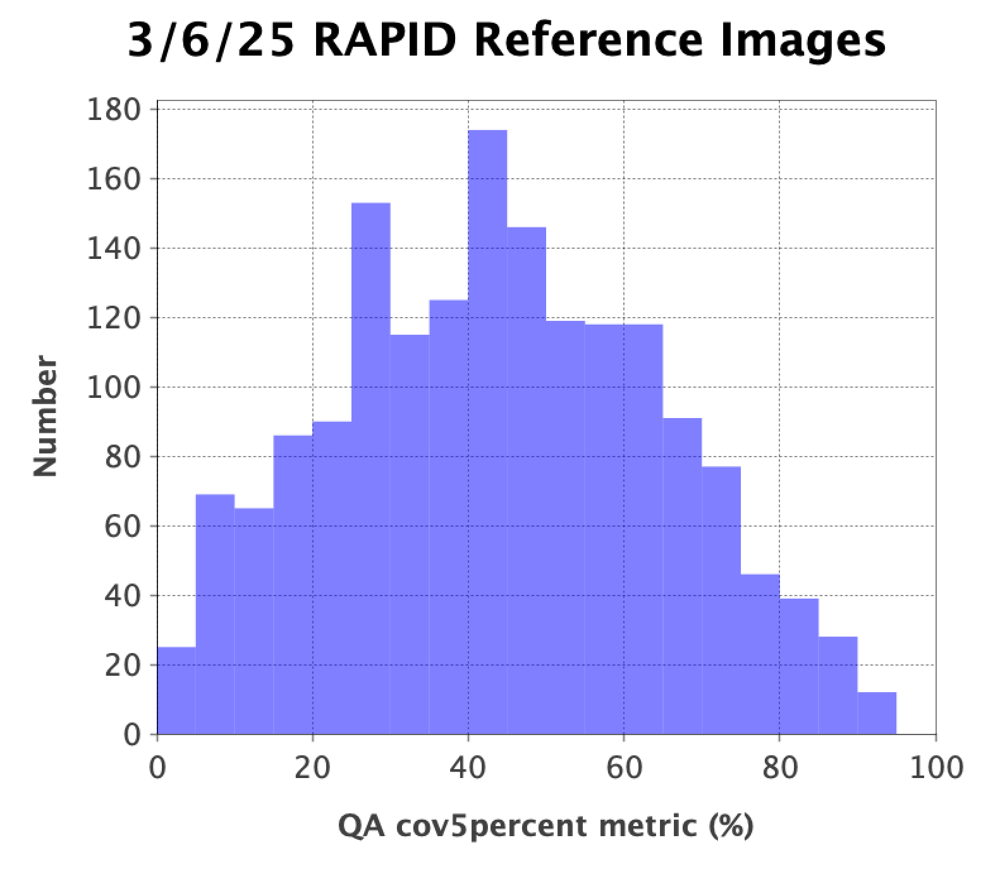

RAPID Pipeline Products
####################################################

Overview
***********

Products are stored in the RAPID-product S3 bucket under their processing
date (``<yyyymmdd>`` Pacific Time)::

    aws s3 ls --recursive s3://rapid-product-files/<yyyymmdd>

List all jobs for processing date ``20260513``::

    aws s3 ls --recursive s3://rapid-product-files/20260513

Each job differences one science image. List the products for ``jid=90828``
on that date::

    aws s3 ls --recursive s3://rapid-product-files/20260513/jid90828

The associated product config output file is parsed for metadata loaded into
the RAPID operations database after processing::

    aws s3 ls  --recursive s3://rapid-product-files/20260513/product_config_jid90828.ini

Public Access
***************

To download a product, construct its URL using the filename, which must be
known in advance. For example::

    https://rapid-product-files.s3.us-west-2.amazonaws.com/20260520/jid90828/awaicgen_output_mosaic_cov_map.fits

A full product listing is generated on demand with ``aws s3 ls``, not
committed to this repository. Redirect the command's output to recreate the
per-date listing previously distributed as a static download::

    aws s3 ls --recursive s3://rapid-product-files/<yyyymmdd> > rapid-product-files_<yyyymmdd>.txt

A simple Python script can parse the listing to generate ``wget`` or
``curl`` download commands.

Pipeline logs are also public, with one log file per processed science
image. The log-file URL template corresponding to the example above is::

    https://rapid-pipeline-logs.s3.us-west-2.amazonaws.com/20260513/rapid_pipeline_job_20260513_jid90828_log.txt

Product Files
*************

The table lists input files, intermediate files for debugging, and final
products. Input filenames are unique. Product filenames are canonical and
predictable, repeating across science-image cases in different directories.

.. warning::
    Availability depends on the test associated with each processing date;
    some products were added later. Not every date has all listed products.

Difference-image products use three methods: ZOGY, SFFT with
cross-convolution, and naive (simple science image minus reference image).

.. note::
   Filenames without the suffix "_negative" identify positive difference
   images ("science image minus reference image"). Those with "_negative"
   identify negative difference images ("reference image minus science image").

==============================================================  =======================================================================================================================
Filename                                                        Description
==============================================================  =======================================================================================================================
Roman_TDS_simple_model_F184_1851_10_lite.fits.gz                Input science image (gzipped)
Roman_TDS_simple_model_F184_1851_10_lite_reformatted.fits       Reformated: Image data are contained in the PRIMARY header and resize to 4089x4089
Roman_TDS_simple_model_F184_1851_10_lite_reformatted_unc.fits   Associated uncertainty image computed via simple model (photon noise only)
Roman_TDS_simple_model_F184_1851_10_lite_reformatted_pv.fits    Reformatted science image with PV distortion
Roman_TDS_simple_model_Y106_124_5_lite_inject.txt               Fake-source-injection truth list, if enabled
awaicgen_output_mosaic_image.fits                               Reference image
awaicgen_output_mosaic_cov_map.fits                             Coverage map for reference image
awaicgen_output_mosaic_uncert_image.fits                        Uncertainty image for reference image
awaicgen_output_mosaic_refimsexcat.txt                          SourceExtractor catalog from reference image
awaicgen_output_mosaic_image_resampled.fits                     Reference image, resampled to distortion grid of science image and background subtracted
awaicgen_output_mosaic_cov_map_resampled.fits                   RefIm coverage map, resampled to distortion grid of science image
awaicgen_output_mosaic_uncert_image_resampled.fits              RefIm uncertainty image, resampled to distortion grid of science image
refimage_psfcat.txt                                             RefIm PhotUtils PSF-fit photometry catalog (noniterative) in space-delimited text file
refimage_psfcat_finder.txt                                      RefIm PhotUtils PSF-fit star-finder catalog (noniterative) in space-delimited text file
refimage_psfcat.parquet                                         Combined PhotoUtils PSF-fit photometry and star-finder catalogs (noniterative) in parquet format
bkg_subbed_science_image.fits                                   Science image, background subtracted, direct input to ZOGY
awaicgen_output_mosaic_image_resampled_gainmatched.fits         Gain-matched reference image, background subtracted, directory input to ZOGY
awaicgen_output_mosaic_image_resampled_refgainmatchsexcat.txt   SourceExtractor catalog from reference image for gain-matching purposes
bkg_subbed_science_image_scigainmatchsexcat.txt                 SourceExtractor catalog from science image for gain-matching purposes
zogy_diffimage_masked.fits                                      ZOGY positive difference image with NaNs in zero-coverage pixels
zogy_diffimage_uncert_masked.fits                               Uncertainty image for ZOGY positive difference image with NaNs in zero-coverage pixels
diffpsf.fits                                                    ZOGY difference-image PSF
scorrimage_masked.fits                                          ZOGY SCORR image with NaNs in zero-coverage pixels
zogy_diffimage_masked.txt                                       SourceExtractor catalog from ZOGY positive difference image
zogy_diffimage_masked_psfcat.txt                                PhotUtils PSF-fit photometry catalog from ZOGY positive difference image (noniterative)
zogy_diffimage_masked_psfcat_finder.txt                         PhotUtils PSF-fit star-finder catalog from ZOGY positive difference image (noniterative)
zogy_diffimage_masked_psfcat_residual.fits                      PhotUtils residual image from ZOGY positive difference image (noniterative)
job_config_jid90828.done                                        Indicates metadata from science pipeline ingested into RAPID operations database
postproc_job_config_jid90828.done                               Indicates metadata from post-processing pipeline ingested into RAPID operations database
sfftdiffimage_masked.fits                                       SFFT positive difference image (when SFFT is not run with the ``--crossconv`` flag), with NaNs in zero-coverage pixels
sfftdiffimage_dconv_masked.fits                                 SFFT decorrelated positive difference image (SFFT via ``--crossconv`` flag).  Akin to ZOGY positive difference image.
sfftdiffimage_cconv_masked.fits                                 SFFT cross-convolved positive difference image (SFFT via ``--crossconv`` flag).  Akin to ZOGY SCORR image.
sfftdiffimage_masked.txt                                        SourceExtractor catalog from SFFT positive difference image
sfftdiffimage_uncert_masked.fits                                Uncertainty image for SFFT positive difference image with NaNs in zero-coverage pixels
sfftsoln.fits                                                   SFFT matching-kernel solution file
sfftdiffimage_masked_psfcat.txt                                 PhotUtils PSF-fit photometry catalog from SFFT positive difference image (noniterative)
sfftdiffimage_masked_psfcat_finder.txt                          PhotUtils PSF-fit star-finder catalog from SFFT positive difference image (noniterative)
sfftdiffimage_masked_psfcat_residual.fits                       PhotUtils residual image from SFFT positive difference image (noniterative)
naive_diffimage_masked.fits                                     Naive output positive difference image with NaNs in zero-coverage pixels
naive_diffimage_masked.txt                                      SourceExtractor catalog from naive positive difference image
naive_masked_psfcat.txt                                         PhotUtils PSF-fit photometry catalog from naive positive difference image (noniterative)
naive_diffimage_uncert_masked.fits                              Uncertainty image for naive positive difference image with NaNs in zero-coverage pixels
naive_masked_psfcat_finder.txt                                  PhotUtils PSF-fit star-finder catalog from naive positive difference image (noniterative)
naive_masked_psfcat_residual.fits                               PhotUtils residual image from naive positive difference image (noniterative)
"_negative.fits" and "_negative.txt"                            Corresponding products for negative difference images
==============================================================  =======================================================================================================================

Example Reference-Image FITS Header
******************************************

The example header below shows reference-image metadata, including
operations database IDs written near the end by the RAPID post-processing
pipeline. All reference images are scaled to a fixed MAGZP of 17.0 mag.

.. code-block::

    Image_file = awaicgen_output_mosaic_image.fits
    Date_time = Fri Feb 27 11:36:07 PST 2026

    HDU number = 1

    SIMPLE  =                    T / conforms to FITS standard
    BITPIX  =                  -32 / array data type
    NAXIS   =                    2 / number of array dimensions
    NAXIS1  =                 7000
    NAXIS2  =                 7000
    COMMENT   FITS (Flexible Image Transport System) format is defined in 'Astronomy
    COMMENT   and Astrophysics', volume 376, page 359; bibcode: 2001A&A...376..359H
    CRVAL1  =             8.887733 / RA at CRPIX1,CRPIX2, J2000.0 (deg)
    CRVAL2  =           -44.894962 / Dec at CRPIX1,CRPIX2, J2000.0 (deg)
    EQUINOX =               2000.0 / Equinox of WCS, (year)
    CTYPE1  = 'RA---TAN'           / Projection type for axis 1
    CTYPE2  = 'DEC--TAN'           / Projection type for axis 2
    CRPIX1  =          3500.500000 / Axis 1 reference pixel at CRVAL1,CRVAL2
    CRPIX2  =          3500.500000 / Axis 2 reference pixel at CRVAL1,CRVAL2
    CDELT1  =  -0.0000305555549858 / Axis 1 scale at CRPIX1,CRPIX2 (deg/pix)
    CDELT2  =   0.0000305555549858 / Axis 2 scale at CRPIX1,CRPIX2 (deg/pix)
    CROTA2  =             0.000000 / Image twist: +axis2 W of N, J2000.0 (deg)
    BITMASK =                    0 / Fatal bitstring mask template
    HISTORY A generic WISE Astronomical Image Coadder, v5.2
    HISTORY Frank J. Masci, fmasci@caltech.edu
    DATE    = '2026-02-27T17:41:34Z' / file creation date (YYYY-MM-DDThh:mm:ss UT)
    BUNIT   = 'DN/s    '
    FIELD   =              5364185 / Roman sky-tile number
    FID     =                    3 / RAPID-OPS-DB filter number
    FILTER  = 'J129    '
    COV5PERC=             66.54596
    NFRAMES =                   14 / Total number of images coadded
    JDSTART =        2463551.29014 / Obs. JD of earliest image used [days]
    JDEND   =         2463561.3418 / Obs. JD of latest image used [days]
    MAGZP   =                 17.0 / Zero point of reference image [mag]
    INFIL001= 'Roman_TDS_simple_model_J129_57166_16_lite.fits.gz'
    INFIL002= 'Roman_TDS_simple_model_J129_56386_7_lite.fits.gz'
    INFIL003= 'Roman_TDS_simple_model_J129_56396_13_lite.fits.gz'
    INFIL004= 'Roman_TDS_simple_model_J129_57156_3_lite.fits.gz'
    INFIL005= 'Roman_TDS_simple_model_J129_56771_5_lite.fits.gz'
    INFIL006= 'Roman_TDS_simple_model_J129_57161_14_lite.fits.gz'
    INFIL007= 'Roman_TDS_simple_model_J129_56776_10_lite.fits.gz'
    INFIL008= 'Roman_TDS_simple_model_J129_56781_13_lite.fits.gz'
    INFIL009= 'Roman_TDS_simple_model_J129_56781_16_lite.fits.gz'
    INFIL010= 'Roman_TDS_simple_model_J129_56776_11_lite.fits.gz'
    INFIL011= 'Roman_TDS_simple_model_J129_56776_1_lite.fits.gz'
    INFIL012= 'Roman_TDS_simple_model_J129_57161_11_lite.fits.gz'
    INFIL013= 'Roman_TDS_simple_model_J129_56776_2_lite.fits.gz'
    INFIL014= 'Roman_TDS_simple_model_J129_57161_10_lite.fits.gz'
    CHECKSUM= 'RFMKTEJHREJHREJH'   / HDU checksum updated 2026-02-27T17:41:36
    DATASUM = '3996369437'         / data unit checksum updated 2026-02-27T17:41:36
    RFID    =                72284
    S3BUCKN = 'rapid-product-files'
    S3OBJPRF= '20260227/jid90893/'
    RFFILEN = 'awaicgen_output_mosaic_image.fits'
    INFOBITS=                    0
    RFIMVER =                  205
    PPID    =                   15
    END

================  ==================================================================================
FITS Keyword      Definition
================  ==================================================================================
RFID              Unique RAPID-OPS-DB ID for RefImages table in RAPID operations database
RFIMVER           Version number of reference image in record of RefImages table
PPID              Unique RAPID-OPS-DB ID for Pipelines table in RAPID operations database
S3BUCKN           S3 bucket where reference image is stored
S3OBJPRF          S3 object prefix where reference image is stored
RFFILEN           Filename of reference image in S3 bucket
INFOBITS          Bit-wise FLAGS for special conditions about reference image (TBD)
BUNIT             Reference-image data units [DN/s]
FIELD             Roman sky-tile number
FID               RAPID-OPS-DB filter number
FILTER            Roman filer name
COV5PERC          Percentage of reference-image area with coverage depth of at least 5 input images
NFRAMES           Total number of input images coadded
JDSTART           Observation JD of earliest input image used [days]
JDEND             Observation JD of latest input image used [days]
MAGZP             Zero point of reference image [mag]
================  ==================================================================================

The reference image above has uneven coverage, including two blue patches
representing NaNs (pixels storing not a number):

Analysis of Reference Images
************************************

The input-frame count is an important reference-image attribute, recorded
in the FITS header as ``NFRAMES`` alongside the input filenames
(``INFIL###``). This histogram shows the counts for the current set of
1696 reference images:

The quality-assurance metric ``cov5percent`` (FITS keyword ``COV5PERC``)
quantifies absolute aggregate areal-depth coverage at a reference depth of
5, corresponding to a coadd depth of at least 5 input images. Computed from
the reference-image coverage map, it is the sum of all pixel coverages,
with values greater than 5 reset to 5 for scoring, expressed as a
percentage of 5 times the total number of pixels.

This histogram shows cov5percent for the current set of 1696 reference images:

Alerts
************************************

.. warning::

   **The RAPID alert schema is under initial development**

   Records, parameter names, types, and semantics may change without
   notice, including backward-incompatible changes. Many parameters are
   stubs always serialized as null. Do not build production consumers
   against this schema yet.

Summary
==================================

Each RAPID alert reports a source detection on a difference image in a
single Apache Avro packet, assembled and serialized by the ``alerts``
package from these records:

- ``alert``: the top-level record: provenance, the triggering source
  detection, object history, and image cutouts.
- ``diaSource``: the triggering source detection on a difference image,
  including astrometry, PSF-fit photometry, and fit-quality parameters.
- ``diaForcedSource``: forced photometry at the object position
- ``diaObject``: the associated astronomical object, aggregated from all
  of its constituent detections.
- ``ssMatch``: an associated solar system source: will contain MPC designation,
  info about the position, and the predicted V-band magnitude.

Current State of the Alert Schema
==================================

Alerts are currently produced end-to-end for sources detected on difference
images. See :ref:`alert-packet-contents` for per-parameter implementation
status.

``alert``
---------

The alert schema currently contains schema version information, the
triggering and previous source detections, persistent object metadata
including aggregate photometry, and difference, science, and reference
image cutouts at the source position. Cutouts are currently 129x129 pixels
(~14"); their size may increase if memory constraints allow.

Planned before version 1.0:

- Forced photometry history (see ``diaForcedSource``)
- solar-system cross-matching
- cross-matching to the reference image SExtractor catalog
- cross-matches to other surveys (NED, Gaia).

``diaSource``
-------------

The source schema currently contains:

- A source ID from our pipeline and the associated object ID
- Exposure metadata (MJD, exposure ID, SCA, exposure time, band, ...)
- Source centroid position and uncertainties
- PSF Photometry on the difference, science, and reference images at the
  difference image source centroid
- PSF Fit quality parameters

Planned additions:

- Reference image ID, including co-add information
- Aperture photometry
- Shape measurements from SExtractor (currently migrating from photutils)
- Flags, including whether the source is a likely solar-system object

``diaForcedSource``
-------------------

The Forced Photometry schema is a stub to be populated in version 1.0.
Forced Photometry routines are being benchmarked to select the best
algorithm. Successful optimization would allow FP delivery at alert time;
otherwise, data will be stored using the first detected object position as
the FP anchor.

Each Forced Source object will contain:

- The forced photometry ID and object ID
- MJD, Exposure ID, SCA number, and band
- Measurement position
- PSF photometry on difference and science image

``diaObject``
-------------

The object schema is half-populated, awaiting automatic photometry
aggregation in the database. It currently contains:

- Object ID
- Position and position uncertainty (standard deviation on detected
  positions)

Planned additions:

- Coverage history
- Aggregate photometric statistics on each band (mean, min, max, slopes,
  and number of measurements)

``ssMatch``
-----------

This record awaits solar-system processing (KONA per-visit output). It
will contain the MPC designation, the predicted object position at the
triggering epoch, and the predicted V-band magnitude.

Other cross-matches
-------------------

A cross-match schema is planned for internal references and other surveys
in the top-level alert schema. The current plan is to include the top 3
closest matches for each catalog, potentially accounting for the half-light
radius of extended sources.

Sample Alert Packet
==================================

.. warning::

   **This sample file is for exploratory purposes only.**

   Production-level avro files will be schema-less and require versioning
   with Confluent schema. This file's schema may become out of date relative
   to the current alert code.

:download:`sample_alert.avro <sample_alert.avro>` (schema version ``00.02``).

The standard Avro object container file embeds its schema and can be read
without RAPID code::

    import fastavro
    with open("sample_alert.avro", "rb") as f:
        alert = next(fastavro.reader(f))

The ``cutoutDifference``, ``cutoutScience``, and ``cutoutReference`` values
are FITS files as raw bytes (e.g. ``astropy.io.fits.open(io.BytesIO(...))``).

.. _alert-packet-contents:

Alert Packet Contents
==================================

.. include:: alert_params.inc
