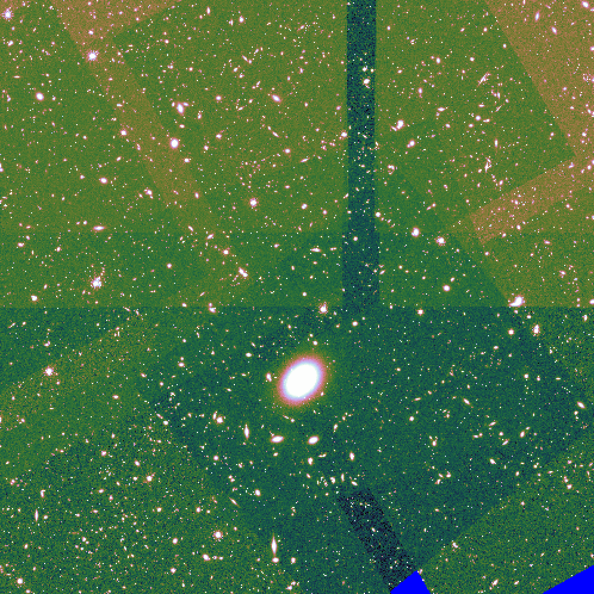

RAPID Pipeline Products
####################################################

Overview
***********

The products processed on any given date (``<yyyymmdd>`` Pacific Time) will be located in
the RAPID-product S3 bucket with the processing date as a prefix::

    aws s3 ls --recursive s3://rapid-product-files/<yyyymmdd>

For example, this command covers all jobs under processing date ``20250428``::

    aws s3 ls --recursive s3://rapid-product-files/20250428

Here are the available products for just one job (``jid=999``) under that processing date::

    aws s3 ls --recursive s3://rapid-product-files/20250428/jid999

Note that there is one science image differenced per job.

The associated product config output file is::

    aws s3 ls  --recursive s3://rapid-product-files/20250428/product_config_jid999.ini

This is parsed for metadata to load into the RAPID operations database after the processing.

The input and intermediate files for debugging and final products are listed in the table below.
The input filenames are unique.
The product filenames are canonical and predictable: they are the same from
one science-image case to the next.

==============================================================  ===========================================================================================
Filename                                                        Description
==============================================================  ===========================================================================================
Roman_TDS_simple_model_F184_1851_10_lite.fits.gz                Input science image (gzipped)
Roman_TDS_simple_model_F184_1851_10_lite_reformatted.fits       Reformated: Image data are contained in the PRIMARY header and resize to 4089x4089
Roman_TDS_simple_model_F184_1851_10_lite_reformatted_unc.fits   Associated uncertainty image computed via simple model (photon noise only)
Roman_TDS_simple_model_F184_1851_10_lite_reformatted_pv.fits    Reformatted science image with PV distortion
awaicgen_output_mosaic_image.fits                               Reference image
awaicgen_output_mosaic_cov_map.fits                             Coverage map for reference image
awaicgen_output_mosaic_uncert_image.fits                        Uncertainty image for reference image
awaicgen_output_mosaic_refimsexcat.txt                          SourceExtractor catalog from reference image
awaicgen_output_mosaic_image_resampled.fits                     Reference image, resampled to distortion grid of science image and background subtracted
awaicgen_output_mosaic_cov_map_resampled.fits                   RefIm coverage map, resampled to distortion grid of science image
awaicgen_output_mosaic_uncert_image_resampled.fits              RefIm uncertainty image, resampled to distortion grid of science image
bkg_subbed_science_image.fits                                   Science image, background subtracted, direct input to ZOGY
awaicgen_output_mosaic_image_resampled_gainmatched.fits         Gain-matched reference image, background subtracted, directory input to ZOGY
awaicgen_output_mosaic_image_resampled_refgainmatchsexcat.txt   SourceExtractor catalog from reference image for gain-matching purposes
bkg_subbed_science_image_scigainmatchsexcat.txt                 SourceExtractor catalog from science image for gain-matching purposes
diffimage_masked.fits                                           ZOGY output difference image with NaNs in zero-coverage pixels
diffimage_uncert_masked.fits                                    ZOGY output uncertainty difference image with NaNs in zero-coverage pixels
diffpsf.fits                                                    ZOGY output PSF
scorrimage_masked.fits                                          ZOGY output SCORR image with NaNs in zero-coverage pixels
diffimage_masked.txt                                            SourceExtractor catalog from ZOGY difference image
diffimage_masked_psfcat.txt                                     PhotUtils PSF-fit catalog from ZOGY difference image (noniterative)
diffimage_masked_psfcat_residual.fits                           PhotUtils residual image
job_config_jid999.done                                          Indicates metadata from science pipeline ingested into RAPID operations database
postproc_job_config_jid999.done                                 Indicates metadata from post-processing pipeline ingested into RAPID operations database
jid999/sfftdiffimage_masked.fits                                SFFT output difference image with NaNs in zero-coverage pixels
sfftdiffimage_masked.txt                                        SourceExtractor catalog from SFFT difference image
sfftdiffimage_uncert_masked.fits                                SFFT output uncertainty difference image with NaNs in zero-coverage pixels
sfftsoln.fits                                                   SFFT matching-kernel solution file
sfftdiffimage_cconv_masked.fits                                 SFFT difference image when SFFT was run with the ``--crossconv`` flag
sfftdiffimage_dconv_masked.fits                                 SFFT decorrelated difference image when SFFT was run with the ``--crossconv`` flag
naive_diffimage_masked.fits                                     Naive output difference image with NaNs in zero-coverage pixels
==============================================================  ===========================================================================================

Public Access
***************

To download a RAPID pipeline product, the
user must construct a URL, knowing the filename in advance, like the following::

    https://rapid-product-files.s3.us-west-2.amazonaws.com/20250428/jid1022/awaicgen_output_mosaic_cov_map.fits

For listings of the available product files, download the following text files:

:download:`rapid-product-files_20250428.txt <rapid-product-files_20250428.txt>`

:download:`rapid-product-files_20250430.txt <rapid-product-files_20250430.txt>`

:download:`rapid-product-files_20250505.txt <rapid-product-files_20250505.txt>`

:download:`rapid-product-files_20250506.txt <rapid-product-files_20250506.txt>`

:download:`rapid-product-files_20250508.txt <rapid-product-files_20250508.txt>`

:download:`rapid-product-files_20250510.txt <rapid-product-files_20250510.txt>`

:download:`rapid-product-files_20250514.txt <rapid-product-files_20250514.txt>`

:download:`rapid-product-files_20250612.txt <rapid-product-files_20250612.txt>`

:download:`rapid-product-files_20250613.txt <rapid-product-files_20250613.txt>`

:download:`rapid-product-files_20250617.txt <rapid-product-files_20250617.txt>`

:download:`rapid-product-files_20250620.txt <rapid-product-files_20250620.txt>`

A simple Python script can be written to parse the listing and generate ``wget`` or ``curl`` download commands.

Example Reference-Image FITS Header
******************************************

This section lists an example reference-image FITS header to expose the user to the
various useful metadata contained therein.  The keywords near the end of the listing
are operations database IDs written to the FITS header by the RAPID post-processing pipeline.

.. code-block::

    Image_file = awaicgen_output_mosaic_image.fits
    Date_time = Wed Apr 09 05:02:28 PDT 2025

    HDU number = 1

    SIMPLE  =                    T / conforms to FITS standard
    BITPIX  =                  -32 / array data type
    NAXIS   =                    2 / number of array dimensions
    NAXIS1  =                 7000
    NAXIS2  =                 7000
    COMMENT   FITS (Flexible Image Transport System) format is defined in 'Astronomy
    COMMENT   and Astrophysics', volume 376, page 359; bibcode: 2001A&A...376..359H
    CRVAL1  =            10.490798 / RA at CRPIX1,CRPIX2, J2000.0 (deg)
    CRVAL2  =           -44.102325 / Dec at CRPIX1,CRPIX2, J2000.0 (deg)
    EQUINOX =               2000.0 / Equinox of WCS, (year)
    CTYPE1  = 'RA---TAN'           / Projection type for axis 1
    CTYPE2  = 'DEC--TAN'           / Projection type for axis 2
    CRPIX1  =          3500.500000 / Axis 1 reference pixel at CRVAL1,CRVAL2
    CRPIX2  =          3500.500000 / Axis 2 reference pixel at CRVAL1,CRVAL2
    CDELT1  =  -0.0000305555549858 / Axis 1 scale at CRPIX1,CRPIX2 (deg/pix)
    CDELT2  =   0.0000305555549858 / Axis 2 scale at CRPIX1,CRPIX2 (deg/pix)
    CROTA2  =             0.000000 / Image twist: +axis2 W of N, J2000.0 (deg)
    BITMASK =                    0 / Fatal bitstring mask template
    HISTORY A generic WISE Astronomical Image Coadder, v5.2
    HISTORY Frank J. Masci, fmasci@caltech.edu
    DATE    = '2025-04-04T15:03:21' / file creation date (YYYY-MM-DDThh:mm:ss UT)
    BUNIT   = 'DN/s    '
    FIELD   = '5333132 '
    FID     = '1       '
    FILTER  = 'F184    '
    COV5PERC= '51.334797'
    NFRAMES = '11      '
    INFIL001= 'Roman_TDS_simple_model_F184_1086_18_lite.fits.gz'
    INFIL002= 'Roman_TDS_simple_model_F184_1846_12_lite.fits.gz'
    INFIL003= 'Roman_TDS_simple_model_F184_312_4_lite.fits.gz'
    INFIL004= 'Roman_TDS_simple_model_F184_1466_15_lite.fits.gz'
    INFIL005= 'Roman_TDS_simple_model_F184_1471_13_lite.fits.gz'
    INFIL006= 'Roman_TDS_simple_model_F184_1466_14_lite.fits.gz'
    INFIL007= 'Roman_TDS_simple_model_F184_317_10_lite.fits.gz'
    INFIL008= 'Roman_TDS_simple_model_F184_1466_11_lite.fits.gz'
    INFIL009= 'Roman_TDS_simple_model_F184_317_13_lite.fits.gz'
    INFIL010= 'Roman_TDS_simple_model_F184_1466_12_lite.fits.gz'
    INFIL011= 'Roman_TDS_simple_model_F184_312_1_lite.fits.gz'
    CHECKSUM= '3aE5AZC53aC5AWC5'   / HDU checksum updated 2025-04-07T17:20:20
    DATASUM = '1546664296'         / data unit checksum updated 2025-04-07T17:20:20
    RFID    = '17030   '
    S3BUCKN = 'rapid-product-files'
    S3OBJPRF= '20250404/jid999/'
    RFFILEN = 'awaicgen_output_mosaic_image.fits'
    INFOBITS= '0       '
    RFIMVER = '16      '
    PPID    = '15      '
    END

================  =========================================================================================
FITS Keyword      Definition
================  =========================================================================================
RFID              Unique database ID for RefImages table in RAPID operations database
RFIMVER           Version number of reference image in record of RefImages table.
PPID              Unique database ID for Pipelines table in RAPID operations database
S3BUCKN           S3 bucket where reference image is stored
S3OBJPRF          S3 object prefix where reference image is stored
RFFILEN           Filename of reference image in S3 bucket
INFOBITS          Bit-wise FLAGS for special conditions about reference image (TBD)
================  =========================================================================================

Here is an image-view of the above-mentioned reference image.  Note the areas of uneven coverage,
including two blue patches representing NaNs (pixels storing not a number).

Analysis of Reference Images
************************************

The number of input frames that went into computing a reference image
is an important attribute of a reference image.  This is listed in the
reference-image FITS header, given by FITS keyword ``NFRAMES``, along
with the filenames of the particular input images used (``INFIL###``).

Here is a histogram of the number of input frames for our current set of 1696 reference images:

The quality-assurance metric ``cov5percent``, given by FITS keyword ``COV5PERC``,
is an absolute quantifier for the aggregate areal-depth coverage of a reference image at a
reference depth of 5, corresponding to a coadd depth of at least 5 input images.
It is computed from the reference-image coverage map.
It is defined as a percentage of the sum of the limited coverage of all pixels in an image,
where the limited coverage is all coverage and any coverage greater than 5 that is reset to 5
for scoring purposes, relative to 5 times the total number of pixels in the image.

Here is a histogram of cov5percent for our current set of 1696 reference images:

