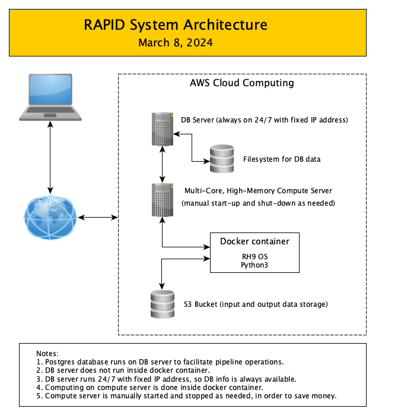
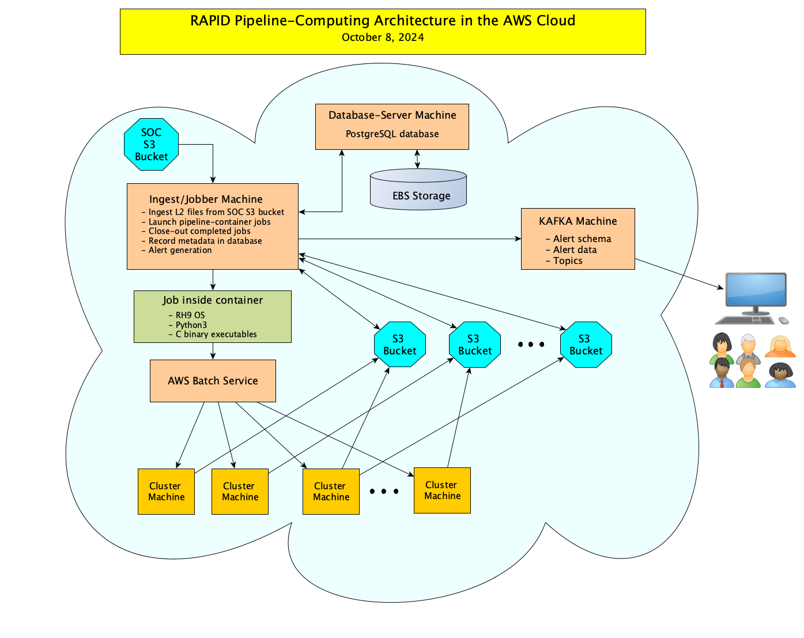
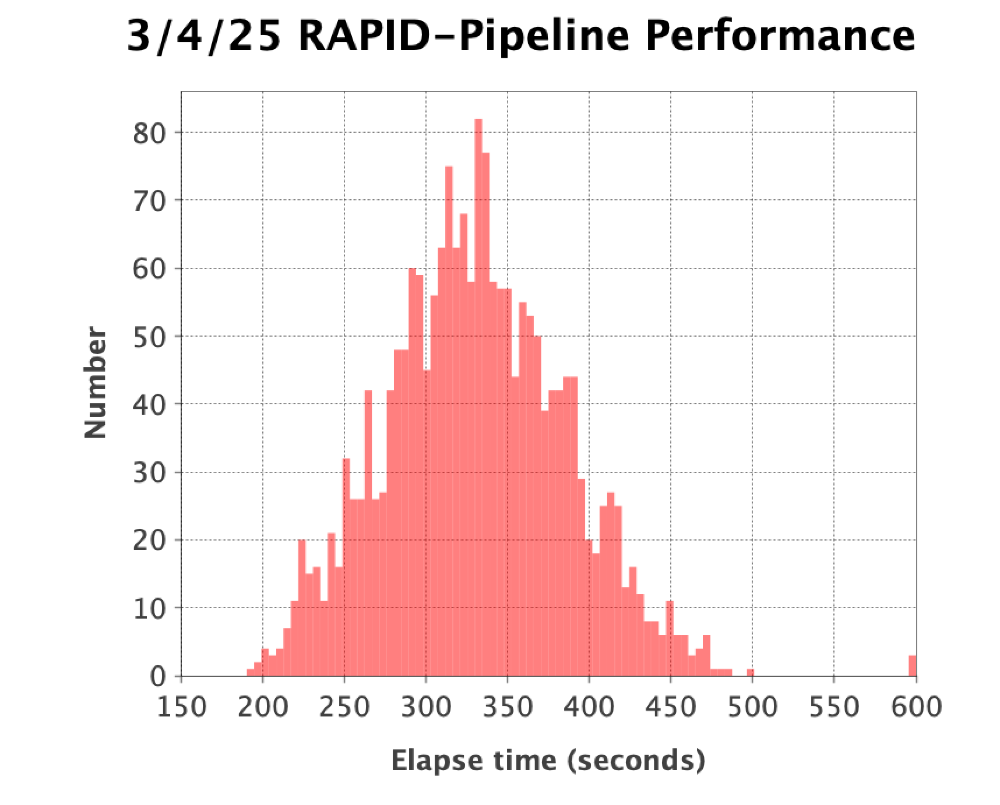
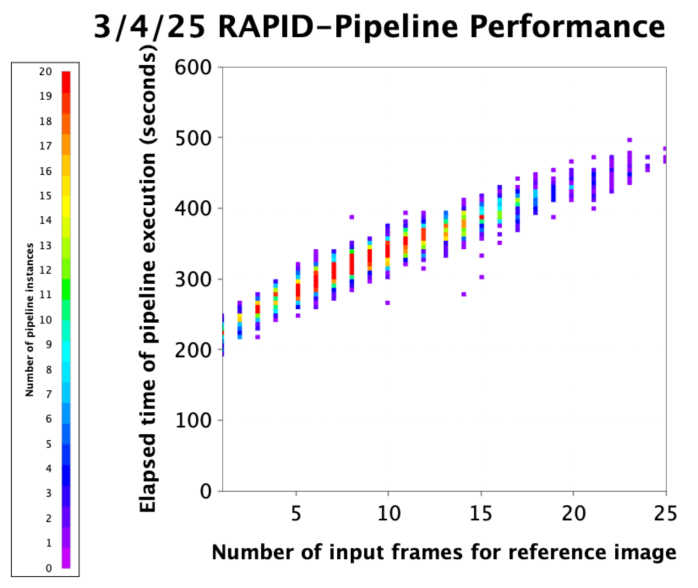

RAPID Computing Architecture
####################################################

System Architecture
**************************

Here is a high-level flowchart of the RAPID system architecture:

Everything is done in the AWS cloud, and is accessible via a laptop with Internet connection.

The database server is a very inexpensive t2.micro AWS machine, which runs 24 hours a day, seven days a week.
A more powerful machine is utilized to launch RAPID pipeline instances, which is only activated as needed in order to save money.

Computing Architecture
**************************

Here is a more detailed flowchart of the RAPID computing architecture:

Parallel processing on a massive scale is facilitated by the AWS Batch Service.

Database interactions are done only during intial pipeline launching and final data aggregation stages,
before and after pipeline instances are executed under the AWS Batch Service.  This ensures scalability
of the RAPID-pipeline computing system.

Pipeline Performance
**************************

In one of our initial large-scale tests,
RAPID pipeline instances were launched for all OpenUniverse simulated images with ``DATE-OBS >= 2028-09-07 00:00:00``
and ``DATE-OBS <= 2028-09-08 08:30:00``.  This is about 2000 jobs, one job per science image.  All jobs were successfully run,
except for 80 jobs in which a reference image could not be made due to lack of prior observations for the associated field.
The elapsed execution time for a RAPID pipeline job was measured
from the time it was launched to the time it finished running on an AWS Batch machine, of course, after writing
the pipeline products to the output S3 bucket.

Here is a histogram of the job execution times:

Here is a 2-D histogram of the job execution times versus number of input frames for the reference image that was generated:

It is obvious from the figure that the execution times have a contribution that is proporational
to the number of reference-image inputs.
