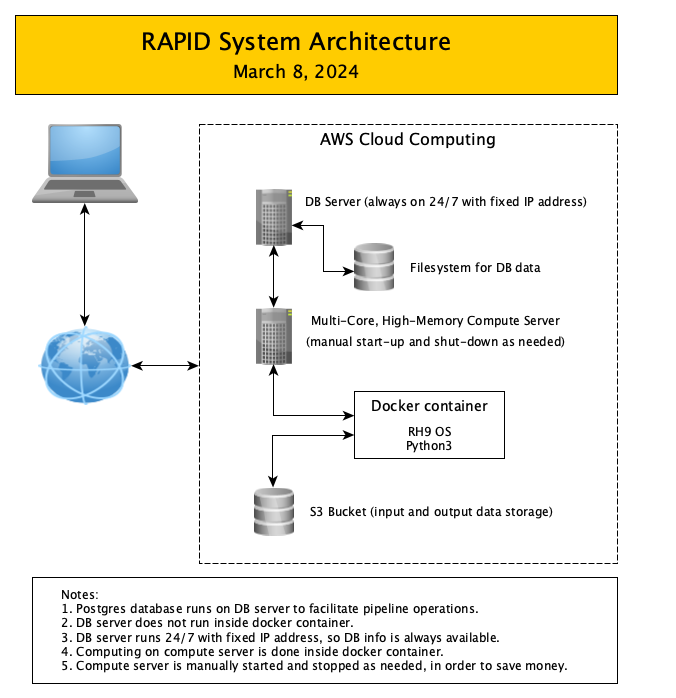
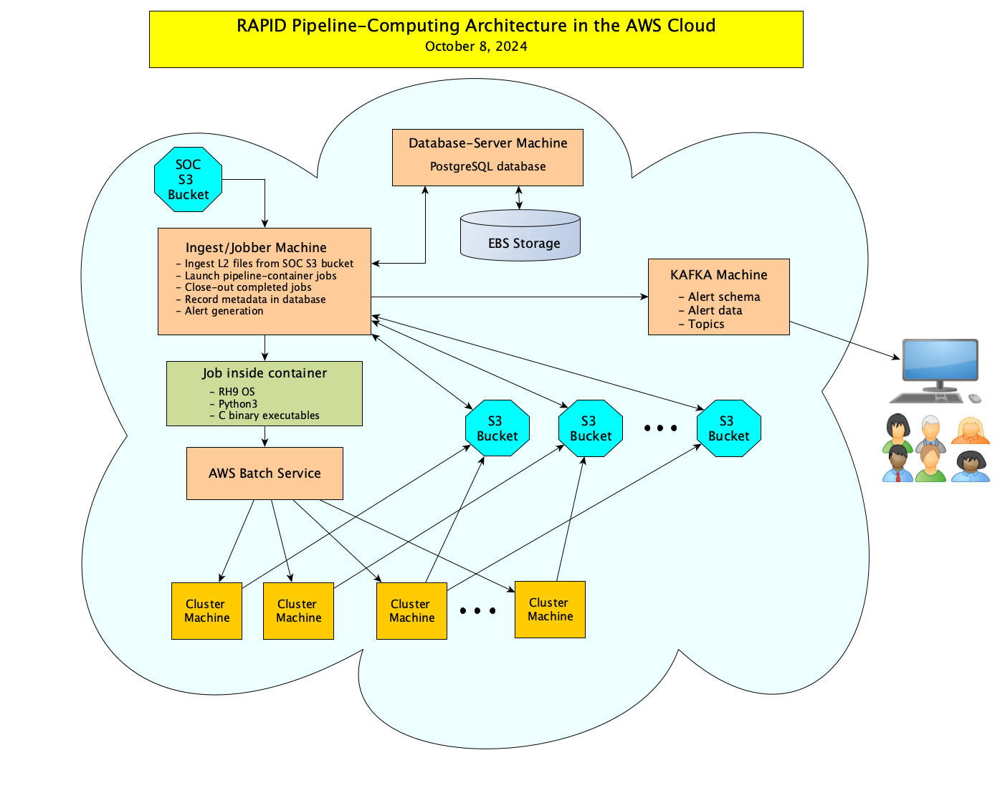
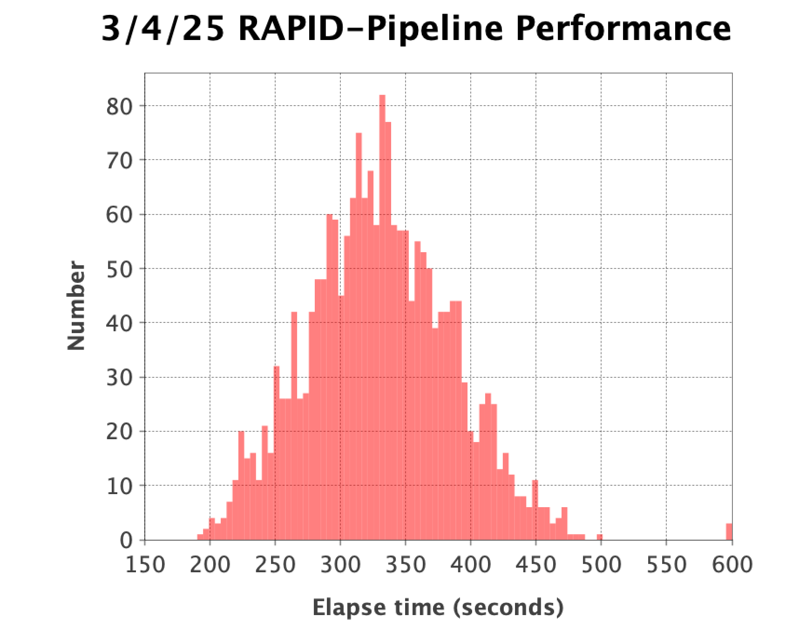
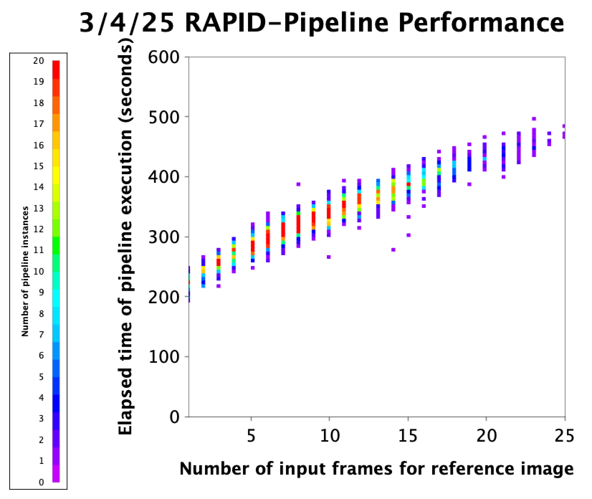

RAPID Computing Architecture
####################################################

System Architecture
**************************

RAPID runs entirely in the AWS cloud and is accessible from a laptop with
an Internet connection. The high-level system architecture is shown below:

The database server is a very inexpensive ``t2.micro`` AWS machine running
24 hours a day, seven days a week. Pipeline instances could run in parallel
on a more powerful multi-core, high-memory machine, activated only as needed
to save money. The next section describes the tested alternative: parallel
processing across multiple machines with the AWS Batch Service.

Computing Architecture
**************************

The AWS Batch Service enables massively parallel data processing across
multiple machines. Extensive testing has demonstrated that this approach
is viable and practical:

To ensure scalability, SQL queries and other interactions with the PostgreSQL
database occur only during initial pipeline launching and final data
aggregation, before and after pipeline instances execute separately on
multiple CPU cores or under the AWS Batch Service.

Pipeline Performance
**************************

.. warning::
    The performance results below are obsolete, but kept for historical reasons.
    The latest performance result can be found :doc:`here </ops/bulk_run>`.

An initial large-scale test launched RAPID pipeline instances for all
OpenUniverse simulated images with ``DATE-OBS >= 2028-09-07 00:00:00``
and ``DATE-OBS <= 2028-09-08 08:30:00``: about 2000 jobs, one per science
image. All succeeded except 80 jobs that could not generate a reference
image because the associated field lacked prior observations.

Elapsed execution time was measured from job launch to completion on an
AWS Batch machine, including writing the pipeline products to the output
S3 bucket. The histogram below shows these times:

The 2-D histogram shows job execution time versus the number of input
frames used to generate the reference image:

The figure shows an execution-time contribution proportional to the number
of reference-image inputs.

The test products are in the following S3 bucket::

    aws s3 ls --recursive s3://rapid-product-files/20250304

For example, the SourceExtractor catalog made from the difference image
for job jid=999 is at::

    s3://rapid-product-files/20250304/jid999/diffimage_masked.txt

A separate page describes all available :doc:`RAPID-pipeline products </prod/products>`.
